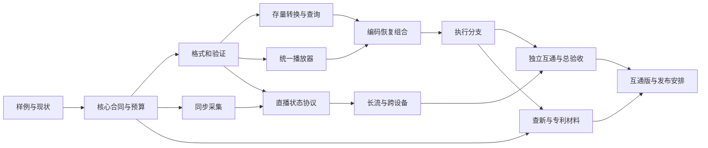

# CSG语义视频方案任务表

日期：2026年9月16日；2026年9月17日文档收口更新。原始任务为制定方案，9月16日后续实施记录已进入apply；本次范围为标准定义与配套专利材料整理，不扩大软件实施范围。不创建分支或worktree，不改生产源码，不操作设备，不公开草案或提交专利。

## 9月17日文档收口

| files | action | verify | done |
|---|---|---|---|
| OpenSpec提案 | 明确标准定义、8条规范义务和专利入口；统一apply状态 | 不改冻结字节合同、不混报历史验证；链接可达 | 已落文档 |
| claim_chart.md | 两份既有10项权利要求逐组对应规范与验证要求 | 核对原权项；不宣称新颖性、标准必要性或实施自由 | 已落文档 |
| 本文件、progress.md、findings.md | 记录本轮范围与限制 | 专利正文和Word不覆盖；生产源码不修改 | 已同步 |

F2材料现已存在，详见claim_chart.md；原表中“拟新增”为9月16日任务提出时描述，不再表示交底稿缺失。候选机制实现与正式申请仍未完成。

## 本次文档交付

| 任务 | files | action | verify | done |
|---|---|---|---|---|
| D1 基线 | findings.md、既有合同与任务记录 | 查清已有能力与公开技术 | 记录时间、范围、未完成项和来源 | 已完成文档核查，未复跑旧实验 |
| D2 技术方案 | ../../csg-semantic-video-core-design.md | 定义数据、时序、状态机、共同核心及能力要求 | 三种输入可映射；未知、失败与修正不冲突 | 已完成方案及文档复核 |
| D3 实施拆解 | 本文件、OpenSpec提案 | 按文件、动作、验证和完成判据拆分 | 每阶段可单独验收；不把拟新增文件当成现有实现 | 已完成拆解，未实施 |
| D4 复核 | review.md、progress.md | 检查引用、术语、时间语义、指标与实施边界 | 无占位、无虚构实测，已有文件引用有效 | 已完成，见review.md |

## 后续开发任务

实施进度（apply）：A1/A2/B1 + B2 结构语义 + B3 语义播放器 + E1-lite 计量 + f 闭环 S1-S4（快照块/恢复对拍/公平基准/统一入口）均闭环；S5 探测定性实拍提取阻塞点；像素级 PSNR 对拍、识别/提取生产链、C1 实采未开始。双真机秒发秒开：L1/L2 正式测量完成——双向各10独立轮 20/20 全 PASS：方向A(Mac→安卓) T_FETCH p50=1282/max=3572ms、ready→首帧 p50=86ms；方向B(安卓→鸿蒙，F-B 修复后) T_FETCH p50=1958.5/max=2260ms、ready→首帧 p50=112ms；完整性失败0，L1(p50≤3000/max≤5000)与L2(p50≤1000)双过（results/miaofa_gate_v0.md、ma_reconnect.md、fb_ohos_rebuild.md、miaofa_dual_real.md）。下表源码路径均为拟实施落点，不代表文件已存在；进入apply时先复核共享树实际结构和所有权。目录名不是生产接线证据。测试夹具和独立验证器不得进入生产路径。

| 任务/依赖 | files | action | verify | done |
|---|---|---|---|---|
| A1 基线 | 本目录baseline.md、fixtures.md、capabilities.json（已建；媒体边界缺项由 media_fixtures.md 补齐） | 冻结源样例、设备、模型、工具链、已知阻塞和披露情况 | 原始数据可取回、摘要与属性可复算；旧证据不当当前验收 | 已完成（实采样例仍缺，C1 前） |
| A2 A1后 | docs/specs/csg-semantic-video-v0.1.md、 本目录memory_budget.md（已建） | 冻结领域schema、能力、时钟、身份、恢复/修订合同和逐相预算 | 字段与核心CSGC不冲突；误差/资源/时延门在测量前确定 | 已完成（数字拼写口径已澄清） |
| B1 A2后 | src/game/assets/semantic_video/{schema,validator,writer,reader}.cheng（已建）；复用core/csg_core | 实现事实映射、严格读写、范围与扩展校验 | 独立解析、边界负例、同事实规范化一致；真实生产入口调用 | 代码+测试闭环（roundtrip/负例13例/原子提交/独立Cheng参考解码器对拍PASS，见interop_ref.md）；生产入口接线待B3 |
| B2 B1后 | source_index.cheng（stsz/stco/co64/stsc 样本表）、convert.cheng、src/apps/semantic_convert（已建）；assertion 待识别接线 | 接通文件样本、识别来源、查询与时间索引 | VFR/B帧/非零起始；人工真值对象事件；查询可回到源样本 | 结构语义闭环达成（两真实样例 svblock+SVIX 索引，ffprobe 对照一致，查询回到源字节）；对象级语义待识别模型 |
| B3 B1后 | src/apps/semantic_player（已建，独立入口不与共享 csg_player 冲突） | 接通验证、状态恢复、播放、seek及证据定位 | 验证链/查询/seek/时间轴步进+证据字节回读全绿；像素呈现待解码接线；取消/100次加载卸载未做 | 记录时间轴+证据锚级消费达成；同能力像素播放待 H.264 解码桥 |
| C1 A2后 | src/game/assets/semantic_video/{capture,calibration,clock_map}.cheng（拟新增）；实际平台provider路径待A1确定 | 从实际设备产生同构Observation，绑定视场与时钟 | 同源时间或校准映射；断时钟/改裁切拒绝旧校准 | 原生采集可被B3消费，非文件回放冒充采集 |
| D1 B1/C1后 | src/game/assets/semantic_video/{stream,snapshot,revision}.cheng（拟新增）；src/moq/适配 | 流世代、增量、快照、修订和来源水位 | 独立接收端加入、乱序重复、丢包/重启及解释版本对照 | 直播与录播恢复合同相同 |
| D2 D1后 | src/apps/csg_player/main.cheng、stream模块 | 接通订阅、背压、断流和EOS；查询结果可更新 | 30分钟实采长流、晚到与身份修订；内存有界且缺口显式 | 长流与跨设备验收通过 |
| E1 B2/B3后 | src/tools/semantic_pack_report.cheng（已建，E1-lite 计量层）；correction/recovery_plan 待做 | 补偿适用条件、候选恢复单元和约束选择 | 冷包/热传输/恢复单元字节实测（compression_report.md，两样例）；无重编码无PSNR不宣称 | 计量层闭环（结论：同能力无增益/热增量为纯语义/公平比值不设）；编码优化与画质门属完整E1 |
| E2 E1后 | src/game/cinema/semantic_branch.cheng（拟新增）；复用世界运行时 | 完整状态恢复、分支操作、写入权限和干预失效 | 新接触/遮挡/灯光、空查询变非空、历史状态与全量执行对拍 | 状态、音画和回执属于同一分支 |
| E2-lite（f 闭环 S1/S2，2026-09-17） | src/game/assets/semantic_video/{snapshot_codec,snapshot_block}.cheng、src/apps/semantic_snapshot、src/tests/sv_f1_snapshot_smoke.cheng、fixtures/f1_ball.svblock（已建）；详见 results/f1_snapshot.md | sv-snap.v1 位级状态编解码（字段切割=已证明检查点原语）+ 共用确定性驱动 + 10 记录块 + capture/restore CLI | 三恢复点续跑逐 tick World3dCid 与直通全等；validator PASS、修订并存、重编码/重建逐字节相等、损坏拒绝；总绿 10/10 | 快照块+恢复对拍闭环（世界运行时全量执行对拍达成；分支操作/写入权限属完整 E2） |
| F1 B至E后 | src/tools/csg_semantic_video_gate.cheng、src/tests/csg_semantic_video_*（拟新增）；本目录results/ | 集中跑三种入口、独立互通、AI查询成本与性能 | 冻结依赖、原始日志、产物摘要、失败计数及逐相内存全绑定 | 按能力发布验收结果，不合并部分PASS |
| F2 核心方案稳定后，可与验证协作 | 本目录claim_chart.md、docs/patents/新交底稿（拟新增） | 逐项查新、与既有申请去重、最多10项初稿、标准条款对应 | 新增步骤可实施，区别和效果有依据；披露时点已查 | 形成可审阅申请材料，不等于提交或授权 |
| F3 F1后 | 标准草案、参考样例及合规清单（拟新增） | 冻结互通版，按授权安排公开和标准组织路径 | 生产门、许可与发布范围已完成 | 实际发布后再archive实现 |

## 依赖关系

每次源码改动先给逐相内存影响、共享源码补丁预检和对应金丝雀安排；不得在此计划下修改其他任务的门值。仅文档制定完成时归档文档任务，不归档以上开发任务。
