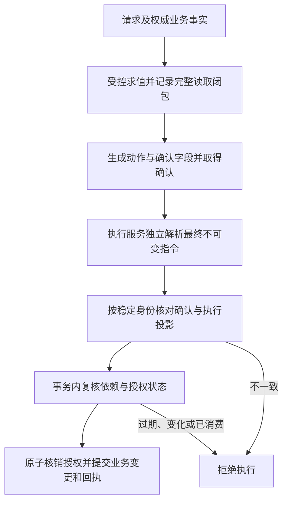

# CSG反诈交易执行控制技术交底草案

日期：2026年9月9日。拟用于中国发明申请的技术评审，含10项权利要求建议。尚未提交申请；未认定新颖性、创造性或不侵权；下述新增机制为待实现与验证的设计。

## 一、发明名称与判断

建议名称：**一种基于语义依赖闭包的交易执行控制方法。**

可以形成一件面向中国申请的候选发明。具体保护对象是授权读取、确认内容和交易提交之间的计算机执行协议。CSG在本稿中指规范语义图；发明名称不必包含CSG，权利要求以图结构、数据关系和执行步骤定义保护范围，避免仅保护名称。

拟解决的技术问题：跨应用调用中，授权时检查的状态可能已经改变，用户确认的收款对象或金额可能与最终指令不同；单独验签或核对请求参数，不能直接证明旧授权对当前执行仍然适用。

候选技术组合为：**完整记录授权的语义读取闭包，包括集合和否定查询；从已批准图与最终执行描述分别提取按精确对象身份对应的关键字段；在同一可串行化提交边界复核依赖、核销一次性授权并改变业务状态。**

已有交易签名、细粒度授权、环境哈希、依赖图和原子事务技术。本稿的具体组合是否具有创造性，需要结合最近公开文本逐项判断，不能凭增加CSG名称得出结论。[CNIPA现行审查指南修订](https://www.cnipa.gov.cn/art/2025/11/14/art_99_202568.html)要求整体分析技术问题、技术手段及技术效果，并将作出贡献的技术特征写入权利要求。

## 二、中国公开文本与已有技术

| 公开文本 | 已核验内容 | 对本稿的约束 |
|---|---|---|
| [CN115996122A，访问控制方法、装置及系统](https://patents.google.com/patent/CN115996122A)，2023年4月21日公开 | 独立项1、10及从属项4、11涉及授权向量、指定请求字段、网关重算授权码与比对放行；同族有WO2023065969A1 | 字段绑定和执行前比对本身已有公开，须比较语义身份对应及授权读取闭包 |
| [CN106506472A，一种安全的移动终端电子认证方法及系统](https://patents.google.com/patent/CN106506472A/zh)，2017年3月15日公开 | 说明书步骤S1至S3及电子签名流程涉及可信显示、用户确认、安全元件签名和服务端验签执行 | 不能把所见即所签作为新增贡献 |
| [CN121706138A，一种金融数据共享安全认证方法及系统](https://patents.google.com/patent/CN121706138A/zh)，2026年3月20日公开 | 独立项1涉及字段规则证明、上下文哈希、联合签名及调用验证后失效的一次性令牌 | 上下文绑定、签名和一次性消费不构成空白领域 |
| [CN121093327A，一种基于多智能体动态权限分级的审计监控方法及系统](https://patents.google.com/patent/CN121093327A/zh)，2025年12月9日公开 | 权利要求1至6涉及原子操作权限、环境哈希、上下文变化回收及防重放 | 环境变化使授权失效也已有公开，须比较具体读取闭包与提交边界 |
| [CN111241590A，一种数据库系统、节点和方法](https://patents.google.com/patent/CN111241590A/zh)，2020年6月5日公开 | 独立项1、5及说明书[0179]、[0185]至[0196]涉及事务提交、重新执行和读写集验证 | 原子事务及读写集校验是已有基础，不单独作为本稿贡献 |

非专利文献也需比较。[RFC 9396](https://www.rfc-editor.org/rfc/rfc9396.html)已经定义支付金额、账户等细粒度授权表达。[早期PCA论文](https://www.cs.princeton.edu/techreports/2001/638.pdf)已有携带证明的Web授权。[Execution-Witness Binding论文摘要](https://papers.ssrn.com/sol3/papers.cfm?abstract_id=6352164)于2026年4月22日发布，提及执行见证绑定、检查与执行时差及持久化一次性标识；本轮未取得全文，不能据摘要认定其没有某项具体机制。

另有CN122528952A的语义关联、字段映射和执行授权线索，本轮未取得可独立核验的中国公开原文，已列入后续检索清单，未作为完成原文对比的文件。

中国申请的新颖性涉及申请日前国内外公开技术；中国实施的权利风险则须另核中国有效权利要求与法律状态。本轮公开检索不是穷尽检索，未取得登记簿及审查档案，不把数据库状态标签当作有效权利结论。

## 三、与现有自有交底的分工

本地《Cheng / Vexa第一批5个核心发明专利技术交底书》的第3项已记载事实根、计划根、证明与回执闭环；第5项已记载AI候选与确定性事实准入。本稿不重复把这些基础命名为新发明，而集中描述运行中授权依据的完整读取、确认至最终指令的字段对应，以及依赖变化时的提交控制。

是否适合单独申请、与已有申请重叠或有可主张的优先权，要以真实提交文本、申请日和权属文件为准。内部交底不能替代正式申请文件，也不能假定新增内容已获早期申请日支持。

## 四、一个可明确实现的实施范围

首个实施例采用同一权威交易服务管理订单、退款、收款账户、授权、撤销和账本；多个Web应用经该服务执行资金动作。服务支持可串行化事务及持久化唯一约束。该范围便于明确证明原子性，不预先声称任意外部银行接口都具备这一能力。

图中的规则限于具有确定输入输出的类型检查、比较、成员查询、否定查询、布尔组合及受控状态转换。全部事实读取经过统一接口；规则不能旁路读取网络、系统环境或未登记的共享状态。时间由权威服务作为显式有效期条件处理。账本写入仅允许由登记的有限动作模式产生，每种模式须封闭声明全部允许业务写入及其参数；模式外字段、额外动作和事后补参均拒绝，无法给出完整效果描述的驱动不接入。

授权核销、集合修订及结果记录属于预先声明的协议控制写入，由执行服务依协议产生，并与用户批准的业务副作用区分。不能借控制记录名义修改未获授权的业务账本，也不要求用户逐项确认这些内部控制字段。

威胁模型允许攻击者操纵网页、替换请求参数、重放旧请求、并发提交或使用过期上下文。权威服务、可信确认组件、部署注册表及其密钥属于信任基础。真实授权下的谎言、签发方串通和该基础被攻陷不由图一致性自动消除。

## 五、数据结构

| 记录 | 内容与作用 |
|---|---|
| 动作记录A | 动作类型、交易域、主体和对象的稳定实例标识、金额与币种等有类型参数、允许的业务状态转换 |
| 事实读取R | 来源、对象实例、字段、类型、规范值及不可回退的修订标识；记录实际分支条件 |
| 查询读取Q | 查询算子与参数、完整查询域、索引或成员集合保护记录、结果及空结果；新增匹配项也能使其失效 |
| 依赖闭包D | 从动作和规则求值沿数据与控制依赖形成的R、Q集合，以及规则、类型及执行适配器的精确实现标识 |
| 确认记录C | 由A生成的确认字段、完整业务动作及副作用描述、其对象对应关系、对A及D的规范承诺、交易域、唯一授权标识、有效期及确认签名 |
| 执行描述E | 权威执行服务从最终待提交指令中独立解析的目标、参数、受影响状态与实现标识；进入验证后不可变 |
| 提交记录T | 授权标识、对应动作、准入裁定时间、前后业务状态标识与结果；与授权核销及实际账本变更共同提交 |

对象身份不能由显示名称、相似文本或地址近似替代。图内可使用分列存储和整数索引，跨机构身份由相应权威域分配并验证。金额采用带币种的整数最小单位或明确精度的十进制，不用二进制浮点近似判断相等。

摘要只绑定规范内容，不自行产生可信来源。依赖从服务已验证的权威存储读取，不接受调用方自报的根哈希作为信任锚。CSGC沿用项目唯一物理格式；业务规则修订不引入另一套CSGC格式或版本协商。

## 六、执行流程

### S101 形成授权闭包

在一致的权威读取视图上求值规则并产生动作A。对每次读取记录实例身份、字段、值及修订；读取派生结果时合并其事实依赖。对“没有未完成退款”等否定条件，必须登记决定查询结果的域和保护记录，不能仅记空结果。

完整而简单的查询实现可为每个租户内相关集合维护修订计数：任何影响该集合的插入、删除及字段修改均在同一事务内更新计数。计数不得回退或发生ABA复用。这可能导致额外失效，但保证不漏掉新记录；更细粒度的谓词范围保护需要另给完整性证明。本稿不宣称得到数学最小依赖集。

### S102 形成确认与授权承诺

由动作A经已登记的类型映射产生必须确认的关键字段，例如收款主体、完整可区分的账户标识、金额、币种及订单。可信确认组件对展示值与规范字段的对应关系进行检查，取得用户或受信任审批主体对同一动作及依赖承诺的确认。

授权载体绑定A、D、执行域、规则与适配器标识、唯一授权标识和有效期。确认签名证明对该记录的确认，不证明业务事实本身真实；依赖的可信性另由来源和权限验证取得。

### S103 独立恢复最终执行语义

最终执行服务从实际将交给账本或受控驱动的描述E中读取字段，根据服务端登记的映射恢复对象实例、参数和状态变化，并与A的确认投影逐项核对。两个投影均覆盖全部业务动作的类型、数量、执行序列、目标实例、业务副作用及所有影响副作用的参数；额外或缺失的动作、字段均拒绝。该投影不得直接复用调用方提交的比较摘要。确认后替换账户、改变金额单位或增加隐藏动作因此不能通过比较。

规范编码明确类型、字段边界、顺序、缺失值和空值。两个投影比较对应的规范值与身份，而非做自然语言相似度判断。执行驱动只接受已检查的不可变E，校验后不得再从可变请求缓冲区补入参数。

### S104 在提交点验证适用性

在新提交路径的可串行化事务内核对D的全部读取、集合保护记录、规则与适配器标识，并核对签名、执行域、有效期和授权未消费状态。首个实施例按确定的记录顺序锁定依赖修订、查询域保护、策略、适配器和授权状态记录，读取当前已提交值或因版本冲突中止；锁保持至提交或中止。所有影响这些记录的修改使用相同事务规则，避免复核后再改变依赖而未被发现。

有效期约束的是授权准入裁定时间。获取全部所需锁、完成其他检查后，在业务变更前读取权威时钟t，要求t处于授权时间窗内，并将t作为成功事务的裁定记录共同提交。授权状态锁持续持有，使该裁定与撤销具有一致顺序；事务中止则该裁定不生效。本实施例不承诺磁盘持久化或外部响应必在时间窗截止前完成，不能把等待前的检查时间当作本次裁定时间。

相关依赖变化使旧授权不能提交，必须基于当前状态重新求值，并在当前有效策略允许时重新取得有权主体的确认，不能用旧确认自动续发授权。未参与D的其他状态变化不因全局根不同而自动使其失效，但提交时仍须完整核对D。撤销与交易提交竞争同一授权状态记录的锁或等价条件更新，撤销事务持久提交后才返回撤销完成。由此，撤销先完成则阻断后续提交，交易先完成则只能记录后续撤销，不能宣称取消已完成交易。

### S105 原子核销与业务执行

在上述事务中，核销唯一授权标识、更新实际业务账本、记录结果T，三者共同提交或共同不生效。相同授权标识的并发请求至多一个提交。

收到重复请求时，先验证请求身份、结果查询权限、执行域及原动作绑定。已有匹配的已提交记录时，仅查询该记录并返回历史结果，不重跑新提交路径，不因授权已消费而再次扣款；没有已提交记录才进入S104。标识相同但动作不同的请求拒绝。原授权后来失效不改变历史事实，但历史结果的访问仍受当前查询权限控制。

所有能改变所保护业务账本的入口均由执行服务控制。网页、批量任务及管理员接口不能持有绕开服务直接付款的权限。缺少必要证据、执行映射不被信任或不能确认原子提交能力时，拒绝该动作。

本实施例中的实际业务状态是权威服务管理的资金账本或退款账本。若外部支付系统只接受普通HTTP请求，向本地队列写一条消息并不等于实际扣款原子完成。要扩展保护范围，须在外部执行端接入同等验证和条件提交协议；该部分目前列为进一步设计项。

## 七、权利要求建议，共10项

### 权利要求1

一种基于语义依赖闭包的交易执行控制方法，由具有业务状态提交权限的计算机执行服务实施，其特征在于，包括：

获取以具有稳定实例标识的对象节点、动作节点以及数据依赖和控制依赖关系表示的规范语义图，在受控事实读取接口下求值所述动作节点的授权条件，生成动作记录及授权读取依赖闭包；其中，所述动作节点属于预先登记并封闭声明允许业务写入及其参数的有限动作模式，所述依赖闭包包含对象字段读取和决定集合查询或否定查询结果的查询域保护记录；

根据所述动作记录生成供确认的字段及其对象对应关系，取得绑定所述动作记录、依赖闭包、执行域和唯一授权标识的确认记录；

由所述计算机执行服务从最终待执行的不可变执行描述中独立提取执行投影，并与所述确认记录绑定的动作投影逐项比较，其中两个投影均包括全部业务动作的类型、数量、执行序列、对象实例标识、业务副作用及决定所述业务副作用的全部参数，存在额外或缺失动作、字段时判定为不一致；

在所述比较一致时，于可串行化事务内验证所述依赖闭包的对象字段读取和查询域保护记录仍然适用，并验证所述确认记录的有效性和所述唯一授权标识未被消费；

仅在验证通过时，于所述事务中共同提交所述唯一授权标识的消费状态、依据所述不可变执行描述产生的业务状态变更以及对应结果记录；在比较不一致、依赖闭包不再适用或授权验证失败时，拒绝所述业务状态变更。

### 权利要求2

根据权利要求1所述的方法，其特征在于，所述对象字段读取记录至少包含权威来源、稳定实例标识、字段标识、数据类型、规范值及不可回退的修订标识；所述两个投影的对应字段按相同身份、类型及明确数值单位进行规范值比较，不以对象显示名称或文本相似度确定对象相等。

### 权利要求3

根据权利要求1所述的方法，其特征在于，所述查询域保护记录包括查询算子、查询参数及查询域的集合修订记录，影响所述查询域的插入、删除或字段修改与所述集合修订记录的变化在同一事务中提交，以使原为空的查询出现匹配项时，基于所述空结果形成的旧授权不能通过依赖闭包验证。

### 权利要求4

根据权利要求1所述的方法，其特征在于，由受信任确认组件根据所述动作记录及登记的类型映射生成关键字段的展示内容，检查展示内容与规范字段的对应关系，并对绑定所述动作记录、依赖闭包、执行域、唯一授权标识和有效期的记录取得确认签名。

### 权利要求5

根据权利要求1所述的方法，其特征在于，所述依赖闭包进一步绑定规则求值器、类型定义及执行适配器的精确实现标识；执行字段从实际交给受控驱动的不可变执行描述中提取，且所述受控驱动在验证后仅以该执行描述的已核验字段执行，不从可变请求中补入参数。

### 权利要求6

根据权利要求1所述的方法，其特征在于，授权撤销与业务状态变更竞争同一授权状态记录的排他锁或条件更新，并在撤销事务持久提交后返回撤销完成；获取全部所需锁并完成其他检查后，在业务变更前取得处于授权时间窗内的权威准入裁定时间，并将其随业务状态共同提交；相关依赖或撤销状态变化导致旧授权拒绝提交，重新授权须基于当前状态及有效策略求值并重新取得有权主体的确认。

### 权利要求7

根据权利要求1所述的方法，其特征在于，所述业务状态的全部可生效修改入口被限制为经所述计算机执行服务提交，调用应用及后台任务不具有绕过所述计算机执行服务直接修改该业务状态的权限。

### 权利要求8

根据权利要求1所述的方法，其特征在于，所述唯一授权标识由持久化唯一约束限定，相同标识的并发请求至多一个完成提交；在进入新的事务提交路径前，验证请求身份、结果查询权限、执行域和原动作绑定，存在匹配的已提交结果记录时仅返回所述历史记录，不再次实施业务状态变更；标识相同但动作不同的请求被拒绝。

### 权利要求9

一种电子设备，包括存储器及处理器，其特征在于，所述存储器存储计算机程序，所述程序由所述处理器执行时，实现权利要求1至8中任一项所述的方法。

### 权利要求10

一种计算机可读存储介质，其上存储计算机程序，其特征在于，所述程序被处理器执行时，实现权利要求1至8中任一项所述的方法。

## 八、实施例与待验证技术效果

例如，平台退款动作绑定原订单、原付款账户、允许退款金额以及“没有已完成或处理中重复退款”的条件。页面确认退款100元至原账户；执行前，新建了一条匹配该订单的处理中退款记录。虽然页面字段和原签名没有改变，集合保护记录已变化，旧授权必须被拒绝。若攻击者仅替换执行账户，则独立执行投影先行拒绝；两个相同请求并发提交时由同一事务约束阻止重复退款。

以上金额和状态为设计示例，不是实测业务数据。计划验证：

| 验证场景 | 应观察的结果 |
|---|---|
| 批准后替换账户、金额或币种 | 无对应业务状态变更 |
| 否定查询后插入新匹配记录 | 旧授权失效，不能因旧结果为空而放行 |
| 规则或适配器变化 | 旧执行合同不能继续使用 |
| 同标识并发、超时重试与重启恢复 | 至多一次实际状态变更，结果可查询 |
| 撤销与提交并发 | 按权威顺序产生唯一可解释结果 |
| 等待锁期间授权过期 | 按获取锁后的准入裁定时间拒绝，不能使用等待前的检查结果 |
| 修改已证明不属于依赖闭包的数据 | 不仅因全局根变化使授权失效，D仍须通过复核 |
| 校验后尝试修改执行缓冲区或绕过入口 | 描述不可变或权限拒绝，不能进入业务账本 |

对照应至少包括交易字段签名、全环境哈希失效、仅记录已返回对象的依赖校验。比较错误接受、错误拒绝、依赖读取量和提交开销；冻结源码、部署合同和负载后记录结果。本稿没有实测性能或诈骗减损百分比，不将商业计划书中的情景数字写为专利技术效果。

## 九、申请路径及尚需补齐的内容

以一件中国发明、10项权利要求组织初稿，保持一个共同技术构思。先完成最近中国公开文本和论文的逐项特征对照，取得CN122528952A及执行见证论文全文，比较数据库谓词冲突检测等基础；再结合真实实现确定区别特征和技术效果。现有五件交底的正式提交文本也需纳入重叠检查。

若技术方案具备充分公开条件，可安排中国申请。存在海外业务需要时，通常在首次申请日起12个月内评估要求该优先权的PCT国际申请；新增内容是否享有优先权另按首次申请披露判断。PCT是申请程序，各国或地区分别审查授权。中国完成的发明向外申请还需履行相应保密审查程序。[CNIPA PCT说明](https://www.cnipa.gov.cn/art/2023/9/18/art_372_187624.html)、[专利法实施细则第八条](https://www.cnipa.gov.cn/art/2023/12/21/art_98_189197.html)

说明书及权利要求最终应符合清楚、完整、能够实现且得到支持的要求；申请人、自然人发明人和权属按真实贡献与协议确认。[专利法第二十二条、第二十六条](https://www.cnipa.gov.cn/art/2020/11/23/art_97_155167.html)
