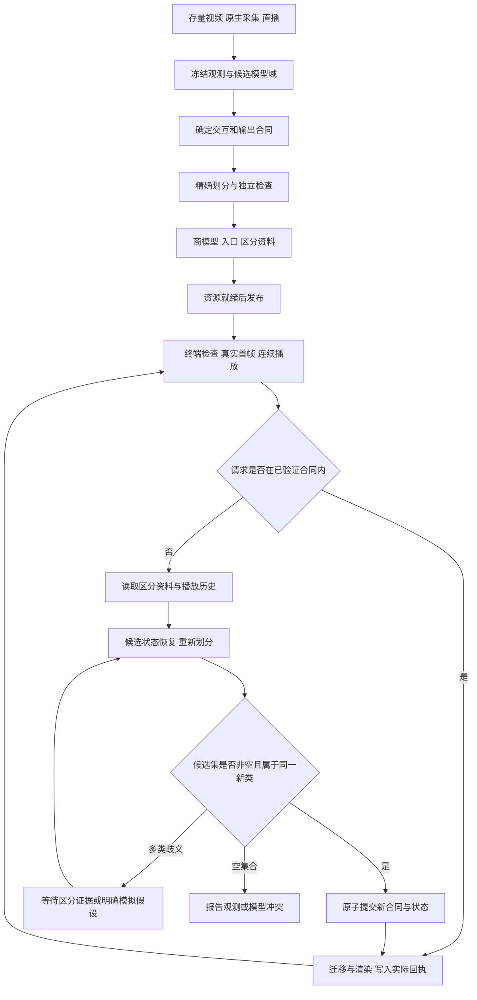

# CSG世界视频按交互契约编码与恢复开发方案

2026年9月17日。设计稿，尚未实现本方案新增的软件功能。

## 1 选定路线

把世界视频编译成“对指定观看和操作足够用的世界程序”。编码时合并在允许操作下始终产生相同规定输出的状态；改变视角、查询隐藏属性或增加物理操作时，恢复被合并的区别，再允许执行。交互能力成为编码的输入条件，而不是先任意丢信息、再让生成模型补齐。

新路线的技术中心是：交互契约、可验证状态合并、可恢复的区分记录、播放历史约束下的状态细化、能力与状态同时切换。它区别于旧稿的“恢复依赖与观测补偿共同校验”，但仍复用CSG身份、字节绑定和回执。CSG在本文指项目既有语义事实与执行体系，不把所有几何强制改成构造实体几何布尔树。

双模拟、状态最小化、按需细化及证明检查都有现有技术。本方案只把下面的完整媒体处理组合列为候选发明，尚不能认定有创造性或已排除侵权。对应交底稿为[10项权利要求及说明](patents/csg_interaction_quotient_invention_disclosure.md)。

## 2 六个核心功能如何兑现

| 核心功能 | 新机制 | 验收边界 |
|---|---|---|
| 存量视频转为世界视频 | 源样本与对象、时间和候选状态绑定，按目标交互编译世界程序 | 所有可解析视频可进入观测层；只有证据和模型支持的范围可交互。格式包装不算世界转换成功 |
| 紧凑表达 | 程序与资产复用，加上契约下的状态商模型和按需区分包 | 分开报告世界模型约简、在线传输与归档总量，不能用状态数量比冒充视频字节压缩比 |
| 快速发布和首帧 | 预生成指定入口的完整商状态、程序和输出资源集合；资源就绪后提交版本 | 转换不计入“瞬时发布”；从冷端请求到真实帧上屏计时，首帧必须属于所选合同 |
| 视频变成游戏 | 原模型支持的动作先求证能否在当前商状态执行，必要时细化后提交 | 真实状态迁移和连续渲染，不用图片平移冒充物理执行；新动作不靠猜测隐藏状态 |
| AI直接查询与操作 | 查询和动作属于同一有类型的合同，结果绑定源证据、分支和状态 | “图中看不出质量”保留未知，权限另行验证，模拟结果不写回拍摄事实 |
| 原生拍摄和直播 | 标定观测及资产状态进入同一模型；新证据形成新模型世代和入口 | 多源时钟、迟到和修订有边界；旧证据不能被新解释覆盖，超预算不静默抽帧 |

所谓千倍压缩保留为有条件的实验目标：有大量可复用程序和资产、且允许交互较少的内容可能收益较大；摄影纹理、噪声、复杂流体或自由视角会显著限制约简。保留完整源视频后，归档总量通常增加，不能声称已把原片整体压成千分之一。

## 3 数据结构与算法

### 3.1 模型与合同

冻结有界模型M，包含状态域S、状态迁移T、输出函数O、单位、数值规则、资产版本及终止行为。S可以由有限位宽程序生成，首版限制为有限状态、有限动作和有界时间；不使用任意神经网络的近似距离证明等价。连续物理只按明确离散模型验证，不能外推成连续真实世界精确性。

合同K规定动作集合、动作参数域、可观察字段、相机和输出分辨率、音频范围、时间域及确定性输出版本。只验证标签相等的合同不能宣称画面相等。要保证图像字节相等，输出函数必须覆盖固定渲染器的实际像素和音频字节；渲染命令相同只能在相同确定性执行合同下推出相同输出。

对状态s与t，合并条件为：规定输出相同，每个动作的可用性相同，而且该动作的后继状态仍属于同一等价类。禁用动作也有明确结果；不能通过省略失败情况得到假等价。随机性、控制器历史、剩余时间等未来可读量须进入状态；首版不覆盖没有封闭输入模型的开放随机系统。

### 3.2 精确构造

先按输出和动作可用性划分S；以每个动作的后继分区号进一步分裂，直到没有分裂。有限状态上该过程终止；对确定性有限模型得到该合同下的最粗稳定划分，而不是全产品全成本最优编码。实现采用反向边、分裂工作队列和精确字段比较；哈希只能加速索引，碰撞时核对规范字节。

首版独立检查器直接重算：分区是否无交叠覆盖S，所有状态的输出是否与所属类一致，每条允许迁移是否落到规定后继类。检查复杂度至少随被验证状态和边增长，不假定证书一定短。大规模符号证明只有在加入确定的证明语言与检查器后才能使用；验证耗时和证明体积计入首开成本。

程序表示与状态合并是两个压缩来源。若区分映射、程序、证明、入口和素材的总字节更多，编码结果记录无收益；不得隐去这些开销。发布端保存完整区分资料，终端可以按请求取回；这减少首次传输不等于减少系统总存储。

### 3.3 逻辑记录

| 记录 | 必须绑定的信息 | 作用 |
|---|---|---|
| InteractionContract | 世界版本、动作及参数域、输出、数值与时间合同 | 明确哪些行为已验证 |
| WorldProgram | 有限域、迁移程序、输出程序、精确资产引用 | 生成可检查状态与真实动画 |
| QuotientPartition | 状态到类的映射、类输出、动作到后继类 | 终端执行当前合同 |
| RefinementCatalog | 原类、可恢复状态域描述、区分字段、精确资源索引 | 能力扩张时找回区分信息 |
| EntryCapsule | 时间、当前类、初始候选集、完整入口资源与历史锚点 | 跳播、中途加入和恢复 |
| InteractionHistory | 实际动作参数、顺序、旧合同、呈现签名、外部证据引用 | 恢复时保留历史约束 |
| RefinementCommit | 新合同、新划分、候选状态集合、映射检查、分支和状态 | 整组切换，禁止能力与状态错配 |
| ExecutionReceipt | 前后版本、实际消费资源、执行与上屏结果、失败原因 | 工程符号落地与复核 |

记录使用现有CSG规范编码与根算法，不新造第二个Merkle根体系。进程内使用Arena和SoA，精确身份映射为int32索引；不靠显示名称、源码行或指针识别对象。以上为拟议扩展，不能把这些新字段直接塞进已冻结v0.1并称互操作通过。

### 3.4 增加交互时如何恢复

收到新请求K′，先检查权限、同一模型域及当前类是否仍满足新合同。只有新增动作或输出、且模型域相同的扩张才走本次细化；修改物理规律、延长模型边界或新增未知资产是新模型版本，不能借用旧证明。

对不满足的类读取区分包。由入口候选集L0开始，顺序重放已实际发生的动作，并按照有效的外部观测及当时规定输出筛选，得到当前候选集Lt。动作历史不能被当成新的质量测量；模拟输出也不能用来证明未观测物理属性真实存在。

按新合同重新划分相关候选状态及其迁移闭包。检查每个新类只映射到一个旧类，并检查旧动作和旧输出保持一致。新分裂沿反向迁移传播，直至闭包稳定；不能只细化屏幕中被点到的物体，遗漏之后会受影响的状态。

若Lt非空且全部落入同一新类，原子提交新合同、入口、分区和当前类，随后执行请求。原划分已满足新合同时使用恒等映射，仍需检查并整组提交新合同。若跨越多个新类，则保留歧义并暂停该新请求，展示可以补充的证据或明确的模拟假设选项。只有具有实际区分力且版本有效的证据才能筛选状态；用户选择假设时建立模拟分支，不将选中参数写成原片事实。Lt为空、资源缺失或检查超预算分别报错，不任意选代表状态。

## 4 全链流程

流程中的等待是所请求能力尚未满足，不能作为成功、自动降级或静默回退。产品可以继续处理独立的已授权请求，但不得把旧画面返回为新视角的结果。

## 5 现状与实施顺序

已读到的现有模块为src/game/assets/semantic_video/下的schema、writer、reader、validator、svtime和clockmap。已有任务记录了B1编解码、负例、时间与独立解码通过；生产入口B3与实采C1仍未完成。现有结构验证不等于本方案的行为等价验证，本轮没有重跑旧测试。

以下为工程估算，不是已经完成的排期承诺。按2名熟悉Cheng与图算法的核心开发者、1名媒体与测试工程师部分投入估算，合计54至81人日，日历约8至12周；若编译器、媒体或渲染前置条件不成立，单列阻塞，不通过改语言或不严谨替代方案假装打通。

| 阶段 | 拟议文件与行动 | 验证 | 完成条件 | 人日 |
|---|---|---|---|---|
| A 模型冻结 | docs/specs/csg-world-interaction-contract-v0.1.md；限定状态、动作、输出及错误语义 | 有限性、跨端数值、旧v0.1兼容边界评审 | 合同与模型边界可判定 | 4至6 |
| B 合并核心 | src/game/assets/semantic_video/interaction/{model,partition,check}.cheng；SoA、反向边与精确分裂 | 原模型和商模型所有允许迁移、输出逐项对拍；注入漏边与错类 | 独立检查器能拒绝不可靠合并 | 10至14 |
| C 存量接入 | interaction/{observation_bind,compile}.cheng；接真实解复用与模板资产，生成证据锚点 | 冻结真实源片、标定、遮挡及尺度反例；不支持能力明确失败 | 至少一个实拍有界刚体片段变成可操作模型 | 9至14 |
| D 发布首开 | interaction/{capsule,publish,open}.cheng；完整入口与不可变资源发布 | 两台终端冷缓存，首帧真实上屏、音画同版，随机跳播 | 完整数据成本和首开报告 | 7至10 |
| E 扩张与游戏 | interaction/{history,refine,commit}.cheng；历史重放、细化闭包、原子切换 | 隐藏质量、遮挡几何、历史重入、权限变化与断包 | 新交互不猜状态，模拟分支可重复连续运行 | 10至15 |
| F 直播与原生资产 | interaction/{live,asset_bind}.cheng；复用时钟、新世代及资产版本 | 乱序、迟到、源重启、标定更新、真实资产动作 | 录播和直播复用同一检查与播放入口 | 8至12 |
| G 产品与专利冻结 | docs/campaigns/.../acceptance；基准、失败集、权项到代码表及FTO复核 | 性能、语义、物理模型和全字节成本四类结果 | 仅对实测覆盖范围发布结论 | 6至10 |

首个可评审产品节点是E：真实源片、完整可见首帧、连续动态渲染、至少一个改变状态的操作、一次需要解封区分信息的新操作，以及不能确定时的真实拒绝。只有标签、播放器外壳或数学小例子均不算世界视频产品完成。

## 6 验收与内存约束

拟定的首个性能试验条件为720p、30fps、10秒刚体片段、1至2个可交互对象，固定终端型号及软件哈希，100Mbps链路、30ms往返延迟、冷缓存30次。希望达到发布就绪后首帧p95不超过1秒、已就绪合同内交互呈现p95不超过100毫秒。它们是待验证目标，新增合同的细化延迟单列，不混入热请求。若失败，保留原目标和实测瓶颈。

发布计时从必要资源全部生成且上传校验结束到版本可发现；另记录源文件输入到完整转换完成。首帧计时从终端发起打开到所选时间点真实图像上屏；已预装依赖及首次使用下载量分别列出。

字节账单包括原片、可执行程序、资产、观测补偿或保真轨、商模型、映射、区分包、证明、索引和发布开销。分别给出归档总量、终端首次传输、一次能力扩张传输、原模型与商模型的同能力表示比。源视频与世界渲染的质量不同就不能报同质量压缩比；状态数量减少千倍也不能标视频压缩千倍。

反例至少覆盖：当前画面相同但第二次操作不同；合同只含标签却宣称像素等价；缺随机状态；未定义动作被漏检；分裂未传播到前驱；循环后从旧类任取代表；新视角需要被遮挡几何；质量未知仍施加力；更换输出器复用旧证明；两版本交错提交；新证据令候选集为空。每个反例必须失败于指定检查阶段。

逐相内存模型使用项目唯一约束卡，不另设宽松门。阶段A解析为当前记录窗口与规范化字节；阶段B为N状态、E迁移、N个分区号、反向CSR与分裂队列，目标O(N+E)；阶段C为有限解码帧窗、模型工作区和输出资源；阶段D为当前入口、验证工作区和有界网络缓冲；阶段E为旧状态、新状态及提交前短时双驻留；阶段F为有限源队列与时钟映射。不得隐藏证明生成器、驱动、GPU上传或子进程贡献。

本轮文档改动对生产运行内存增量为0。实施时按实际字段宽度和最大N、E钉定每一模型项，未定项不能填0。逐相RSS与模型差超过50MB必须解释，总峰不超过768MiB、各相贴线且退出码为0三条件同时成立；不能抬门获得通过。复杂度爆炸或证明超预算属于失败边界。

## 7 专利主线与边界

拟独立权利要求保护“带区分资料的契约约简媒体包，在新请求时利用入口和真实播放历史恢复候选状态，再以新合同的可区分性控制原子切换”。字节压缩比、秒开指标、CSG商标、哈希或Merkle名称均不作为必要创新点。

新权项与旧稿区别在被校验的对象：旧稿校验某补偿或计算结果能否复用；新稿校验已丢弃的状态区别是否会影响新请求，并控制如何取回。与核心根专利的关系是使用基础能力，与符号落地稿的关系是一个具体媒体执行机制。是否构成独立可授权改进，须以正式在审权利要求及既有公开文本再比对，不能只因应用名称不同下结论。

本轮新发现与旧审查共存：CN109584343B比仅含污染列表的理解更广；CN118196277A仍直接涉及视频转三维再交互。选用本路线不会自动消除重建、渲染或资产组件的侵权风险。完整资料及逐项边界在交底书附录和本任务findings.md中。

保护范围只能落在有支持的技术组合上。他人可能通过预传完整世界、固定交互、直接像素流或其他建模算法达到相近体验；本方案不能诚实承诺“任何世界视频都绕不过”。
