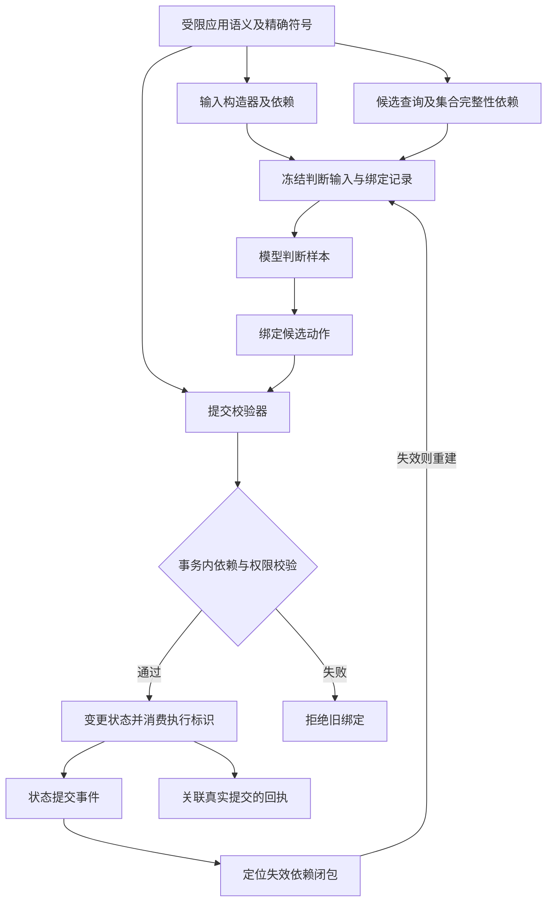

# CSG 决策依据与状态提交连续绑定：发明交底初稿

日期：2026-09-21。状态：研究草案，未申请；不是授权、有效性或自由实施法律意见。本文件仅写入本地工作区，不代表对外发布。拟按中国发明专利准备，其他法域尚未分析。

## 1. 当前判断

候选名称：**一种由同源语义合同生成判断依赖与提交条件的计算机交互执行方法**。

独立的统一图、版本校验、依赖失效、执行前授权均不足以被认定为创新。优先研究的组合是：由受限应用语义同时生成模型输入构造器、候选集查询及完整性依赖、动作提交校验器；异步模型结果携带这些依赖的绑定；状态变化时按其依赖验证或失效；最终在同一受控事务边界验证和提交。创造性尚待逐项检索及实现证明，不能宣称无法绕过。

这里的完整性是“覆盖模型实际输入构造和候选查询所需的系统依赖”，不是识别模型脑内的真实推理原因，更不是证明模型语义正确。

## 2. 技术问题与最小反例

场景：原生应用中，用户要求选择符合描述的一条记录并修改状态。模型在冻结候选集上判断，推理期间其他事务更新页面数据。

- 对象替换：原槽位的对象被删除重建，旧索引可能命中新对象。
- 查询幻读：模型最初看到 A、B；推理期间新增更符合条件的 C。A、B 自身版本均未变化，单纯验证已读对象无法发现候选集已变。
- 隐藏依赖：候选筛选规则、排序、权限、目标参数、模型输入格式变化，但旧结果仍被复用。
- 校验竞争：验证完成到真正提交之间发生状态改变。

要同时抑制过期决策执行与不必要重推理。目标效果是减少无关更新导致的推理次数、缩短任务延迟，同时拒绝相关变更导致的过期提交；所有效果目前未测。

## 3. 拟议技术方案

### 3.1 限定可检查语义

首个实施例支持有限对象集合、带精确身份的字段读取、受限谓词查询、确定性排序、显式动作前后条件。查询、输入构造器与动作合同有共同的声明来源和精确符号关联。任意 handler、隐式外部 I/O 或未建模时间输入不在范围内；发现缺失依赖即拒绝该动作进入本机制。

不从自然语言描述猜读写集，不从注意力权重、解释文本或模型自行报告推断依赖。不承诺对任意程序求最小依赖，这是另一个不可泛化的问题。

### 3.2 同源生成三类产物

1. 输入构造器：按冻结目标与证据规则生成模型实际输入，记录其全部数据读取以及控制依赖。
2. 候选查询与依赖描述：记录候选身份及参数，同时记录影响集合成员资格、数量、顺序的查询依赖。不能只记录查询返回对象；插入、删除和谓词相关变更必须可检测。
3. 提交校验器：验证动作所用判断的输入绑定、候选引用、当前授权、生命周期与前置条件，校验逻辑与前两类产物共享原始语义定义。

第一可实现版本可使用受影响集合的精确单调版本作为集合依赖：它可能使无关字段变化也失效，但不漏掉相关变化。更细粒度谓词范围依赖须单独实现与验证；不声称一开始实现最小失效集合。既有产品首版整快照失效合同继续有效，本研究不静默替换冻结合同。

### 3.3 判断绑定记录

拟议记录含：目标和合同身份、对象身份及世代、输入构造器身份、模型/分词器/校准工件身份、解码或采样配置、完整候选及顺序、字段版本依赖、查询成员资格依赖、判断结果身份。记录须覆盖真正送入模型的全部输入；上下文包含整页则整页属于依赖，不能为了复用只登记选中的对象。

固定模型和输入不保证随机推理重跑得到相同样本。复用合同定义为“保留同一已生成的判断样本”，不是“必然等于重新采样”；若需比较数值一致，必须固定可复现执行条件。判断仍为概率类型，授权不能来自置信度。

### 3.4 依赖验证、世代迁移与提交

收到状态提交事件后，利用反向依赖索引定位受影响判断。每个准备执行的结果还必须在提交事务内验证权威依赖版本，以防事件延迟、丢失或乱序。事件索引只减少工作，不能签发有效性。

若相关依赖不变，可通过 canonical identity 在新快照重新解析对象并建立新绑定；绝不把旧 int32 索引直接带入新世代。相关依赖变化则旧结果无效；依赖闭包内节点按拓扑重新求值。授权是否仍有效须另行检查，不能由输入未变推出。

在原生状态存储的可串行化事务内，完成依赖与权限校验、动作变更及执行标识消费。校验失败不产生该动作副作用；事务成功后产生与该提交关联的回执。推理不持有长事务锁。外部系统仅在它自身提供相应条件提交边界时可继承此保证，系统点击本身不具备该能力。

### 3.5 保证与非保证

在依赖完整、版本可靠、权限可验证且所有写入受同一事务系统管控的假设下，拟证明：每次提交所消费的判断样本，其受保护依据与当前动作绑定一致。尚未完成形式证明。

不证明用户目标解释正确，不证明模型选择最优，不证明未知外部世界没变化，不将接受请求当成完成。外部结果未知继续使用 UnknownOutcome，禁止盲目重发。

## 4. 权利要求技术骨架（非正式法律文本）

候选独立方法项拟包含以下相互作用的步骤；是否全部保留，应由检索结果与实际技术贡献决定，不能简单堆特征缩窄保护：

1. 取得包含对象、查询、动作约束及其关联关系的受限应用语义表示。
2. 基于该表示生成判断输入构造器、候选查询的字段与集合成员资格依赖描述以及动作提交校验逻辑。
3. 对一状态版本构造模型输入与候选集合，建立覆盖实际输入、候选完整性和模型配置的绑定记录，关联模型返回的判断结果。
4. 在状态变更后依据依赖描述判断结果有效性；有效时重新绑定当前对象身份，失效时重求值受影响节点。
5. 在受控状态提交事务内依据生成的校验逻辑验证结果绑定、候选动作和当前授权，并在通过时执行状态变更，关联产生提交回执。

从属项储备：精确对象世代与跨世代重绑定；查询插入/删除引起的幻读检测；固定样本复用合同；模型/输入工件版本失效；反向依赖索引与提交时权威复验的配合；受控事务回执与下一轮观察的绑定。只有取得实质贡献与说明书支持后才考虑独立保护或分案，不预设必须申请多件。

装置、电子设备、存储介质或计算机程序产品的对应项由代理师按实际实施例转换。没有必要的情况下，不把 Cheng 名称、Jev 名称、int32、某种哈希、SoA 或单一物理调度线程写成独立项限制；它们可作为实施方式。技术关系必须具体，不能只写“确保一致性”等效果目标。

## 5. 现有技术与绕开分析

详见 [逐项对照与实验](invention_validation.md)。当前最大的创造性风险是：同源代码生成、增量计算和可串行化事务的已知组合是否已经给出足够技术启示。增加“用于大模型”不能单独化解该风险。

可能绕法包括全量重算、长事务锁定、手工依赖声明、运行期访问跟踪、独立执行网关及分布式提交。它们不一定成本更高；必须实测，不能把产品自己的唯一执行入口当成行业必须使用本专利的证据。换语言或换模型不改变技术关系，也不能据此直接断言侵权，仍须逐项比对权利要求。

## 6. 源码基础与缺口

本轮阅读确认 `src/core/runtime/csg_decision_contract.cheng` 已有节点、候选、世代和分型结构，`src/inference/decision_validate.cheng` 有引用与概率合法性校验；并未在本轮运行测试。共享台账中的既有实现进度保持原样。

本交底新增研究点仍缺：从语义到输入/查询/校验的实际同源生成链、完整查询依赖及幻读验证、绑定样本跨世代复用协议、与真实状态事务的不可分割接线、相应证明与实测。现有类型字段和 smoke 不能填充这些缺口。

## 7. 申请准备边界

- 本轮仅完成技术交底草稿和检索线索；未做完整中外同族检索、审查档案分析或自由实施调查。专利是否可申请与产品是否侵犯他人专利是两个问题。
- 核对首次申请/优先权、每项特征首次公开时间、Git 公共可达时间、文章和演示及贡献者记录。提交时间不是公开时间，私有仓提交也不自动构成公开。本轮不改变仓库访问设置、不提交或推送文件。
- 申请前公开可能影响新颖性；例外须按法定条件核实，不能假定有普遍六个月宽限期。说明书要达到可实施程度，不必把“等所有实验做完”误作申请的法定前置。[专利法第二十二、二十四、二十六条](https://www.cnipa.gov.cn/art/2020/11/23/art_97_155167.html)
- 记录自然人对实质技术特点的实际创造性贡献；本草稿不能代替发明人认定。算法贡献需与具体技术问题、技术手段和技术效果对应。[2025 年指南修改解读，2026 年施行](https://www.cnipa.gov.cn/art/2025/12/4/art_66_202935.html)

本轮只增改 Markdown，各产品运行相内存增量为 0；后续实验需按唯一内存约束卡钉实，禁止用未知值充零。
