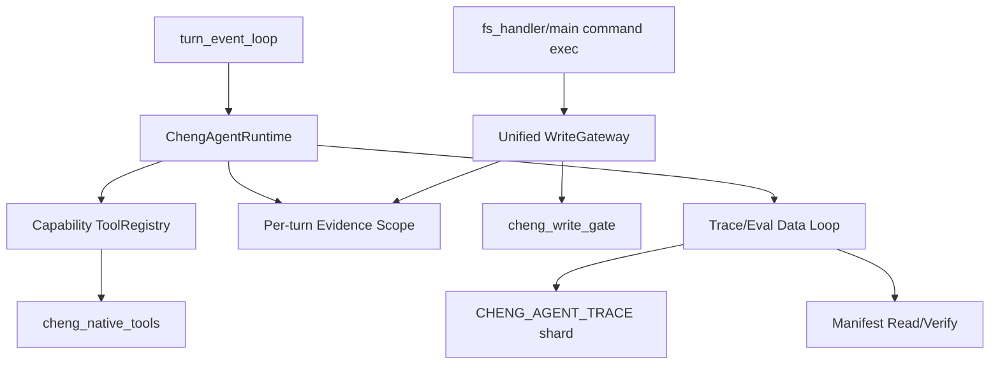

<!-- 7e34aa98-00f1-4001-b82c-b7e5d6eb5418 -->
---
todos:
  - id: "agent-runtime"
    content: "Add ChengAgentRuntime per-turn core and integrate with turn_event_loop tool injection/completion"
    status: completed
  - id: "tool-registry"
    content: "Introduce capability-based native ToolRegistry while preserving current handler API"
    status: completed
  - id: "write-gateway"
    content: "Centralize fs and command mutation gating through a unified WriteGateway"
    status: completed
  - id: "data-roundtrip"
    content: "Implement CHENG_AGENT_TRACE manifest/shard readback, verification, and JSONL export from storage"
    status: completed
  - id: "evidence-scope"
    content: "Add per-turn evidence scope and attach evidence snapshots to trace/eval records"
    status: completed
  - id: "runtime-smokes"
    content: "Add production core smokes for routing, gating, trace verify/export, and eval metadata"
    status: completed
isProject: false
---
# Cheng Agent Core Completion Plan

## Scope
本轮交付目标是 `production_agent_core`，不是先做完整 UI 产品壳，也不是优先推进 TS->Cheng 全量转换。完成后应具备：AgentRuntime 主循环、正式 ToolRegistry、统一 WriteGateway、per-turn Evidence/Data Loop、manifest/shard 读取校验、可回放 eval 元数据、核心 smoke/eval。

## Current Integration Points
- 主模型/工具循环在 [`codex/src/app_server/turn_event_loop.cheng`](/Users/lbcheng/cheng-lang/codex/src/app_server/turn_event_loop.cheng)：已接入 `ChengAgentRuntimeBeginTurn`、工具注入记录、native tool completion 记录、成功/失败 finalize。
- 原生工具在 [`codex/src/app_server/cheng_native_tools.cheng`](/Users/lbcheng/cheng-lang/codex/src/app_server/cheng_native_tools.cheng)：tool specs、role allow、handler kind 都从 capability registry 生成，保留 `ChengNativeIsTool` / `ChengNativeHandleToolCall` API；native dispatch 只消费 registry handler kind。
- 写入门禁在 [`codex/src/app_server/fs_handler.cheng`](/Users/lbcheng/cheng-lang/codex/src/app_server/fs_handler.cheng) 和 [`codex/src/app_server/main.cheng`](/Users/lbcheng/cheng-lang/codex/src/app_server/main.cheng)：fs 写路径已走 before/after gateway；command mutation 已走 before gate，并在 blocking/stream completion 记录 after；成功写入会生成结构化 post-write validation requirement。
- 证据和 Data Loop 在 [`codex/src/app_server/cheng_evidence_ledger.cheng`](/Users/lbcheng/cheng-lang/codex/src/app_server/cheng_evidence_ledger.cheng) 与 [`codex/src/app_server/cheng_training_trace.cheng`](/Users/lbcheng/cheng-lang/codex/src/app_server/cheng_training_trace.cheng)：已有 per-turn evidence scope、manifest/shard 回读校验、JSONL export；native trace/eval 缺省 evidence 时会挂当前 runtime snapshot；AgentRuntime finalize 在配置 trace out dir 后自动写 `agent-runtime` manifest/shard。

## Current Progress
- 已完成：AgentRuntime 核心、registry-owned native routing、统一 WriteGateway、结构化 validation requirement、manifest/shard 读取校验、JSONL export、runtime finalize 自动 trace 持久化。
- 已验证：`CHENG_BIN=/tmp/cheng_backend_current bash codex/support/run_cheng_native_auto_fusion_smoke.sh` 通过，输出 `real_backend_codegen=1` 与 `rust_csg_cheng_native_auto_fusion_smoke ok`。
- 已验证：`CHENG_BIN=/tmp/cheng_backend_current OUT_DIR=/tmp/app_server_main_agent_core_verify bash codex/support/run_app_server_main_smoke.sh` 通过，输出 `rust_csg_app_server_main_smoke ok`。
- 已验证：`CHENG_BIN=/tmp/cheng_backend_current OUT_DIR=/tmp/app_server_turn_event_flow_agent_core_verify_after_gate bash codex/support/run_app_server_turn_event_flow_smoke.sh` 通过，输出 `rust_csg_app_server_turn_event_flow_smoke ok`。
- 已验证：`CHENG_BIN=/tmp/cheng_backend_current OUT_DIR=/tmp/current_smokes_agent_core_skip_mcp JOBS=4 CURRENT_SKIP_MCP=1 bash codex/support/run_current_smokes.sh` 中 agent-core 相关 `app_server_main`、`app_server_turn_event_flow`、`cheng_native_auto_fusion` 均通过；聚合结果 `375 total, 374 pass, 1 fail`。
- 非 core 阻塞：完整 `CHENG_BIN=/tmp/cheng_backend_current OUT_DIR=/tmp/current_smokes_agent_core JOBS=4 bash codex/support/run_current_smokes.sh` 结果为 `397 total, 391 pass, 6 fail`，失败集中在 MCP 工具清单/compare 和 dashboard fresh-login；no-MCP 聚合唯一失败为 `app_server_rate_limit_dashboard_fresh_login`，原因是 `cached auth email mismatch for fresh@example.test: got fspace_fresh`。

## Architecture

## Implementation Lanes
1. AgentRuntime lane
   - Done: [`codex/src/app_server/cheng_agent_runtime.cheng`](/Users/lbcheng/cheng-lang/codex/src/app_server/cheng_agent_runtime.cheng) owns per-turn state: `threadId`, `turnId`, input summary, selected tools, evidence snapshot, write attempts, validation outcome.
   - Done: `turn_event_loop.cheng` records tool injection and native tool completion.
   - Done: success and failure paths finalize runtime snapshots as `success`, `failed`, or `unverified`.

2. ToolRegistry/capability lane
   - Done: `ChengToolCapability` registry exists with name, description, schema, `readOnly`, `writesArtifacts`, `recordsEvidence`, `requiresTempOut`, `allowedForModelRole`.
   - Done: existing `ChengNativeIsTool` and `ChengNativeHandleToolCall` API remains stable; specs are generated from registry.
   - Done: readonly role can only receive readonly specs, and `ChengNativeHandleToolCallForRole` hard-rejects write/data-loop tools.
   - Done: `ChengToolRegistryHandlerKind` and `ChengToolRegistryToolAllowedForRole` keep dispatch/role metadata behind registry; native dispatch no longer string-matches tool names.

3. Unified WriteGateway lane
   - Done: [`codex/src/app_server/cheng_write_gateway.cheng`](/Users/lbcheng/cheng-lang/codex/src/app_server/cheng_write_gateway.cheng) wraps `ChengWriteGateCheckAllowed` plus before/after write event JSON.
   - Done: direct gate calls in `fs_handler.cheng` and command mutation paths in `main.cheng` now go through the gateway.
   - Done: denied/allowed write attempts are recorded into runtime state.
   - Done: successful post-write paths emit `cheng.write_validation_requirement.v1` contracts and attach them to runtime snapshots.

4. Data Loop roundtrip/export lane
   - Done: `cheng_training_trace.cheng` validates schema/version, `rootCid`, raw shard existence, `payloadSha256`, `payloadBytes`, and payload hash.
   - Done: native tools `cheng_agent_trace_verify` and `cheng_agent_trace_export_jsonl` read from manifest/shard, not from in-memory cache.
   - Done: `ChengEvalCase` carries cwd, toolchain snapshot, source revision, manifest refs, validation status/result, and replay fixture refs.

5. Evidence scope lane
   - Done: global ledger remains compatible; per-turn begin/end/scope JSON APIs exist.
   - Done: runtime snapshot includes evidence scope, and native trace/eval defaults to the current runtime snapshot when explicit evidence is absent.
   - Done: turn finalize snapshot is automatically persisted as `agent-runtime` CHENG_AGENT_TRACE shard/manifest when `ChengAgentRuntimeConfigureTraceOutDir` or `CHENG_AGENT_TRACE_OUT_DIR` is configured.

6. Smoke/eval lane
   - Done: [`codex/src/tests/rust_csg_cheng_native_auto_fusion_smoke.cheng`](/Users/lbcheng/cheng-lang/codex/src/tests/rust_csg_cheng_native_auto_fusion_smoke.cheng) covers capability routing, readonly-vs-write model roles, registry handler kind, WriteGateway event flow, structured validation requirements, trace manifest readback, corrupted CID failure, JSONL export from shard, eval metadata, runtime finalization, automatic evidence attachment, and automatic finalize persistence.
   - Done: `bash codex/support/run_cheng_native_auto_fusion_smoke.sh` is green.
   - Done: `run_current_smokes.sh` no-MCP aggregate proves the agent-core path green; remaining full-aggregate failures are outside this core lane.

## Validation
- `CHENG_BIN=/tmp/cheng_backend_current bash codex/support/run_cheng_native_auto_fusion_smoke.sh`
- `CHENG_BIN=/tmp/cheng_backend_current OUT_DIR=/tmp/app_server_main_agent_core_verify bash codex/support/run_app_server_main_smoke.sh`
- `CHENG_BIN=/tmp/cheng_backend_current OUT_DIR=/tmp/app_server_turn_event_flow_agent_core_verify_after_gate bash codex/support/run_app_server_turn_event_flow_smoke.sh`
- `CHENG_BIN=/tmp/cheng_backend_current OUT_DIR=/tmp/current_smokes_agent_core_skip_mcp JOBS=4 CURRENT_SKIP_MCP=1 bash codex/support/run_current_smokes.sh`
- Full aggregate attempted: `CHENG_BIN=/tmp/cheng_backend_current OUT_DIR=/tmp/current_smokes_agent_core JOBS=4 bash codex/support/run_current_smokes.sh`

## Non-Core Gate Blockers
- MCP gate mismatch: `mcp_server_integration` and `mcp_server_launch_verify` expect 15 tools but current server returns 12; `mcp_server_compare` reports unknown `CHENG_INIT`.
- Dashboard gate mismatch: `app_server_rate_limit_dashboard_fresh_login` stops before usage fetch because cached auth email is `fspace_fresh`, not `fresh@example.test`.
- Dashboard script state mismatch: a later standalone `run_app_server_main_smoke.sh` rerun failed in the rate-limit dashboard section because the dirty script returned a cached-auth 200 where its new assertion expected a 500 terminal device-code failure.
- These blockers are outside `production_agent_core`; do not hide them as pass when claiming repository-wide current gate.

## Constraints
- Do not treat UI ToolFormer cards or TS->Cheng full runtime closure as blockers for this core delivery.
- Do not make JSONL primary storage; manifest/shard remains production source of truth.
- Keep changes separated from unrelated relfacts/bootstrap churn already present in the working tree.
