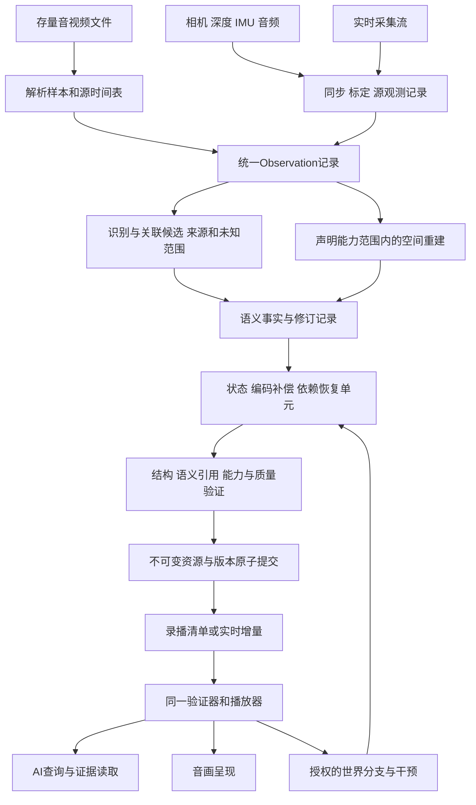

# CSG语义视频核心技术方案

版本：0.1研究提案。日期：2026年9月16日。状态：方案制定，不是已发布标准、已实现产品或已提交专利。

目标是让存量视频转换、原生语义拍摄和语义直播采用同一种可验证的内容表达，由同一个播放器恢复音画、查询语义，并在声明的范围内恢复空间与执行状态。

本文是后续格式草案、实施任务和专利交底的共同技术底稿。开发任务见[任务表](campaigns/2026-09-16-csg-semantic-video-standard/task_plan.md)，资料及现状见[发现记录](campaigns/2026-09-16-csg-semantic-video-standard/findings.md)。

## 〇、实现状态（2026-09-20）

本节为战役收口时的实现状态标注，不修改正文设计内容。逐项证据与全部指标见[FINAL 总收口](campaigns/2026-09-16-csg-semantic-video-standard/FINAL.md)（下表「指向」列为其章节）。

| 设计条目（正文节） | 状态 | 指向 FINAL / 证据 |
|---|---|---|
| 一/1.1 三入口共用写入器、验证器、播放器 | 部分 | 存量文件入口已闭环（FINAL §2.1–2.3）；采集入口被设备层阻塞（c1_camera_blockers.md，FINAL §6）；直播入口未开工 |
| 二、共同核心（结构/引用/时序/来源合同） | 已实现（结构层） | FINAL §2.1；双实现对拍 interop_ref.md |
| 二、语义描述能力（对象/事件断言） | 未做 | 识别模型未接线、零 assertion（FINAL §5 边界 1–5） |
| 二、空间重建 | 部分 | L1 深度 DPD1 + L2 平面级语义记录入容器（FINAL §2.6–2.7）；标定/相机未接；深度为相对深度 |
| 二、世界执行（检查点+确定性迁移） | 部分（仿真世界） | 快照恢复+像素级全帧 A/B 门（FINAL §2.4、§3 表 26–28）；实拍世界执行未做 |
| 二、实时流（流世代/快照/增量/修订） | 未做 | D 阶段未开工；现有跨机通道为录播传输语义（FINAL §2.5） |
| 三、数据模型与身份（3.1 记录集） | 部分 | 10 记录类型+§9 plane 增补已冻结落码（FINAL §2.1）；StateDelta/ObservationCorrection 未做 |
| 三、3.3 时间合同（tick/timebase/VFR/B帧） | 已实现（容器级） | svtime/clockmap+四类媒体边界样例（FINAL §2.1） |
| 四、4.1 存量转换 | 已实现（无识别） | B2 管线字节确定（FINAL §2.2） |
| 四、4.2 原生语义拍摄 | 阻塞 | M16A 一步之遥、M16B 卡 HAL/SDK（FINAL §6 归属表） |
| 四、4.3 语义直播 | 未做 | — |
| 五、统一播放、恢复和交互 | 部分 | player+hub 七模式+restore/seek/chain（FINAL §2.3–2.4）；交互分支/观测补偿/干预未做 |
| 六、6.1 录播装载（清单/记录块/原子提交） | 已实现 | FINAL §2.1；负例拒收（FINAL §3 表 31–32） |
| 六、6.2 协议语义（恢复单元/订阅增量/修订） | 部分 | 传输通道（SSM1/ssm1q、libp2p QUIC）跨机双向+SSM2 一次传输已证（FINAL §4 能力矩阵）；订阅/流世代语义未做 |
| 七、压缩与时延（计量与门） | 部分 | 155.6:1（born-digital）/5.77:1、257.3:1（语义侧）+ 秒开门 L1/L2 + 渐进 7.57×（FINAL §3）；编码器候选选择路线未做 |
| 八、架构复用与内存（768MiB 逐相贴线） | 部分 | 各任务按约束卡登记逐相增量（KB–MB 级）；总峰逐相贴线验收未执行 |
| 九、9.1 验收一（结构正确，双实现） | 已实现 | interop_ref.md |
| 九、9.1 验收二（语义有效，真值/准确率） | 未做 | 无真值标注（FINAL §5 边界 5、19） |
| 九、9.1 验收三（恢复/执行正确，全量对照） | 已实现（仿真世界） | 状态层逐 tick CID + 像素级 7,803 帧全等（FINAL §3 表 26–28） |
| 九、9.1 验收四（质量/性能，PSNR/时延分布） | 部分 | T_FETCH p50/p95/max、RSS、渐进/秒开已报（FINAL §3）；PSNR/SSIM 未做（仿真世界以像素字节全等替代） |
| 十、阶段 A–F | 部分 | A/B 主体完成；C 阻塞设备；D 未开工；E 仿真部分完成；F 专利交底文档+真机互通证据在案、申请未提交（progress.md 9/17 专利节） |

## 一、定义与范围

语义视频是将音画观测与对象、属性、关系、事件及其时空变化绑定，并声明来源、适用范围和消费能力的媒体。具有执行能力的内容还包含恢复和推进世界所需的状态及规则。

共同核心采用CSG事实表达，几何可以是网格、点、深度或其他明确编码的资源；“CSG”在本文不等于要求所有物体用几何布尔运算建模。标准规定可交换的字节、关系与行为，Cheng是本项目生产实现语言，不要求其他实现使用同一语言。

### 1.1 首版要完成什么

三种入口共用一个写入器、验证器和播放器：已有文件经过解析和识别；采集设备输出同步观测及识别结果；直播端持续输出同构记录。首版先贯通有限输入、对象和设备，随后扩展覆盖。采用已有视频编码保存观测属于明确的混合表示设计，不得标成纯世界压缩或零视频解码。

“任意存量视频可接入”是长期覆盖目标。当前已支持、可解码的输入才能转换；损坏、缺密钥或未支持的编码应明确失败。纳入载体、完成语义识别、恢复空间、恢复物理能力是四件不同的事。只封装MP4或只添加一段介绍文字，不满足本方案语义描述能力要求。

普通单目视频无法唯一确定未观察的背面、真实尺度、质量和受力。已观察、由模型推断、人工补充、未知分别记录；未知不填默认物理值，不凭外观自动授予执行资格。

### 1.2 对AI原生应用的价值与趋势判断

AI原生在本文指应用直接消费结构化对象、事件、状态与操作结果，而不要求每次使用都从像素重新推断同一批信息。首次识别仍有成本；模型升级或新任务需要重新检查原始观测，结构化结果不是永久正确的真值。

| 用途 | 标准必须提供的能力 | 验证收益的方法 |
|---|---|---|
| 视频问答和搜索 | 带时间、区域和来源的对象/事件索引 | 同一查询集的准确率、证据命中率、端到端耗时和总计算量 |
| 智能体持续记忆 | 对象连续身份、变化事件、修订记录 | 遮挡重现、身份误认纠正、长片追踪；计算节省计入预处理成本 |
| 直接编辑与交互 | 明确的可写状态、操作范围、状态版本和执行结果 | 同一对象修改后，音画与执行状态一致；不能只改标签 |
| 仿真和训练 | 有来源的动作、前后状态、可重复执行条件 | 固定环境回放、反事实干预、保留观测域和模拟域区别 |
| 多模型协作 | 稳定的语义类型和单位、来源定位、明确未知 | 不同识别器和消费者无需共享私有特征向量就能交换已声明语义 |
| 直播事件驱动 | 增量事件、订阅条件、断续与修订语义 | 空闲不轮询；检查漏报、误报、识别迟延和修正后查询一致性 |

从已有公开工作判断，面向机器消费的视频表达、多模态索引和可交互世界是明确发展方向：[MPEG视频编码工作组](https://www.mpeg.org/structure/video-coding/)包含机器消费和特征编码；[NVIDIA VSS](https://docs.nvidia.com/vss/2.3.0/content/architecture.html)把视频描述、语音转写和元数据索引到向量与图数据库；[DeepMind Genie 3](https://deepmind.google/blog/genie-3-a-new-frontier-for-world-models/)探索实时交互生成环境。这是趋势依据，不证明显式语义图将全面替代像素或CSG会成为通用标准。神经特征、像素和显式状态仍有不同用途。

本方案的判断是：未来更可能采用“观测证据＋可共享语义＋按需执行状态”的组合。对外价值表述为“让视频成为AI可以查询、复核和在授权范围内操作的时空内容”。在实际比较前，不宣称减少多少算力、消除幻觉或解决通用世界理解。

### 1.3 与CSG工程符号落地的对齐

CSG语义视频是CSG工程符号落地在时空媒体领域的应用。其核心义务是把符号绑定到明确语义、具体观测字节、有效状态与合法权限，并使请求、实际消费/执行和结果能够相互核验。依据为[符号落地交底稿](patents/csg_symbol_grounding_invention_disclosure.md)及[CSG核心规范](csg-core-standard.md)；引用交底稿不代表其全部能力已经实现或其权利范围已经授权确认。

| 落地环节 | 语义视频中的绑定 | 必须防止的错误 |
|---|---|---|
| 明确语义 | 对象类别、属性、关系、事件有类型、单位、时间区间和判定规则 | “接触”直接解释成“抓牢”；一段文字摘要冒充世界状态 |
| 真实字节 | 语义断言指向具体源轨道、样本、时空区域、标定和原始负载 | 有标签无依据；仅保存摘要却无法复核原片 |
| 唯一对象与有效状态 | 本次操作绑定精确实体、分支、版本和观测有效区间 | 同名对象串接；目标在计划后已换版仍执行 |
| 合法权限 | 读取、编辑、模拟及外部设备操作分别声明主体、范围和允许效果 | 把“识别到门”直接升级为“有权控制现实门” |
| 实际行为 | 验证器、播放器或执行器消费已绑定对象和输入；记录真实解码、呈现或状态迁移 | 包到达冒充上屏；命令发送冒充动作完成 |
| 可复核回执 | 绑定前后状态、执行器身份、实际产物和可检查后置条件 | 返回success或生成一段描述就宣布完成 |

观测根、实体根、意图根、计划根、执行根和回执根是既有CSG闭环的角色。本文的Observation、Entity、恢复/操作请求、依赖计划、实际消费记录和ValidationReceipt应投影到这些角色；可合并物理存储，但不能省略角色之间的绑定验证。复用唯一规范根/证明算法，不为视频另造第二套信任根。纯读取不强行产生物理动作，但仍需证明“查询/呈现结果对应所请求的对象、时间和版本”。

这里有两个不能混淆的保证：一是精确绑定和执行一致性，验证器可以检查；二是“这段画面中的对象在现实中究竟是什么”，受传感器、识别和外部依据限制。程序符号的精确身份规则不能直接变成视觉识别的绝对正确性。CSG应把识别假设、歧义和未知带入执行条件，不能用确定性编码把错误识别包装成事实。

例如语义声明“球被桌面支撑”，必须给出判断依据和适用时间；仅有重叠像素至多支持接触候选。用户执行“移开桌子”时先绑定模拟分支中的桌子及允许操作，提交后检查桌面位置、接触和球状态；模型中的下落回执只证明模型执行结果。若要控制现实设备，必须另有设备身份、授权、实际动作及执行后传感观测，不能沿用虚拟分支回执。

因此，本方案所追求的工程落地是“有出处、有边界、可执行、可复核”。它不声称解决哲学理解，也不声称哈希能证明现实真实性。语义视频对AI原生最有价值的部分，是把原本隐藏在模型回答里的对象指称和行动依据变成可查询、可验证的合同。

## 二、共同核心与能力要求

“共同核心合规”只证明结构、引用、时序和来源合同成立。具体功能由内容声明、请求能力和验证结果共同决定；格式合规不自动证明识别正确。

| 要求 | 必需内容 | 拒绝条件 |
|---|---|---|
| 共同核心 | 版本、内容/流身份、时间基准、观测定位、语义记录、版本依赖、能力清单、完整性信息 | 必需资源缺失、引用越界、未知必需扩展、时间映射不成立 |
| 语义描述 | 明确对象或事件类型、时空锚点、识别来源、已分析范围与未知区间；可执行查询 | 只有文件包装；用空结果冒充已分析且不存在；用摘要代替精确定位 |
| 空间重建 | 坐标系、尺度状态、相机/标定、几何与姿态、可支持视域及误差依据 | 把相对深度当米制距离；把补全区域说成已观测；缺标定却请求度量操作 |
| 世界执行 | 完整检查点、确定的状态迁移接口、数值合同、行为适用域、权限与恢复依赖 | 原片轨迹和求解器同时写权威位置；未知质量/规则仍宣布可执行 |
| 实时流 | 流世代、序号、时钟映射、快照、增量、迟到与修正规则、断流/EOS | 重启复用旧序号身份、无基态应用增量、篡改已发布的历史记录 |

空间重建和世界执行是附加能力，实时流是传送能力，不能当成一条自动升级的等级链。一个录播文件可以可执行，一个直播流也可以只支持描述。播放器按用户已选择的能力验证；不满足时明确拒绝该请求，不静默缩减为另一种功能后报成功。

标准语义词汇只先冻结少量可测试类型：对象轨迹、进入/离开指定区域、对象间接触候选、明确记录的用户操作。轨迹关联是识别假设；接触候选不是承载成功。扩展类型必须携带schema版本、单位、定义和检验方法，不能只靠自然语言名称相同判等。

## 三、数据模型、身份和时间

### 3.1 最小逻辑记录

以下是拟议逻辑模型，尚未分配正式方言编号和二进制字段号。大块图像、音频、深度和权重作为类型化资源存储，不展开成逐像素事实。

| 记录 | 核心字段 | 不变量 |
|---|---|---|
| ContentManifest | schema版本、内容实例、能力、时间表、资源表、入口检查点、实现合同 | 版本不可原地覆盖；资源类型、长度与内容身份一致 |
| Observation | 源身份、轨道/传感器、样本或字节范围、曝光/采样区间、标定引用 | 可追溯到具体源数据；不能只保留无法取回的URL |
| Entity | 生产者命名域、创建世代、整数对象号、类型版本、生命周期 | 显示名称不参与身份；删除后不复用旧身份 |
| SemanticAssertion | 主体/关系/值、有效时间、观测锚点、来源类别、模型/人工方法、修订号 | 已知与未知分开；置信分数包含定义且不能冒充正确率 |
| StateSnapshot | 分支、tick、schema、完整状态载荷、执行/数值合同、依赖 | 可恢复全部后续可读持久量；截图或可见位姿不足以充当检查点 |
| StateDelta | 精确基态、序号、时间、操作集合、目标状态摘要 | 整组验证后原子应用；基态不匹配不得猜测 |
| ObservationCorrection | 参考观测、基准渲染输入、补偿载荷、时空域、依赖与误差记录 | 仅校正声明的输出域，不写物理状态；不自动适用于干预分支 |
| Dependency | 消费者、依赖身份/范围/版本、用途、查询集合依据 | 包含能改变查询结果的集合与不存在性条件 |
| Revision | 被修订记录、原版本、新版本、有效时间、发布时间、理由与来源 | 撤销/替换是新记录，不能擦去原记录 |
| ValidationReceipt | 精确输入/实现/配置、能力、测量方法、结果、产物摘要 | 请求、声明、实际验证结果分列；摘要完整性不等于内容真实性 |

输入视频的历史证据链与推断世界的执行依赖是不同关系：观测引用证明“推断依据在哪”，不能由此证明“实际物理因果已经确定”。两类关系分列，算法不得混用。

### 3.2 身份和内存表示

内容身份与实体身份分开：文件字节相同可以去重，不意味着两个视频里的同名人物是同一个实体。跨拍摄源关联以可修订的同一性断言表达，不能因外观相近直接合并主键。误认后的拆分、合并保留旧身份和映射版本。

进程内按DOD、Arena、SoA存储；跨节点使用int32行索引和代际校验。跨包的生产者命名域、对象号、世代映射到已验证的本地表，不把文本标签、裸指针或摘要截断值当运行主键。生产者命名域的签发、碰撞检测及既有identity模块的精确映射在阶段A冻结。

### 3.3 时间和空间

媒体时间使用int64 tick与正有理数timebase，PTS和DTS分别保存；比较和换算防溢出，区间采用左闭右开。VFR、B帧、非零起始、编辑列表、音频填充均显式映射。不得用帧号除以名义帧率替代源时间表。

实时记录三个不同量：观测发生时间、结果产生/修订时间、接收端到达时间。源时钟到会话时间的映射携带版本、适用区间和测量不确定度。漂移更新生成新映射段；断时钟生成新世代。单位未知或不确定度超请求上限时拒绝相关同步能力。

度量空间沿用世界合同的米、秒、千克、弧度及右手Z向上约定。非度量深度使用明确的相对量纲，禁止假设其比例。不同视场须保存内外参、畸变、裁切、缩放和旋转映射；相同输出尺寸不意味着像素对齐。

### 3.4 观测事实与交互分支

原始采集和视频轨道只追加或形成新版本。交互从明确检查点派生分支，记录操作及执行结果；用户改变虚拟桌子不能修改拍摄历史。分支画面标明观测、推断与模拟来源。取消操作也形成确定的分支恢复过程，不通过隐蔽改写旧状态实现。

## 四、三种输入的编码流程

### 4.1 存量转换

1. 冻结输入身份与大小，解析真实媒体样本、解码依赖和时间表。读取中变化即失败。
2. 解码出明确的样本视图，保存到原始观测的映射；识别器输出对象轨迹、事件和未知范围。模型及预处理配置绑定版本。
3. 按请求能力处理空间与执行候选。相机不动、缺尺度、遮挡等歧义明确留在结果中；需要的能力不能由输入支持时，返回具体缺项。
4. 生成语义记录、状态及可选观测补偿。以实际接收端的重建输出验证声明的画质和能力。
5. 构建依赖完整的恢复单元，原子提交已验证清单；转换耗时与随后发布耗时分别测量。

首版生产语义逻辑使用Cheng；识别模型以有版本的图、权重、算子合同接入。当前Python、Kotlin、C等实验仅作为参考和验证材料，未迁入正式执行链前不得宣称纯Cheng生产转换已完成。

### 4.2 原生语义拍摄

先选现有采集设备验证同步合同，不先购买或制造专用设备。最低配置为可取回源时间戳的相机与音频；空间采集增加经过标定的双目或深度传感器，运动采集可增加IMU。硬件选型在实际可访问性核验后确定。

观测入口先写入源序号、曝光区间、标定和时钟映射，再异步生成语义结果。语义迟到不能修改对应视频的原始采样时刻。传感器没有采到的内容留为未知；不把模型估深度标为实测深度。

验收必须使用同一曝光或经过标定的时空映射做对照。M16A已经暴露分析流与录像流视场、起点不同的问题，不能靠统一帧号或缩放到同尺寸修补。相机重新配置、裁切改变或标定失效时，结束旧标定区间并重新验证后续区间。

### 4.3 语义直播

直播由源观测流和可迟到的语义断言流组成，共享媒体时间。源缺帧发布精确缺口，识别未完成发布未知区间；二者不能互相代替。订阅者按能力明确选择需要的轨道和语义类型。

采用单一提交者为每个流世代分配提交序号；多个传感器分别保留源序号。识别结果针对已有观测追加，修订引用旧断言版本。客户端可以重建“当时已知的解释”与“当前修正后的解释”，不能混成一条没有来源的时间线。

中途加入先取得声明能力所需快照和已提交头，再按基态与序号应用增量。确认连续区间后才能呈现该能力的当前状态。缺包可请求精确重传或取得更新的完整同步点；间隙必须记录，不能编造缺失轨迹。设备重启创建新流世代，不能把新序号0接到旧增量链。

来源完成水位只表示某一输入范围已经收到或明确标记缺口，不代表AI判断不会更改。若发布“处理完成水位”，它必须绑定模型、任务和解释版本；后续修正生成新解释版本并通知订阅者，旧记录保持可追溯。

背压按已协商的有限队列和截止时间处理，事件驱动唤醒。若无法保持请求的帧率、语义覆盖或迟延，记录超限并拒绝该段能力验收，不静默抽帧后仍标同等质量。正常EOS、源中断和服务故障使用不同结束状态。

## 五、统一播放、恢复和交互

播放器的状态转换为：未打开→核对清单/能力→取得完整入口依赖→恢复→就绪→播放或交互。缺依赖进入明确的等待状态，损坏或不支持进入错误状态；等待有截止时间，不以黑屏或占位图记为首帧成功。

录播跳播和直播加入使用同一恢复接口：给定内容/分支、目标媒体时间、解释版本和所需能力，输出完整恢复单元。一个单元可引用精确缓存资源，但“本地已有”必须经内容身份与长度校验，不能仅按文件名判定。

恢复画面须包括媒体解码依赖；恢复执行须包括速度、求解器历史、控制器记忆、随机流、事件队列等所有影响后续行为的持久量。渲染或音频若有跨帧历史也必须保存或从合法起点重放。索引快速找到入口不等于整个跳播恢复是常数时间。

显示、语义查询、空间命中和交互以同一已提交状态及解释版本为依据。新的识别结果尚未与当前画面对应时，不能把后一个时刻的对象框画在前一个时刻的画面上。用户修改基于明确的前状态版本；并发修改发生版本冲突时返回冲突，不自动按最后写入获胜。

观测补偿只在声明的时空和依赖范围内生效。用户移动物体或灯光后，重新检查相应几何、光照、遮挡、历史采样及查询域；不能只遍历此前可见对象。缺少局部独立性依据时，按完整相关域判定，不虚称只需重算局部。

世界执行模块只能写入声明的状态字段；观测补偿和渲染模块只写输出。回放轨迹交给物理执行前，必须撤销冲突的状态写入者并构造有效初态。所需参数未知、求解失败或权限不足时拒绝该操作；未经验证的生成画面不替代成功回执。

AI通过只读查询、观测片段读取、能力查询及版本化操作接口接入。查询返回证据位置、解释版本和未知范围；空结果只有在查询域已分析完整时才能解释成“没有发生”。文本、字幕和物体标签都是内容，不能自动升级为执行指令。

## 六、文件、流协议与失败语义

### 6.1 一份逻辑内容，两种装载方式

录播采用入口清单、不可变记录块、资源块和时间索引；实时流逐段提交同构块，并额外提供流世代、提交头、快照和增量订阅。文件索引是派生结构，不能与记录冲突时成为另一事实来源。

复用CSGC、规范编码与现有内容寻址机制，不新造相互独立的事实库。现有CSGC header、section、字典及规范JSON token规则以核心规范为准；阶段A冻结的是新增领域schema和资源载荷布局，包括字段类型和顺序、字节序、长度范围、未知扩展规则、规范数值/单位及摘要域绑定，不能私自改变核心格式或建立第二套事实编码。当前名称“CSG语义视频0.1”为工作名称，尚未注册扩展名或媒体类型。

一个记录块不得存在未解析的跨块必需引用而被标为可执行。物理约束环保留在求解节点内部，块级依赖按检查点与时序展开；不能为了DAG封装删除约束。

### 6.2 协议语义

| 操作 | 请求与成功条件 |
|---|---|
| 读取清单 | 返回精确版本、能力、资源与入口；含缓存条件，不返回可变内容冒充旧身份 |
| 读取资源范围 | 范围、总长与类型可核验；部分块若缺独立认证路径，必须收齐所绑定块再信任 |
| 获取恢复单元 | 指定时间、分支、解释版本和能力，返回完整依赖及同步点 |
| 订阅增量 | 指定流世代与已确认提交序号，接收带基态的连续提交 |
| 获取修订 | 返回旧断言到新断言的版本关系、有效区间及依据 |
| 创建交互分支 | 指定有效检查点、操作和权限，返回新分支或明确错误 |

传输适配与内容语义分离。优先评估既有MoQ/QUIC接线；必须锁定实际协议版本并通过互通，不凭模块名称宣布兼容。标准不强制所有实现使用同一网络协议。

### 6.3 原子性、完整性与信任

新资源先在任务拥有的暂存区写完并验证，随后使用正式准入与不可变发布机制提交，最后原子激活新头；失败保留原有效头。禁止rename失败后直接覆写正式文件。读者看到的版本必须是完整旧版或完整新版，不能混合。

摘要与Merkle结构证明字节绑定和完整性，设备签名证明对应身份的声明来源；两者均不能单独证明拍摄现实、识别准确或物理模型真实。签名证书、授权与可执行模块准入复用既有权威链，不由内容自行声明可信。

未知必需schema/codec、越界、非法单位、引用环、陈旧基态、超配额、完整性失败、时钟不确定度超限、请求能力不成立各有结构化错误。可选扩展只有被证明不影响所请求能力时才能忽略，并记录忽略项。失败不能自动修改请求能力重新签成功。

## 七、压缩与时延的联合约束

目标函数首先受能力、正确性和质量约束，再比较总字节与恢复成本。不能以画质退化、少算模型或预装大量资产换取表面的高倍率。

以下为编码器研究路线，不是所有合规实现必须采用的算法：在预先声明的候选表示中选择世界状态、观测载荷、补偿和恢复位置。每个候选区间通过真实消费者重建，记录画质、资源字节、入口依赖和恢复计算量；不满足约束的候选不得进入选择集合。区间成本可独立相加时，可以在有限候选图上求最短路径；跨段共享、缓存或耦合依赖存在时，必须在状态和成本中显式表示，不能继续声称简单区间算法全局最优。互通规范只约束声明的能力、载荷解释、依赖与输出正确性；具体优化、神经压缩和缓存实现须按[专利与实现选择规则](specs/csg-semantic-video-ip-policy.md)单独审查，不能由格式合规推导已经获得许可。

不同能力具有不同恢复集合：仅播放不一定需要物理执行器；请求世界执行则必须取得完整执行依赖。编码选择、恢复集合和干预后的失效使用同一依赖语义，避免三套规则互相冲突。这是研发及专利候选，不是已证明的创造性或性能优势。

| 指标 | 计量边界 |
|---|---|
| 转换时间 | 冻结源文件到合格内容可发布，包含识别、重建、编码和验证 |
| 发布时间 | 发布请求到独立接收端实际能够取得声明内容；录播完整可用与直播首单元可用分开 |
| 首帧时间 | 用户打开到符合请求能力的首帧实际呈现；封面、首包和解码完成不能代替 |
| 交互就绪 | 打开到操作接口可接受请求并有完整状态；与首帧时间分别报告 |
| 跳播时间 | 跳播请求到目标时间对应帧呈现，以及可执行状态分别就绪 |
| 直播迟延 | 同步后的观测发生到呈现；语义可用迟延和后续修正迟延另外报告 |
| 冷包体积 | 全部必需媒体、几何、语义、补偿、音频、索引、模型和执行依赖；共享运行时单列首次安装成本 |
| 热传输体积 | 在明确列出的已验证缓存集合下实际新增传输字节，含协议开销另列 |

“千倍压缩”只有在同内容、同画质、同分辨率/帧率和同能力需求的基准下测量才可使用。普通视频与可交互世界的能力不同，必须分别报告原片回放码率和新增交互数据，不能把二者硬算成一个公平比值。

“秒开”作为专项性能目标，不是格式合规的定义。阶段A先冻结设备、链路、输入、冷热缓存、试验次数与时延门限；未达标如实失败，不在测试后改口径。直播无法预知未来，不得依赖整段未来视频的全局量化范围；量化域须按可独立解码单元先行声明。

## 八、架构复用、工程边界与内存

| 现有落点 | 复用目的 | 必须补查 |
|---|---|---|
| `src/core/csg_core/` | 规范编码、身份、内容寻址、准入与版本提交 | 本方案类型、流世代和大资源是否实际可消费，原子失败路径是否严格 |
| `src/game/assets/` | 媒体解析、来源映射、资产与能力验证 | 声明能力与行为证据的连接，真实PTS/DTS与观测关联 |
| `src/game/cinema/`、世界运行时 | 只读渲染、检查点及分支执行 | 完整持久状态、音画历史和干预失效 |
| `src/moq/`、媒体传输模块 | 内容发布、按需取数和订阅适配 | 真实网络互通、版本、跨设备时延、背压和中断 |
| `src/apps/csg_player/main.cheng` | 用户打开、播放、跳播与查询入口 | 主界面实际接线、事件驱动、真实首帧与交互就绪 |

上述是复用候选，目录或函数存在不等于本方案已接线。本次没有编译或运行这些模块。

自有解析、语义处理、打包、验证和执行逻辑使用Cheng；系统采集、硬件编解码、驱动和文件能力通过已审查平台接口接入并列清单。Python/ffprobe可作为独立测试工具，不进入生产语义路径。模型权重作为数据；所需算子未接线时明确阻塞，不调用收费平台或外语脚本填补生产能力。

播放器内容不能任意装载未审查的二进制。执行器、数值配置和权限绑定准入记录；只支持有限、可验证的状态迁移和外部效应。移动端等待媒体、网络、用户操作或截止时间事件，不通过循环查询维持空闲运行。

内存以[唯一约束卡](campaigns/2026-08-31-kernel-userpath/design/memory_model_constraints.md)为准，不继承旧媒体计划的4GiB预算。总峰不超过768MiB，同时逐相模型贴线且退出码为0才算通过；差值超过50MB要解释，未测项不能填0。编译器生产资格另按该卡与正式发布规则验证，不由媒体任务报告替代。

| 相位 | 必须建模的新增工作集 | 生命周期与验证 |
|---|---|---|
| 读取/解码 | 有界输入窗、codec状态、已解码帧池 | 消费后释放；按分辨率、像素格式和最大帧数外推 |
| 识别/重建 | 常驻权重、激活峰值、活动轨迹表 | 权重去重，活动窗有界；模型实测不可用文件大小冒充 |
| 编码/封包 | 当前候选窗、补偿、目录与暂存块 | 不能同时保留全片帧与全部候选；长片索引落盘分段 |
| 网络/验证 | 在途块、重排队列、摘要状态 | 额度和队列上界冻结；背压触发有事件与回执 |
| 恢复/呈现 | 必需状态、纹理/音频历史、解码与呈现队列 | 场景切换、seek取消与卸载释放；GPU和服务内存单列 |

本次仅新增文档，对生产运行时各相结构的增量为0；这不是实测内存结论。后续开发须把新增结构映射到权威模型项，补齐系数、计数与同窗口实测。正式编译须先过补丁预检、新驱动金丝雀和发布门，不因本计划是媒体任务而绕过。

## 九、样例、验证与性能口径

首轮样例和门槛在阶段A冻结；以下是覆盖要求和建议样例，不是已运行测试或已经通过的指标。

| 样例组 | 输入与操作 | 必须证明 |
|---|---|---|
| 存量真实片 | 室内对象运动、手持遮挡、剪辑切镜头各一段，保留源分辨率和时间表 | 三类内容均可追溯；不可重建区域明确；质量和能力按各自声明验证 |
| 媒体边界 | VFR、B帧、非零起点、长时间轴、音频填充 | 与独立解析时间表一致，不累计截断误差 |
| 原生采集 | 一组实际RGB/深度或双目及音频数据，记录设备标定 | 时间和视场映射可独立验证，模型深度与实测深度不混淆 |
| 实时流 | 连续采集建议30分钟，至少两个不同加入时刻 | 中途加入恢复一致，活动内存不随时长无界增长 |
| 修订与身份 | 迟到识别、撤销误报、同名对象、遮挡后重现、身份拆分 | 原始记录不变，历史与当前解释可分别查询 |
| 世界干预 | 受控球/桌面场景，从中段移开支撑并添加新遮挡 | 恢复速度和历史正确，旧反弹/阴影补偿失效，模拟与观测分支分离 |
| 异常与生命周期 | 乱序、重复、缺包、设备重启、取消、资源损坏、未知必需扩展 | 不错误应用增量、不激活半成品、不吞掉失败、不泄漏资源 |

受控数学场景用于验证状态算法；真实采集和存量视频用于验证内容与设备能力。两类证据分别记账，构造夹具不能充当真实生产能力证明。

### 9.1 四组独立验收

一、结构正确：两套独立解析器消费同一冻结样例，规范值与引用一致；负例按规定拒绝。第二实现不复用生产解析器的关键解码函数，可用独立测试工具。跨实现只要求标准规定的语义或数值一致，不武断要求不同识别模型输出相同字节。

二、语义有效：冻结人工复核的对象/事件真值、未知范围与独立留出集，报告准确率、召回率、身份切换、时空定位误差及置信校准。按素材分组，不能用结构PASS替代识别准确性，也不以平均值掩盖特定失败类。

三、恢复和执行正确：任意选定同步点恢复后的状态与从相同初态完整重放对照。全量对照不读增量缓存；比较对象状态、事件、音频区间和原始渲染输出。删除对象、新增遮挡、空查询变非空、修改灯光、改变执行版本、过期缓存和并发操作必须覆盖。真实物理正确性还需独立解析/测量依据，路径一致性不是物理真实性证明。

四、质量与性能：像素质量、几何/轨迹误差、语义准确性分别设置门限。画质至少报告整片及最差时段的PSNR/SSIM和视觉复核，指标配置、颜色域及对齐方法冻结；新视角没有真值时只报告支持域和测量方法，不套用原视角保真结论。时延报告p50、p95、最大值和失败次数，建议每场景不少于30次独立打开；全部记录设备、功耗模式、负载、链路和缓存状态。

### 9.2 面向AI的直接对照

固定同一源片、查询/操作集合和答案依据，比较“每次直接消费视频”“已有语义索引”“索引加按需回看观测”三条路径。计入一次性建索引、存储、更新和模型调用成本，测试不同查询次数，才能判断成本是否摊薄。跨模型更换和新问题超出已有语义时，检查回看观测能否发现遗漏，不能把只适合预设问题的压缩表示称为通用理解。

### 9.3 统一验证记录

每次结果绑定源文件/采集样本、源码、编译器、模型与配置、schema版本、设备/协议版本、缓存清单、测量方法、原始日志和实际产物摘要。记录请求、声明、验证能力和失败原因。性能预算预先保存；修改预算生成新版本，新旧结果不可混报。正式报告没有产物或缺原始日志时不得记完成。

## 十、阶段、角色与交付

按依赖推进，具体文件、动作、验证和完成判据见[开发任务表](campaigns/2026-09-16-csg-semantic-video-standard/task_plan.md)。下表人日为规划估计，假定熟悉现有工程、编译器可用、传感器能访问，不是实际投入或日历承诺。

| 阶段 | 工作与交付 | 放行条件 | 初步工作量 |
|---|---|---|---|
| A 核心合同与基线 | 冻结有限能力、真实样例、时间/身份、字节schema、设备/内存/性能预算；更新现状 | 每项都有定义、验证方法和负例；没有用历史PASS抵扣当前接线 | 4至7人日 |
| B 文件共同核心 | Cheng写入/读取、规范化、时间索引、断言查询、原子提交；独立解析器 | 存量输入到同一播放器闭环，时间和证据引用准确 | 8至12人日 |
| C 同步采集 | 单组实际传感器适配、时钟与视场映射、同构输出 | 真实采集与文件入口可共用消费者，校准和断时钟反例通过 | 6至10人日，不含硬件驱动缺陷修复 |
| D 语义直播 | 增量、快照、晚到修订、重连、背压与状态订阅 | 跨设备中途加入和长流验证；故障注入不破坏状态 | 8至12人日 |
| E 编码与执行组合 | 观测补偿适用条件、恢复分段、限定世界干预；与全量执行对照 | 同时通过画质、恢复和干预检查，再报告压缩/时延 | 10至15人日为有限场景工程估计；通用重建研究另列 |
| F 互通与申请准备 | 独立互通、性能/AI收益报告、技术区别表、申请稿和标准草案 | 证据可复核，权利要求与拟定条款对应，公开安排完成 | 5至8人日，不含审查或标准组织周期 |

合计约41至64工程人日仅用于上述有限范围；模型算子缺口、可靠识别/重建研究、编译器缺陷和设备不可访问可能显著增加工作量，阶段A后必须重新估算。禁止把未解决研究问题按0天计入。

建议职责为语义与协议、媒体与设备、运行时与验证三类主责；这不代表已经分配人员。共享CSG核心、播放器和平台接口一次只由明确负责人修改，其他模块以冻结接口协作。

首个可演示成果是“一段真实视频可播放、可按对象/事件查询、每条答案可回到原片依据”，随后接真实同步采集和直播，再完成限定世界中的可执行干预。完整完成定义是三种入口、统一消费者、对应能力验证和独立互通均有证据；不以某一个演示替代整套计划。

## 十一、专利候选与标准化路径

当前已形成交底稿《一种语义视频状态恢复与观测补偿控制方法》，见[交底文本](patents/csg_semantic_video_recovery_invention_disclosure.md)。该稿尚未提交。发明点必须落实到观测补偿适用关系、状态依赖、恢复单元和干预失效之间的具体技术联系，不能用三种输入名称或功能清单替代创造性。

| 候选 | 要研究的区别 | 必须对比 |
|---|---|---|
| 编码与恢复共同机制 | 同一依赖语义如何约束观测补偿复用、恢复成本和干预失效 | ReRF、渲染资产压缩、随机访问预测依赖、现有CSG再生成稿 |
| 观测和修订的流式一致性 | 晚到/纠错时如何保持已呈现状态、语义引用和重建版本可恢复 | ONVIF、流处理事件时间/版本系统、MPEG动态场景；普通时间戳或追加日志不能独立视为新贡献 |
| 采集到执行的绑定 | 多传感器观测、校准版本与执行状态如何形成可检验转换 | 传感器融合、数字孪生、物理逆向、SimReady及已有资产能力稿 |

后两项先作为研究候选，不预设必然需要独立申请。若没有独立技术问题和足够区别，纳入共同说明书或停止该选题；避免同一技术换应用场景重复撰写。

已有材料的具体重合与边界见[发现记录](campaigns/2026-09-16-csg-semantic-video-standard/findings.md)。2026年9月16日已补做[11份相关专利文本的初步实施审查](campaigns/2026-09-16-csg-semantic-video-patent-review/review_report.md)，包括中国授权、公开申请、场景同步分案及美国相关权项；正式登记簿、审查档案、等同分析和完整产品部署仍未核准。继续按技术流程补查中文、WO/PCT及各实施国文本，并覆盖标准、论文和开源实现；不把局部检索记为完整实施自由通过。

申请稿原则上先控制在10项权利要求以内，但以技术完整和单一性为准。分别考虑编码端和消费端可独立实施、可观察的行为，避免独立项必须由设备厂商、服务端和用户共同完成才能成立。方法、系统、设备和存储介质布局由最终支持内容决定，不先为凑项数扩写。

标准和专利平行维护：标准写可互通的规范义务，申请写具体技术方案；二者建立“权项特征—标准条款—互通测试—实施证据”对照。未授权、未完成对应分析时，不称标准必要专利；不声称制定私有格式即可垄断所有语义视频。[国家知识产权局指引](https://www.cnipa.gov.cn/art/2026/3/14/art_66_205332.html)

在对外公开核心草案或实现前完成披露核查和申请安排。先形成私有研究草案、独立互通和参考实现，再评估团体/行业/国际标准路径及相应知识产权政策；涉及第三方标准专利不能只检索本公司的候选。提交申请、公开发布和对外合作各自按实际授权执行，本次不执行这些动作。

### 11.1 规范与实现的专利边界

[专利与实现选择规则](specs/csg-semantic-video-ip-policy.md)适用于本方案。共同核心不强制把对象ID编码为像素颜色的语义参考视频，不强制特定神经重建/分段网络、运动残差网格、跨帧污染列表或云端场景排序回传架构。保持可核验的语义引用、精确基态、完整恢复、补偿适用条件和请求能力，不通过删除必要依赖或降低画质处理专利问题。

能力可选只表示标准没有强制所有实现采用，不能免除实际采用该能力的产品所需许可。尤其是视频重建后的对象修改、双向场景同步及跨帧缓存，应将实际执行角色、处理顺序和所有相关独立权项逐项核对；改名、换语言、云端拆分或新增自有专利均不直接关闭风险。

技术合规、申请可专利性、产品实施自由分别给出结论。当前字段层实现不等于完整能力实现，也不等于完成专利许可核查。对外发布按IP-07记录源码与配置、实施地区、权利状态、特征比对和许可依据；未解决事项保持未解决。

## 十二、待冻结决策及开始条件

进入实现前由阶段A形成六份明确清单：受支持媒体与能力表、schema字节布局、真实样例与标注、设备与标定、逐相资源预算、验收指标与测量脚本。参数由真实需求和校准确定，不能在失败后放宽。

本提案已作出的默认选择是：共同核心加独立能力要求；原始观测与推断状态分列；录播与直播共用记录模型；版本追加和原子提交；Cheng生产语义；不另建世界引擎；不新增付费平台或硬件采购。

尚未冻结的技术项是：正式类型/字段编号、传感器型号与可访问接口、识别模型生产闭包、可接受的识别与画质误差、网络/设备性能基准、恢复分段候选集合。它们不阻止本技术方案交付，但在对应实施阶段必须关闭，未关闭不得发布相关能力。

OpenSpec提案见[CSG语义视频标准与统一消费](../openspec/proposals/csg-semantic-video-standard.md)。本次完成方案制定；后续源码实施按提案流程进入apply，只有实际能力和生产门禁通过才归档实现。不把文档交付或旧实验报告写成开发完成。
