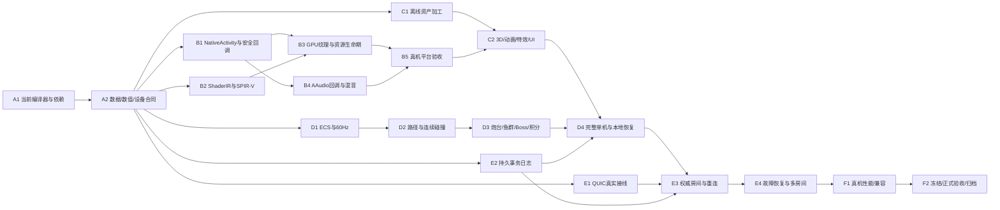

# 纯 Cheng 捕鱼游戏开发计划

> 执行代理：实施时按任务选择 `superpowers:subagent-driven-development` 或 `superpowers:executing-plans`，遵守仓库授权和共享工作树规则；本文件不构成进入 apply 的授权。

**Goal:** 用纯 Cheng 自有源码交付 Android 横屏捕鱼，先完成真机可玩单机，再完成四人权威联网和可发布版本。

**Architecture:** 固定相机的3D表现、二维确定性玩法、Arena + SoA、单写入者房间。游戏规则、资源加工、GPU命令、音频混合、协议与存储都由 Cheng 实现，设备能力经受控系统 provider 接入。

**Tech Stack:** Cheng/ORC/ZRPC；Android NativeActivity + Vulkan + AAudio 系统接口；有限 Cheng shader 子集 → TypedShaderIR → SPIR-V；Cheng QUIC；Cheng 事务日志与快照。美术工具只生成数据。

**Spec:** `openspec/proposals/pure-cheng-fishing-game.md`。

状态：`propose`，2026-09-05。以下文件名除现有源码外均为拟新增位置，测试名和门禁为实施交付物，本轮没有创建可执行工具或运行测试。

## 全局约束

- 用户只要求制定计划。实施、发布和 OpenSpec archive 均未完成；不创建分支或 worktree，不覆盖共享树他线修改。
- 所有自有可执行源为 Cheng；系统 API、驱动及 SDK 打包工具允许，生成 C/Kotlin/Objective-C 壳和手写 GLSL/MSL 不允许。
- 无裸指针公开接口、无业务层 `@importc`、无按名称/源码行猜身份。ABI 仅在证明完成后瞬时生成物理地址。
- 遇到合法 Cheng 语法无法编译，修编译器真实实现并回归；不把业务 hoist、改API或固定小容量当产品方案。
- 活跃对局由精确 tick 截止事件调度，渲染由 VSync 事件调度；输入/网络/设备生命周期用事件；不以轮询驱动。
- 资产、模拟、网络、存储、最终安装包分别验证；测试源码或历史报告存在不算当前通过。
- 每个任务完成后 Review 查 Bug，再从第一性原理检查实现能否更小、更稳健。修共享引擎时覆盖已有消费者，不破坏 UniMaker 的物理语义。
- 构建采用任务级 scratch，默认 `tools/cheng_scratch_scope.sh`；跨命令产物绑定拥有进程，退出即清理。正式证据另行归档，不保留冷对象缓存。

## 平台、范围与投入假设

首发拟定 Android 10+、arm64、真实支持 Vulkan 所需能力的设备；系统版本不能替代 GPU 能力检查。A1 冻结一台开发机和一台较低性能验收机的型号、SoC、GPU、驱动、系统、分辨率。当前没有绑定设备，不声称已达到兼容或帧率目标。

选择 Android 先行，是为了在一个真实移动端闭合硬件链。系统提供 [NativeActivity](https://developer.android.com/ndk/guides/concepts?hl=zh-CN)、[Vulkan](https://developer.android.com/ndk/guides/graphics/getting-started) 和 [AAudio](https://developer.android.com/ndk/guides/audio/aaudio/aaudio)；能否由 Cheng 的 ABI、安全回调和链接器打通仍是前置验证。macOS 先承担无窗口逻辑和离线加工；iOS/Metal、桌面窗口均需独立计划，不包含在本表工期。

| 阶段 | 粗估工程量 | 交付 |
|---|---|---|
| A 基线与合同 | 3–5人日 | 当前能力回执、严格依赖边界、任务接口 |
| B 平台/GPU/音频闭环 | 6–12人周 | 纯Cheng真机纹理、触摸、声音及恢复 |
| C 3D资源与表现 | 3–5人周 | 鱼、炮台、海底、骨骼、粒子、UI |
| D 完整单机玩法 | 3–5人周 | 首版可玩单机与本地恢复 |
| E 四人权威联网 | 3–5人周 | 真网络、权威结算、恢复、多房间 |
| F 性能与发布验收 | 2–4人周 | 冻结资源和源码的正式安装包 |

总量约18–32人周，是范围估算而非交付承诺。按一名熟悉 Cheng 的工程人员全职投入且美术配合，约5–8个月量级；C与D部分可并行，但不得机械地按代理数除工期。模型、原画、声音采购或制作另行投入，未计入这些人周。编译器/安全ABI/SPIR-V均存在前沿风险，修复时间可能超出区间；A结束后重估，B真机闭环通过后再承诺首个可玩版本的日历时间。

## 全局依赖图

并行边界：只并行独立文件的资产、模拟、shader与网络工作；共享类型先冻结。E2的共享存储属于单机和联网共同前置，必须在D4之前完成，不能按章节字母推迟到单机交付后。编译器修改和重型编译不并行争用；不存在“游戏尚未完成就先烤正式固定点”的步骤。

## 目录与责任

| 路径 | 责任 |
|---|---|
| `src/game/ecs.cheng`、`runtime.cheng`、`physics2d.cheng` | 现有通用基座；改动前核对消费者，不混入捕鱼业务 |
| `src/game/entity_store.cheng`、`clock.cheng`、`command_queue.cheng` | 精确实体生命周期、时钟、输入队列 |
| `src/game/collision_grid.cheng`、`sweep2d.cheng` | 可复用宽阶段和连续检测，不替代已有刚体步进 |
| `src/game/platform/contracts.cheng`、`android_host.cheng` | 值/借用设备合同、生命周期和事件调度 |
| `src/core/runtime/game_android_provider.cheng` | 受控系统能力接线，安全ABI由编译器支持；不公开物理地址 |
| `src/game/shader/types.cheng`、`lower_typed_expr.cheng`、`validate.cheng`、`emit_spirv.cheng` | 真实Cheng源码的有限shader语义、TypedExpr降至SoA IR与SPIR-V发射 |
| `src/game/render/resources.cheng`、`vulkan_device.cheng`、`frame.cheng`、`animation.cheng`、`particles.cheng`、`ui.cheng` | GPU资源、绘制、动画、特效、游戏UI |
| `src/game/audio/mixer.cheng`、`device.cheng` | PCM voice池、混音、设备回调及恢复 |
| `src/game/assets/manifest.cheng`、`gltf_profile.cheng`、`cook.cheng`、`bundle.cheng` | 确定的资产导入、校验与打包 |
| `src/apps/fishing/model.cheng`、`paths.cheng`、`rules.cheng`、`boss.cheng`、`client.cheng` | 捕鱼定义、路径、规则、Boss状态机与客户端组合 |
| `src/apps/fishing/protocol.cheng`、`room.cheng`、`server.cheng`、`store.cheng`、`recovery.cheng` | 消息、权威房间、进程入口、持久化和恢复 |
| `assets/fishing/` | 模型/纹理/声音、来源清单和配置；像素和PCM不内联进源码 |
| `platform/android/ChengFishing/` | Manifest、资源与包清单；无自有Java/Kotlin/C源 |
| `src/tests/fishing_*.cheng`、`tools/fishing_gate.cheng` | 语义测试和统一验收器；测试和门禁均拟新增 |

## 共享数据合同

以下是待A2冻结的数据规格，不是假定已有API。除CID内容字节外，跨记录关联均为精确整数索引；所有集合有明确容量、顺序和所有权。

| 记录 | 必须字段/语义 |
|---|---|
| RoomKey | `roomId:int32, roomEpoch:int64`；epoch按持久分配序列生成，重建/复用不得重置；绑定已认证服务器身份 |
| EntityKey | `slot:int32, generation:int32`；跨房间/网络引用必须带完整RoomKey；回收时增加generation，溢出拒绝复用 |
| AssetRow | `assetIndex:int32, kind, contentCid, bundleCid, byteLength, layout`；路径只用于导入；CID查验后才建行 |
| TickClock | `tick:int64, anchorTick:int64, monoAnchorNs:int64, numerator=1, denominator=60`；截止按相对anchorTick的有理时间计算，累积余数不丢失；持久化逻辑tick，不持久化进程单调时钟anchor |
| InputCommand | `room:RoomKey, accountId, sessionEpoch:int64, commandSeq:int64, assignedTick:int64, kind, typedPayload`；payload不含客户端裁定奖励；assignedTick由服务器在有界接收窗口内确定 |
| SimState | SoA实体、路径进度、规则版本、独立PRNG状态、积分/射速状态、tick；无GPU句柄/墙上时钟 |
| TickDelta | `room:RoomKey, tick, priorStateHash, orderedCommands, resultingStateHash, events`；仅提交后才成为权威状态 |
| RenderSnapshot | 完整RoomKey、已提交tick及视觉transform/资产行；浮点插值、骨骼和粒子不可写回SimState；本地瞄准/UI状态另存，只作即时反馈 |
| AudioCommand | `eventId, clipIndex, action, gain, pan, startSample`；设备回调借用输出缓冲，不持有跨回调借用 |
| CommitRecord | `schema, sequence, previousHash, payloadLength, payloadHash, payload, commitTrailer`；包含完整RoomKey、状态变更与去重结果；快照和回执同样带RoomKey |
| ContactEvent | `tick, toiNumerator:int64, toiDenominator:int64, bulletKey, fishKey, shapeIndex:int32`；TOI为[0,1]有理数，分母严格为正；全序按tick、精确TOI、弹/鱼完整身份、shapeIndex |

模拟坐标拟用有界定点整数，A2冻结缩放、每tick位移单位、速度/场景范围及中间值上界。精确碰撞所需平方/乘积若超int64范围，必须加宽或收紧公开profile并证明，不允许静默溢出。数学和资产范围是预先定义的合同，不是为绕编译器故障临时缩小场景。

碰撞规则选显式凸多边形/复合凸多边形与每tick内的分段线性平移，使用连续SAT产生有理数TOI；不把视觉网格当碰撞体，也不在窄阶段引入浮点epsilon或开方近似。有理数比较采用带符号的欧几里得商余算法，避免交叉乘溢出；整数投影范围由A2证明。形状/朝向变更在tick边界生效，Boss阶段切换在本tick命中结算结束后应用，影响下一tick。

## 实施任务：files / action / verify / done

每个任务的步骤顺序均为：先实现能暴露所列故障的验收入口 → 确认失败原因 → 实现生产路径 → 验证 → Review与精简。记录真实命令、退出码和报告；不创建只镜像实现的测试。标注“拟新增”的门在落地前不能调用或填PASS。

### A1 当前编译器、闭包与设备基线

**Files:** 本战役`findings.md`；拟新增`capabilities.json`、`src/tests/fishing_platform_contract.cheng`、`tools/fishing_gate.cheng`。只读既有game/quic/provider和正式编译入口。
**Action:** 记录当前源码闭包、编译器二进制、工具、target与设备能力；统一验收器接入任务scratch与进程树守卫。复跑现有`ecs_capacity_smoke`、`ecs_world_hash_smoke`、`physics2d_collision_smoke`、`physics2d_determinism_smoke`、`game_tick_replay_smoke`，只使用现场核实存在的入口。沿调用图确认每个外部符号的provider、实际链接对象与来源。
**Verify:** 从当前源码生成非空目标并执行；公开值/借用接口通过，指针绕过负例拒绝；缺库、假GUI provider、缺编译证据不得PASS。Android设备查询和包能力实际回读。
**Done:** [ ] 当前能力清单可重算，每项明确“已实测/未通过/不支持”；阻塞项有最小复现与负责模块，不承诺其修复日期。

### A2 类型、数值、输入和性能profile

**Files:** `src/game/platform/contracts.cheng`、`src/apps/fishing/model.cheng`；拟新增`src/tests/fishing_contracts.cheng`、`assets/fishing/profile.json`。
**Action:** 落实共享数据表；冻结所有权/存储/返回/覆盖矩阵、定点范围、碰撞体、规则版本与容量。事件队列按会话和tick限流，满时明确拒绝未接收命令，不丢已接收命令。固定内容profile和验收设备记录格式。
**Verify:** 最小/最大数值、非法代际、错资产类型、重复/越界命令、buffer容量边界均得精确判词；规则序列化往返字节一致。
**Done:** [ ] 后续模块只消费同一套合同，身份/单位/容量/时间基准无隐含约定。

### B1 Android启动与安全事件边界

**Files:** `src/game/platform/android_host.cheng`、`src/core/runtime/game_android_provider.cheng`、`platform/android/ChengFishing/AndroidManifest.xml`；若复现需要，修改精确的编译器ABI模块并纳入其回归。
**Action:** Cheng直接产arm64共享库，由系统NativeActivity进入；不链接C native_app_glue。实现Surface创建/销毁、输入、VSync、前后台、音频焦点与网络就绪事件。系统回调携带的临时缓冲经证明形成借用，异步队列存Owned事件数据；调度器阻塞到就绪事件或最早截止时间。
**Verify:** 真机冷启动、触摸坐标/横屏安全区、取消触摸、100次前后台与Surface重建；旧世代回调被拒，空闲无Sleep轮询，退出资源清零。最终包无自有非Cheng编译单元。
**Done:** [ ] 平台事件进入真实Cheng队列，所有回调和资源生命期有源码/二进制/设备绑定回执。

### B2 有限shader语义与SPIR-V

**Files:** `src/game/shader/types.cheng`、`lower_typed_expr.cheng`、`validate.cheng`、`emit_spirv.cheng`；拟新增`src/tests/fishing_shader_contract.cheng`。
**Action:** 子集只支持本游戏需要的vertex/fragment、定长向量矩阵、标量算术、纹理采样、固定布局uniform/storage输入和受限控制流。GPU入口清单绑定真实Cheng函数的canonical SymbolId/TypeId，复用parser和TypedExpr，再经有限lowering生成TypedShaderIR；不新增未入规范语法，不按文本/名称扫描或手工IR构造冒充源码编译。GPU入口不允许ORC对象、动态分配、递归、未知调用。精确TypedShaderIR采用Arena+SoA+int32；从它发射SPIR-V并绑定材质CID，不嵌入手写外语shader模板。
**Verify:** 重复发射逐字节一致；修改真实Cheng shader算式后，TypedExpr/ShaderIR/SPIR-V与GPU结果必须对应改变。类型/布局/阶段错误硬拒；离线官方SPIR-V验证工具仅作oracle，最终真GPU验证纹理、变换与混合结果。至少覆盖静态网格、蒙皮、实例和粒子所需指令路径。
**Done:** [ ] 游戏全部shader来自声明的Cheng子集；没有“任意Cheng可上GPU”的未经证明承诺。

### B3 Vulkan设备与资源寿命

**Files:** `src/game/render/resources.cheng`、`vulkan_device.cheng`、`frame.cheng`；拟新增`src/tests/fishing_gpu_lifetime.cheng`。
**Action:** 实现所选Vulkan能力profile、swapchain、纹理上传/mip、顶点/索引、描述符、深度、透明混合、draw和present。CPU记录用资源行+generation；GPU提交有精确fence，最后一次消费结束才销毁/复用。缺少要求的设备能力明确报告，不走其他渲染器兜底。
**Verify:** 真实带纹理三角形与可动网格；resize/后台后重建；上传中取消、资源二次覆盖、过期引用、GPU未完成时销毁负例。捕获实际提交与present，不用窗口句柄存在代替呈现。
**Done:** [ ] GPU消费了本轮Cheng产生的SPIR-V、网格、纹理和draw数据，资源账与设备回执吻合。

### B4 PCM混音与AAudio输出

**Files:** `src/game/audio/mixer.cheng`、`device.cheng`、Android provider；拟新增`src/tests/fishing_audio_mix.cheng`。
**Action:** 固定voice池、播放/停止/循环、音量/声像和采样率转换；输出混合公式与限幅范围明确。回调只读取预分配PCM和命令，禁止阻塞、文件IO及临时托管分配；设备断开由错误事件驱动重新建流并重建时间基准。
**Verify:** 离线混音样本与独立公式对拍；真实可听声音、重复播放去重、循环边界、音频焦点失去/恢复、输出设备变化；回调超时/欠载计数必须可见。
**Done:** [ ] 听到的声音确实来自Cheng混音缓冲，暂停和设备恢复无悬垂引用或持续分配增长。

### B5 手机基础闭环验收

**Files:** 拟新增`src/tests/fishing_device_slice.cheng`、`tools/fishing_gate.cheng`设备阶段、平台包清单。
**Action:** 合并B1–B4：触摸移动真实纹理网格并触发PCM音效，退出/恢复仍可操作。绑定安装包、已装版本与native库哈希，检查最终source/object/dynamic-library闭包。
**Verify:** 两台目标设备各完成冷启动、持续交互和100次恢复；任何生成C壳、回调证明缺失、未present或无声音均失败。
**Done:** [ ] 才允许计“纯Cheng移动端基础已打通”，据实修订后续时间；关卡失败保留阻塞，不改纯度定义。

### C1 确定的离线资产加工

**Files:** `src/game/assets/manifest.cheng`、`gltf_profile.cheng`、`cook.cheng`、`bundle.cheng`、`assets/fishing/`；拟新增`src/tests/fishing_assets.cheng`。
**Action:** 冻结有限glTF/GLB子集：三角网格、UV/法线、贴图、层级TRS、最多4权重/顶点、每骨架最多32关节、LINEAR/STEP轨道。骨骼/纹理尺寸上限为明确产品profile；压缩扩展、稀疏accessor和未声明材质直接拒绝。PCM/WAV和纹理走明确格式，生成mip、字体图集、碰撞体与二进制bundle；二进制数据不编进Cheng源码。所有CID绑定原始内容与加工参数。
**Verify:** 一套真实授权素材从源文件到bundle，再读出网格/骨骼/声音；越界accessor、错误骨架、损坏CID、缺资源、路径越界负例；相同输入重复加工字节相同。
**Done:** [ ] 一条真实鱼/一个炮台/一个Boss所需数据均可加载并有明确来源；内容不因缺失而用空资源替代。

### C2 游戏所需3D与特效

**Files:** `src/game/render/animation.cheng`、`particles.cheng`、`ui.cheng`、`frame.cheng`；拟新增`src/tests/fishing_render_scene.cheng`。
**Action:** 固定相机、分层海底、带纹理的鱼与炮台；有限骨骼动画与混合、同类鱼实例绘制、明确透明排序、贴图粒子/金币/命中闪光/拖尾、游戏UI与字体合批。骨骼和视觉粒子用独立SoA池；外观随机流与权威玩法PRNG隔离。
**Verify:** 同一场景多相机尺寸下遮挡、透明、触摸坐标一致；骨骼关节边界、实例资产不串线；金币爆发和Boss入场录屏。视觉参考与游戏状态分别验证，不能因不同GPU像素差异否定或掩盖世界哈希问题。
**Done:** [ ] 形成接近视频类型的真实3D观感；不以离线图片或已有UI框架截图冒充动态游戏。

### D1 ECS生命周期、定步长和输入

**Files:** `src/game/entity_store.cheng`、`clock.cheng`、`command_queue.cheng`及现有`ecs.cheng`、`runtime.cheng`；拟新增`src/tests/fishing_world_lifetime.cheng`、`fishing_tick_clock.cheng`。
**Action:** 固定容量由profile配置并预分配，支持create/destroy/free-list/generation，句柄查找O(1)，密集遍历与swap-remove映射可验证。替换8个手写输入槽为有界typed队列；完整的世界、队列和PRNG纳入状态哈希。60Hz按整数tick计算，积分/速度余数明确保存。离线暂停不推进世界，恢复时以当前逻辑tick重新绑定本进程单调时间；进程重启不恢复旧anchor。服务器停机期间首版世界不推进，恢复从最后提交tick重新绑定时钟；在线客户端退后台不暂停服务器。
**Verify:** 反复生成/销毁、旧句柄复用、generation临界、容量满、managed值跨函数返回/覆盖/自赋值/空值与ORC计数；60Hz推进一小时不累计16ms误差。增加长暂停、墙上时钟跳变、进程重启导致单调anchor变化的用例，恢复不追赶停机时间。已有ECS/物理消费者回归。
**Done:** [ ] 权威世界只使用精确身份与明确所有权，稳定场景热路径无未界定的堆分配。

### D2 鱼群路径与连续命中

**Files:** `src/apps/fishing/paths.cheng`、`src/game/collision_grid.cheng`、`sweep2d.cheng`；拟新增`src/tests/fishing_swept_collision.cheng`。
**Action:** 路径曲线按确定参数采样，世界步内为明确的分段线性运动；网格登记鱼的完整扫掠包围区。合并子弹与鱼的分段时间边界，逐段对凸多边形做相对平移连续SAT；各段局部TOI先精确转换成整个tick的有理数TOI，再参与排序。候选按精确身份去重；全房间ContactEvent统一按合同全序结算，不能按子弹遍历顺序先结算较晚命中。已死亡鱼/已消费弹后续事件失效；存活弹仍可命中其后有效目标。贯穿/范围技能有显式事件规则，阶段/碰撞形状变化在tick边界应用。网格通常减少候选，最坏情形仍可能二次复杂度，不宣称普遍线性。
**Verify:** 高速弹、移动鱼、平行/相切、起点重叠、边界跨格、同刻多鱼、Boss复合体、最远坐标；极近TOI、反转候选遍历顺序、同刻Boss转阶段结果一致；与独立穷举精确数学oracle对拍。穷举仅用于测试，不作为生产降级路径。
**Done:** [ ] 无离散步进穿透、无重复候选奖励，候选数和耗时在压力场景有真实记录。

### D3 完整捕鱼规则

**Files:** `src/apps/fishing/rules.cheng`、`boss.cheng`、`model.cheng`、`client.cheng`；拟新增`src/tests/fishing_rules_replay.cheng`。
**Action:** 6类鱼、炮台档位、射速/消耗、锁定和自动开火、鱼死亡与固定积分、Boss阶段/技能/退出；锁定鱼销毁后必须清除精确引用。自动开火由输入状态和tick截止生成，离开前台清除按下状态；按钮和粒子只消费结果事件。
**Verify:** 余额不足、射速边界、切炮时开火、断触/取消、锁定旧鱼、Boss阶段边缘同时命中、死亡后再命中；固定规则+种子+命令跨Android/Linux模拟核回放至少216000 tick逐步同hash。
**Done:** [ ] 一张场景从进入到Boss结束形成完整可玩循环，任何奖励都可追溯唯一事件。

### D4 可玩单机与本地恢复

**Files:** `src/apps/fishing/client.cheng`、`store.cheng`、`recovery.cheng`，组合C2/D3及E2的共同存储合同；拟新增`src/tests/fishing_offline_session.cheng`。
**Action:** 实际场景选择、加载、开始、暂停、退出、声音设置和存档恢复；离线模式使用同一权威规则的本地实例。联网身份/积分与离线存档分域，不允许上传本地积分覆盖服务器账本。
**Verify:** 连续完整对局、冷启恢复、杀进程、资源加载取消、两次覆盖旧存档、状态版本不兼容；画面/输入/声音/积分/内存同时验收。
**Done:** [ ] 交付第一份严格纯Cheng可玩安装包，附设备实拍和明确已验收范围。

### E1 真实QUIC与事件接线

**Files:** `src/apps/fishing/protocol.cheng`；现有`src/quic/msquictransport_native.cheng`、`native_runtime.cheng`及实际需要的UDP/provider模块；拟新增`src/tests/fishing_quic_process.cheng`。
**Action:** 复用原生Cheng QUIC链，冻结服务身份和认证绑定；实现长度上限明确的二进制帧及分离的命令/快照stream。网络调度使用socket就绪、最早QUIC重传/握手截止与房间tick，去除本消费链的Sleep轮询。先证明4客户端单房间；连接容量再由multi-room profile决定。暂不引入DHT/Gossip或第二网络库。
**Verify:** 真实独立进程和设备握手、stream拆包/粘包/半包、错误证书/身份、超长帧、连接耗尽、断开释放、重传定时；源码调用链和实际网络包同时可见。排除内存newConnectionPair和echo路径。
**Done:** [ ] 4个真实客户端可持续交换认证命令与服务器状态，跨设备权限检查明确。

### E2 持久事务日志

**Files:** `src/apps/fishing/store.cheng`、`recovery.cheng`；按需要补齐`src/std/os.cheng`公开同步持久接口及其Cheng provider；拟新增`src/tests/fishing_store_crash.cheng`。
**Action:** 单写入者追加事务日志，世界变更、积分事件、会话去重表一起提交；写完整记录与commit trailer并同步成功后才发布已提交回执。快照绑定最后提交序号和状态哈希，文件同步后原子发布且同步父目录，再允许按协议回收旧日志。崩溃后完整可验证的事务可重放；不完整尾记录按格式的确定边界截断，已提交区损坏硬错。
**Verify:** 在每个write/sync/rename/ack边界强制退出，重启核对余额、世界hash和去重结果；必须区分OS缓存写入和真正同步。磁盘满/IO错即停止接受新结算并报告，不继续给成功回执。
**Done:** [ ] 所有已确认事务可恢复且不会执行两次；“提交后回执前崩溃”的重试得到相同结果。

### E3 权威房间与重连

**Files:** `src/apps/fishing/room.cheng`、`server.cheng`、`protocol.cheng`，接D3/E1/E2；拟新增`src/tests/fishing_authority.cheng`。
**Action:** 服务器生成鱼群和PRNG，先验证完整RoomKey及会话房间绑定，再查实体和验证身份/射速/弹种/积分；assignedTick由服务器确定，按tick固定顺序裁定命中。去重键=`accountId+sessionEpoch+commandSeq`，同键不同payload（包含不同RoomKey）拒绝；命中事件绑定完整RoomKey、弹/鱼代际与事件序号。QUIC连接与业务会话分离，普通重连恢复同一持久sessionEpoch和原命令键；新登录先持久撤销旧会话，只能查询旧键结果，不能把旧待确认命令改成新键重发。一账号仅一活动房间和有效会话；首版一个进程单调度者和日志写入者，跨房间账户变化进入同一提交顺序。重连返回同RoomKey的已提交快照与最后命令序号，客户端按原键续发未确认命令。
**Verify:** 4人同时射击、伪造奖励、重复/乱序/旧epoch命令、同鱼同tick多人命中、二次登录、换房中断、两个房间相同slot/generation的交叉旧包；提交后ack前断线再恢复和新登录均不二次扣分；权威账本与每个客户端回执对账。插值快照和本地瞄准UI只用于视觉，不能产生奖励。
**Done:** [ ] 4客户端共享同一权威世界和唯一结算历史，无客户端自报命中或积分路径。

### E4 故障恢复与多房间

**Files:** `room.cheng`、`server.cheng`、`client.cheng`、`tools/fishing_gate.cheng`网络/恢复阶段；拟新增`src/tests/fishing_multiplayer_recovery.cheng`。
**Action:** 大厅显示实际房间状态和容量；先支持同进程独立多房间，再按测量决定扩容。提供有明确截止的真实重连状态；服务器停机/网络断开不得继续展示已确认收益。构造RTT/丢包/乱序实验，并绑定真实网络条件工具及设备。
**Verify:** 拟测试RTT 50/150/300ms、丢包0/1/5%，客户端反复断连和服务器重启；日志落盘后ack前崩溃、快照中断、旧房间回包均不串账。至少4房间×4客户端压力测试；超容量明确拒绝。
**Done:** [ ] 大厅/换房/重连/恢复可用，容量以实测报告声明，不能从N_SLOTS或接口名推断。

### F1 性能、兼容和内容完成

**Files:** 渲染/动画/模拟/音频真实热点、内容profile、验收器性能阶段；不预先创建全新调度框架。
**Action:** 先测CPU/GPU/内存/提交延迟，再针对实际热点优化合批、实例、资产驻留和候选检索。最终内容含海底层次、6鱼、炮台、Boss阶段、声音和UI；未达画质必须回到同一实现修正，不静默换为低配表现。
**Verify:** 下表目标在绑定设备与固定资产上记录p50/p95/p99及最坏值；30分钟满场、1小时逻辑回放、100次进出场景，排查托管与GPU资源增长。服务器压力与模拟/磁盘提交耗时分别记录。
**Done:** [ ] 所有目标有真实测量；未达项明确失败且有根因，优化没有改变命中、奖励或资源身份。

### F2 冻结、发布验收与archive

**Files:** 最终source/asset/build manifests、验收器release阶段、计划三文件与OpenSpec归档记录。
**Action:** 冻结源码和资产，绑定编译器、工具、target、设备、配置、包/native库/shader/bundle哈希；复用正式纯编译器证据。如确需新编译器，转入其正式发布闭环，在精确1GiB进程树守卫下证明GEN2/GEN3原始字节固定点并落实正式工具仓；游戏线不凭旧seed或生成driver跳过。游戏构建也使用真实进程树守卫，失败不抬帽。
**Verify:** 安装包无自有外语执行单元，native链接闭包可追溯；同源重建的代码/资源按确定性合同一致，最终已安装包身份回读；全部功能/生命周期/故障/性能门通过，缺设备或跳过不算通过。签名/时间戳等包封装差异单列，不能用掩码比较冒充编译器固定点。
**Done:** [ ] 才可宣称完成并archive；外发/发布按既有授权范围另行执行，计划文档完成不等于软件完成。

## 拟定验收目标（均非实测）

| 维度 | 首版目标/方法 |
|---|---|
| 世界负载 | profile支持1024逻辑实体；测试同屏256鱼+512弹+4炮台，包含1个Boss；视觉粒子独立池支持8192，profile越界明确拒绝 |
| 呈现 | 固定1280×720内部渲染目标、正确横屏适配；绑定设备连续30分钟平均≥58fps，帧间隔p95≤20ms、p99≤33.4ms，无持续性长卡顿 |
| 模拟 | 精确60Hz；最大负载模拟耗时p99≤4ms；1小时216000 tick跨目标逐步hash一致 |
| 本地触摸 | 瞄准/UI即时反馈p95≤80ms，用设备时间戳与实拍测量，不能只计函数调用耗时；本地表现不生成命中/积分，不等待服务器快照才转动瞄准UI |
| 权威反馈 | 单独测量命令到已提交命中/积分的延迟，预算由实测RTT+最多2个tick等待+持久提交耗时+1帧呈现组成；不同RTT/丢包条件分别报告，不套用80ms本地目标 |
| 音频 | 32并发voice；30分钟正常设备状态无callback超时/underrun；音效开始延迟p95≤100ms |
| 内存 | 客户端进程RSS≤512MiB，GPU分配单独计账；100次卸载回到可解释基线，CPU/GPU live资源无残留；warm-up后稳定世界tick不做堆分配 |
| 空闲/后台 | 暂停无动画、无网络任务时无周期CPU工作；后台没有渲染帧/音频提交；网络必须任务的唤醒与deadline可追踪 |
| 服务端 | 首版4房间×4真客户端；全进程树≤1GiB；单tick模拟与批量持久提交均有耗时分布，持续处理不落后60Hz |
| 持久化 | 已确认事务零丢失、重复命令零重复结算；故障后恢复hash与提交序号一致 |
| 纯度/工具链 | 真实source/object/link闭包可重算；无自有外语运行壳；正式编译器证据和游戏证据分别绑定 |

数值目标在A阶段结合指定验收机确认后冻结；这是产品profile的明确决策，不在性能失败后自动降画质、降帧率或缩容量。如果需要改目标，必须回到提案说明影响并取得范围变更授权。

## 验收运行与证据格式

统一入口拟为Cheng实现的`tools/fishing_gate.cheng`，经现场核验的正式编译入口构建后，提供`baseline / device / assets / simulation / network / recovery / performance / release`阶段选择。A1负责落地并自测参数与失败退出码；本文件不把尚不存在的CLI命令写成已可运行命令。

每次报告包含：准确命令/参数、退出码、源码闭包CID、编译器/工具SHA256、目标架构、设备/驱动、配置/资源根、进程树峰值、产物hash、阶段结果与缺失项。大像素/音频/追踪二进制独立保存，报告只引用内容摘要。负例只在测试中构造输入，不在生产代码中放Mock服务或假结算。

正常结果、越界/损坏结果与故障恢复各自有验收；状态采用通过/失败/未运行，不把“无环境”折算为通过。正式归档前由另一审阅者检查真实调用链、数据所有权与资源末次消费，并验证报告确实来自冻结产物。

## 执行前沿与风险处理

1. **编译器/ABI证明**：先完成当前源码复现；合法表面失败交还对应compiler/provider任务，不改业务契约。无法证明安全回调时B不放行。
2. **GPU子集**：只覆盖固定鱼场景需要的shader能力；用真实骨骼鱼和粒子证明指令集完整，不能以三角形通过声称3D内容完成。
3. **资产质量**：先选一套真实资源确定风格和性能；没有模型/动画时可以做结构测试，但C/D不能验收完成。
4. **网络/存储**：现有8槽QUIC及同步写入接口需真实容量和持久性证明；未过则E不放行，不切换外语服务器或SQLite兜底。
5. **长程并发**：其他编译器战役有在途修改，重型构建要协调独占窗口；源码变化立即使旧正式报告失去本轮验收资格。

任务当前状态见 `docs/campaigns/2026-09-05-pure-cheng-fishing/task_plan.md`；源码事实见同目录`findings.md`。本计划交付后继续保持`propose`，直至用户要求实施。
