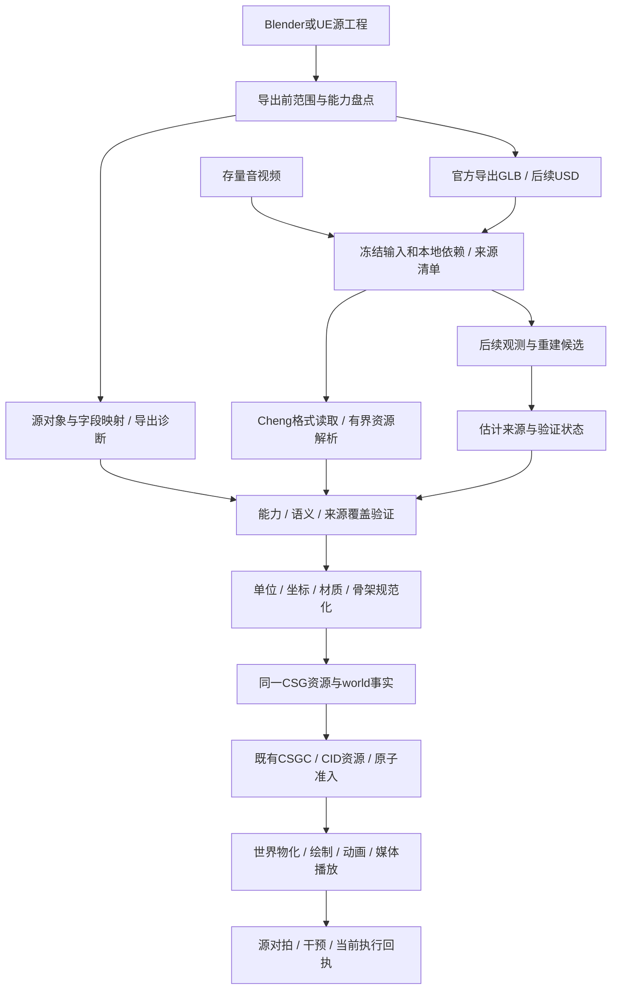
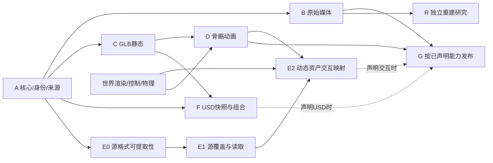

# CSG 资产管线开发计划

日期：2026-09-06。状态：`propose`。本文是 [世界视频计划](2026-09-06-csg-semantic-physical-world-video.md) D1 的详细资产子计划，不另建引擎。所有工作量、支持范围及验收数字均为拟议合同，不是实测能力。

[产品提案](../../../openspec/proposals/csg-asset-pipeline.md) · [任务表](../../campaigns/2026-09-06-csg-asset-pipeline/task_plan.md) · [事实依据](../../campaigns/2026-09-06-csg-asset-pipeline/findings.md) · [进度](../../campaigns/2026-09-06-csg-asset-pipeline/progress.md)

## 1. 交付范围与纯度

**目标：把不同来源变成同一套可验证的CSG资产，让世界执行器实际使用，并准确标出哪些是原始数据、动画记录、物理规则或重建假设。**

首期交付五份真实样例：一段原视频；一个Blender静态场景和一个骨骼角色；一个UE静态场景和一个骨骼角色。输出每份的CSGC、完整资源闭包、能力/来源记录、导入诊断、实际画面或播放记录。具体文件、源软件/插件版本与资产规模在A1冻结，本轮不下载或臆造样例。解析器正反例可用专门构造的格式夹具，不能代替最终真实资产验收。

纯Cheng范围为自有导入、验证、规范化、加工、CSG加载和执行代码。Blender/UE的官方离线导出属于源资产创作边界，版本与选项必须记录；发布后的CSG加载/执行不启动源应用、不依赖Python/UE插件/Assimp/OpenUSD承载语义。图像解码、几何和动画求值若仓库缺失，必须计入Cheng实现任务；媒体可复用上位计划明确列账的系统codec。

首期从媒体文件和GLB导入。直接读取任意`.blend/.uasset`、完整蓝图或任意源插件不是GLB兼容的附带能力。E阶段先做格式与可提取性研究，再冻结具体源版本与字段；需要自有外语插件的方案不在本纯Cheng范围内，不自动引入。

本项目交付资产和消费证明。实时可交互程序仍依赖上位世界的控制、物理和渲染性能门；不能由资产导入通过推出整台引擎已完成。

## 2. 统一管线与事实合同

### 2.1 唯一核心

- 复用世界D1拟定的`src/game/assets`、`src/tools/csg_world_asset_main.cheng`与世界CSG producer/validator/materializer；资产版本与世界实例分离，不新建ECS或独立资产身份数据库。
- `pack`调用既有CSGC、Merkle manifest/admission与资源对象存储；大块几何、纹理、音频为有类型/范围/CID的字节载荷。源格式JSON和可读诊断不是CSG生产主事实。
- 在现有core资源事实与拟定world扩展内增加实际需要且可执行的字段；producer、validator、consumer成对接线后再注册。金融`oracle_asset`不借作三维方言。
- 自有公开接口使用值、`var T`隐式借用和精确`int32`索引；内部DOD＋Arena＋SoA。文件长度、offset/stride计算用经过溢出证明的宽整数，不能因运行节点是int32而截短文件偏移。

### 2.2 三类输入事实与能力

能力是可组合的明确集合，不靠一个“已转CSG”布尔值表达：

| 能力 | 成功必须证明 | 不随之成立的能力 |
|---|---|---|
| 原始媒体播放 | 原字节不变、时间信息正确、实际解码播放 | 三维世界重建、自由换视角 |
| 几何/材质/摄影机 | 类型与变换正确、真实绘制 | 骨骼动画、碰撞或物理 |
| 骨骼/关键帧/形态键 | 在指定时间正确求值、蒙皮对应完整 | 状态机、有限力控制、接触因果 |
| 仿真缓存 | 明确时间区间内的状态记录可重放 | 修改外力后的重新求解 |
| 物理/控制 | 质量惯量、碰撞、关节、约束/控制实现可达，干预通过 | 与源求解器每步浮点轨迹完全相同 |
| 重建候选 | 观测、方法/模型版本、不确定项及验证结果可追溯 | 源工程真实值、被遮挡部分的唯一正确答案 |

输入请求先声明所需能力和选择范围，导入不满足时失败。一个原本只含动画的GLB可按动画合同接收；请求“原工程物理等价”时，同一个GLB不能被自动按动画合同放行。

### 2.3 身份、来源与构建键

| 记录 | 冻结内容 |
|---|---|
| 原始输入 | 源文件/工程依赖CID、交换文件CID、格式版本、完整本地资源清单、所选范围 |
| 源对象身份 | 有持久GUID则绑定源系统/命名空间和GUID；否则用冻结源快照CID＋精确对象表行/成员键。显示名称不作身份；跨版本缺少精确映射就建立新版本关系，不启发式合并 |
| 来源证据 | 源应用/插件/导出器的版本和可获得的构建哈希、导出选项、导出前对象与字段清单、映射表、原始诊断、源参考产物 |
| 能力 | requested、source-declared、verified分别记录；原始/推导/重建/人工创作来源分别标注。用户填写清单本身不构成完整来源证明 |
| 规范化 | 坐标/单位/时间/色彩空间的精确转换及实现/配置CID；字段默认值依照源规范明示，不用默认值顶替无法支持的输入 |
| 构建与产物 | 全部输入依赖＋导入器/实现闭包＋目标合同＋数值配置CID；输出facts_root、directory/object CID及每个资源CID、错误/执行回执 |

相同冻结输入与实现产生字节相同的CSGC。源重排/重导出可能改变来源记录与根，不能承诺不同输入根相同；未变化的几何/纹理资源仍可按其内容CID精确复用。被多个实例引用的资源与各实例自身身份必须分离。

### 2.4 源导出完整性

必须区分两个验收范围：**交换文件到CSG的完整转换**、**所选源工程内容到CSG的语义对应**。前者通过不能自动签发后者。

Blender/UE输入若声明源工程对应，先在源侧冻结对象、属性、材质输入、骨架、约束和行为清单，再建立源项→交换/附加数据→CSG的精确映射。范围内覆盖率必须100%；未知内容、导出警告、字段省略或替换都阻断该能力。只把丢失记入报告但仍宣称完整转换不合格。

尤其UE官方导出器会忽略碰撞，某些材质输入可能被默认值替换。GLB合法性检查无法发现已经丢掉的源数据。没有结构化源清单时，只承诺所给GLB本身的能力；不得从对象名字、截图或无告警日志推断完整源工程。

源数据无法由已有官方输出准确提供时，E0必须评估纯Cheng源格式读取；指定版本的必要解码器和语义翻译真实实现后才放行。人工新增物理参数应标为新创作版本，不称为从源工程恢复。源应用运行结果仅作独立验证基准，不能由同一个导入后的GLB再导回源应用生成基准。

## 3. 格式与能力支持顺序

| 输入 | 首次支持范围 | 后续独立建设 | 必须拒绝或明确不支持 |
|---|---|---|---|
| 原视频/音频 | 第一批MP4/M4A与WAV；保留原始字节，真实解析声明支持的轨道、时间、索引与元数据 | 更多容器/codec、字幕/轨迹观测 | 加密/未知codec/错误时间表；不能假定所有视频恒定帧率 |
| GLB静态 | glTF2受支持子集：完整GLB结构、TRIANGLES网格、场景/实例/变换、明确PBR材质、PNG/JPEG、摄影机 | 灯光、扩展材质、更多图元与压缩扩展 | 未支持的必要扩展、渲染相关未知能力、外部缺资源；不静默清零或替代 |
| GLB动态 | skin/inverse bind、骨骼、morph、STEP/LINEAR/CUBICSPLINE动画求值；使用同一身份表 | 应用层循环/混合/事件/状态机的独立world语义 | 不支持的驱动器或状态机；动画不自动获得物理控制能力 |
| Blender/UE源语义 | 固定版本与输入合同；能取得精确来源的数据、有限刚体/碰撞/关节参数及声明支持的控制子图 | `.blend/.uasset`具体版本解码、程序材质/驱动器/蓝图的逐节点实现 | 任意原工程、任意节点和源插件兼容；不能用烘焙曲线抵扣行为迁移 |
| USD快照 | 有限本地USDA，明确为已组合的场景快照，几何/变换/材质子集 | UsdSkel/Physics与时间采样；composition单独验收 | 不能称为保留全部layer/variant/reference创作结构 |
| USD可组合工程 | 逐项实现本地layer/reference/payload/variant/instance和时间偏移；保留源路径解析与精确引用语义 | USDC/USDZ及更多schema、resolver | 未支持的composition arc、插件或resolver明确失败，不自动flatten |
| 视频重建 | 独立阶段仅接入有真实输出与验证的观测/候选 | 所选本地模型推理、几何/相机/骨架重建及物理补充 | 无证据的质量/惯量/遮挡几何；不得给候选签发已知世界身份 |

GLB中的合法规范默认值按规范解释；实现缺失与合法默认值是两种情况。`extensionsRequired`未知必拒绝；未列required但会影响请求能力的未知扩展同样拒绝。明确不影响请求能力的描述性extras可原样保留，但不赋予运行语义。

坐标转换一次完成：源坐标→世界右手Z向上、米/千克/秒/弧度；同步处理网格、法线/切线、绕序、父子矩阵、逆绑定、动画、碰撞、关节坐标系与摄影机。质量/惯量的单位转换独立按量纲计算，禁止对所有字段乘同一比例。非均匀缩放、镜像和奇异变换有明确支持判据，不能只修视觉矩阵。

首期依赖闭包全部为本地已冻结对象。GLB可引用在清单内的本地资源；URI、解压和文件解析不隐式联网。源软件原本生成的动画记录可按记录合同接收；管线不会因遇到未知行为而自动生成烘焙替代物。

## 4. 阶段、依赖和工作量

下表是熟悉Cheng/CSG工程师的规划级人周估算，假设编译器与基础文件/内存能力可用；共享编译器修复、素材制作、源格式深度解码、完整USD二进制与视频模型研究另计。A1后按真实样例和能力支持表重估。与世界D1重叠的工作不能重复相加。

| 阶段 | 依赖 | 交付 | 估算 |
|---|---|---|---|
| A 核心合同 | 世界A/B接口 | 身份/能力/来源/事务和有界读取，真实样例基线 | 1–2人周 |
| B 媒体入库 | A；媒体解码接口 | 原视频保真、索引/时间、实际播放 | 2–4人周 |
| C 静态GLB | A；世界D2渲染 | 静态几何、材质、摄影机与源对拍 | 3–5人周 |
| D 骨骼动画 | C；世界蒙皮/时间 | Blender/UE角色求值、动画记录及实际画面 | 3–5人周 |
| E 来源与交互 | E0依赖A1；E1依赖E0和真实源读取；E2依赖E1与世界B/C | 源覆盖审计、有限物理/控制映射与干预；与世界E联合验收 | 4–8人周；E0提前研究，必要原格式解码另估 |
| F USD场景 | A、C；动态/物理消费按能力依赖D/E | USDA快照→限定composition→Skel/Physics | 5–10人周；USDC/USDZ与任意插件另估 |
| G 发布与更新 | 已声明来源能力通过；世界生产门 | 批量、重导入、依赖失效、原子发布与完整验收 | 2–4人周 |
| R 视频重建 | B；世界模型/本地推理能力 | 观测→候选→独立验证→有来源的新资产版本 | 先做1–2人周可行性研究，实施量据选定模型与样例估算 |

A–G限定范围合计 **20–38工程人周**；首批媒体＋GLB静态/动画＋对应G发布范围为 **11–20工程人周**。均非日历承诺，且不含上位渲染/物理引擎本身。E/F/R并非首批资产播放的前置，要求物理交互或USD工程完整性时则必须通过对应门。

### 4.1 与世界计划的唯一工作归属

| 工作 | 唯一计账与实现归属 | 上位计划关系 |
|---|---|---|
| 格式读取、来源/能力、资产打包与准入 | 本计划A–D及相关G | 接管原世界D1的导入/校验/加工工作，不再在D1重复估工 |
| 动画曲线与skin/morph数据解释 | 本计划D1的assets/animation及导入模块 | 世界D2调用这一份求值语义，不重写第二份 |
| 顶点蒙皮执行、渲染采样、材质着色、CPU光栅 | 世界D2 | 本计划D2只接线和验证消费；估算不再计渲染器实现 |
| 三维求解、关节/接触、行为控制 | 世界C与E | 本计划E只导入/映射/验证源字段，不再估一套物理引擎 |
| 原媒体解析与已有MP4时间/codec接口 | 共享cinema模块由世界D3单owner；本计划B计新增格式/资产接线 | 按函数/模块拆出复用与新增，不能两边各写解析器 |
| 角色/声音制作与动作表演调校 | 世界内容D/F或独立美术任务 | 不含在资产导入器人周中 |
| 通用CSGC、编译器、生产权限链 | 既有主线 | 本计划只计接口接入和本资产验收，不重复计算通用实现 |

A1必须按这张归属表把原世界D阶段6–10人周拆成资产、表现、媒体的具体任务，再给出合并估算。拆账前**不能使用25–43＋20–38作为总工期**。共享渲染与资产消费按冻结接口并行实现，C2/D2和世界D2在联合样例上收敛，不互相要求对方先整体完成才开始编码。

G对每个发布清单执行其声明能力的依赖，不要求未声明的E/F全部完成；任何尚未通过的能力必须保持不可激活。整体项目完成清单固定为A1–A3、B1–B2、C1–C2、D1–D2、E0–E2、F1–F3、G1–G2全部通过，以及R1的可行性研究结论完成；R的模型产品化、任意原工程解码和USDC/USDZ不在该实现清单内。若扩展这些范围，应新立具体实施任务，不能由某次发布临时改变整体完成清单。完成一批GLB资产不能提前archive。

## 5. 文件、行动、验证和完成条件

以下路径为拟新增或必要演进。所有格式直接产生同一资产/世界事实；临时解析结构允许为其格式服务，但不成为第二套权威图。共享文件单一owner；实现前检查同名模块，复用优先。

| 任务 | files | action | verify | done |
|---|---|---|---|---|
| A1 基线与范围 | 拟新增`docs/csg-asset-import-contract.md`、campaign的`baseline.md/capabilities.json/fixtures.md` | 冻结源版本、真实五样例、请求能力、大小/时间/数值预算，复验编译及系统codec | 源清单、当前可达执行、缺失项有最小复现；真实文件不以假数据替代 | [ ] 输入与目标可重现，未支持项明确 |
| A2 统一身份与事务 | 复用core CSGC/manifest/admission；拟新增`src/game/assets/{source_map,validation,pack}.cheng`、`import/{request,dependency,diagnostic,commit}.cheng` | 冻结输入闭包和来源，类型/能力验证后原子提交，复用content CID | 缺依赖/陈旧源/错CID/重复身份/中断写入；同输入字节一致 | [ ] 无第二套wire或权威目录，无半包激活 |
| A3 有界读取与规范化 | 拟新增`src/game/assets/import/{reader,normalize}.cheng`；审查专用`wow_export/binary.cheng` | 安全范围计算、配额、单位/坐标/色彩转换；提炼可复用原语 | offset/count溢出、短读、镜像/非均匀缩放、旧消费者回归 | [ ] 保留必要精度，无专用格式整数化补丁 |
| B1 媒体解析 | 拟新增`src/game/assets/media.cheng`、`import/media.cheng`；复用cinema/timeline/mp4与现有媒体事实能力 | 原码流保留，真实解析声明支持的轨道/索引/timebase/旋转/音频有效区间 | 可变帧率、B帧顺序、编辑列表、AAC首尾填充、坏轨道与缺codec | [ ] 原字节CID相同，时间可解释且实际播放 |
| B2 观测记录 | 拟新增`src/game/assets/reconstruction/observation.cheng` | 接入已有真实字幕/轨迹或未来提取器输出；绑定帧区间、坐标系和方法 | 时间偏移、冲突文本、无来源结果拒绝；人工/提取来源分开 | [ ] 只授予已验证观测能力，不伪造提取算法完成 |
| C1 GLB与accessor | 拟新增`src/game/assets/import/gltf/{glb,json,accessor}.cheng` | 实现容器/JSON/二进制范围、offset/stride/component、matrix填充、normalized/sparse、索引和扩展准入 | 官方独立validator＋成对正反例，未知required/溢出/环/NaN拒绝 | [ ] 支持表覆盖均可证，不能只有文件计数 |
| C2 几何/材质/图像 | 复用D1路径`src/game/assets/{mesh,material}.cheng`；拟新增`import/gltf/{mesh,material,scene}.cheng`与明确PNG/JPEG解码模块 | 保留层级/实例与语义；Cheng纹理解码、有限PBR、摄影机；共同规范化 | 非同源参考几何/材质诊断、多机位实际绘制、缺纹理/不支持材质拒绝 | [ ] Blender/UE静态样例消费通过，源对应能力按证据授予 |
| D1 skin与动画 | 复用`src/game/assets/skeleton.cheng`；拟新增`animation.cheng`、`import/gltf/{skin,animation}.cheng` | 精确joint/逆绑定/权重/morph，三种插值与四元数求值；根运动独立定义 | 绑定姿态、全部关键帧与区间时刻的关节/顶点对拍；边界权重和多实例骨架 | [ ] 两来源角色真实运动，无按名称重配或静默修权重 |
| D2 世界消费 | 复用`src/game/render/{resources,frame,animation}.cheng`与world物化；拟新增`src/tools/csg_world_asset_main.cheng` | 从正式CSGC加载、展示、播放，CLI逐项输出能力及回执 | 在不启动源应用的环境运行，缺资源/缺消费者明确失败 | [ ] 静态和动态样例实际可见，影片/截图/状态绑定资产版本 |
| E0 源格式可提取性 | 拟新增`docs/csg-asset-source-capabilities.md`、campaign的`source-format-study.md` | 选定Blender/UE版本，逐字段查官方可用输出；研究纯Cheng读取必要源字段的可行性/工作量 | 至少1个包含导出会丢失属性的真实源样例；不能凭GLB反推源完整性 | [ ] 源数据、精确身份与覆盖证据获得路径具体；缺路径的能力标阻塞 |
| E1 源清单与映射 | 拟新增`src/game/assets/import/source/{blender,unreal,coverage}.cheng`；原格式解码按E0冻结后另列具体文件 | 读取结构化源字段和导出诊断，源项→交换数据→CSG精确关联；不支持的源功能拒绝 | 同名对象、导出遗漏/材质替换/碰撞丢失、版本/插件变化 | [ ] 请求源范围覆盖100%，来源声明不冒充权威 |
| E2 物理与控制 | 复用world physics/contacts/constraints/motion；拟新增`src/game/assets/import/physics.cheng` | 质量惯量、碰撞、关节frame/drive/过滤与已实现控制子图接线 | 独立解析/源参考例；撤销支撑、施外力、改变摩擦；失败继续物理而非播放根轨迹 | [ ] 声明交互的资产真实干预通过；源求解器数值差异单独定义 |
| F1 USD快照 | 拟新增`src/game/assets/import/usd/{usda,transform,mesh,material}.cheng` | 读取明确的已组合本地快照，保留转换依据和资产映射 | 未支持arc/schema显式拒绝；源场景布局/材质诊断对拍 | [ ] 仅授予快照能力，不冒充原工程结构 |
| F2 composition | 拟新增`src/game/assets/import/usd/{composition,resolver,instance}.cheng` | 按支持表建设layer/reference/payload/variant/实例及时间映射；完整本地依赖解析 | 改variant/引用/时间offset，源stage求值对拍；循环/缺依赖/错误目标定位拒绝 | [ ] 请求组合语义保持，源路径只用于解析不充当Cheng运行身份 |
| F3 Skel/Physics | 拟新增`src/game/assets/import/usd/{skel,physics}.cheng`；复用D/E消费者 | 转换已有USD骨架/动画/刚体/关节语义，保留单位和驱动约束 | 求值姿态及动力学案例；量纲、轴、惯量、碰撞过滤负例 | [ ] 字段、计算和干预分别通过，不能仅schema存在 |
| G1 重导入与批次 | 复用Merkle失效；拟新增`src/game/assets/{reimport,dependency}.cheng` | 精确构建键和选择范围；资源复用、变更失效、原子替换资产版本关联 | 改纹理/骨架/源设置/工具版本；全量从原输入重建、不共用旧解析状态对拍 | [ ] 与完整重导入一致、无陈旧关联或部分成功冒充全批成功 |
| G2 门禁与发布 | 拟新增`src/tools/csg_asset_gate.cheng`、`src/tests/csg_asset_*`与最终manifest/回执 | 五真实样例、格式反例、完整消费、资源/纯度/生产准入；支持矩阵随版本发布 | 损坏/越界/中断/取消/无源应用运行/100次加载卸载；正式compiler与CSG生产门 | [ ] 声明范围全部通过才发布；整体范围满足才archive |
| R1 重建可行性 | 本轮拟新增campaign的`reconstruction-study.md`；后续若立项再新增`src/game/assets/reconstruction/{candidate,validation}.cheng`并复用本地inference | 研究具体模型、真实输入、所需算子/硬件与可验证范围；条件具备才执行小样例推理，不把接口草图计产品化 | 有执行则保留未拟合时间/视角、输出与资源回执；无可达模型则记录缺口、工作量及不支持范围；物理另过E | [ ] 研究结论可评审；真实模型产品化与重建质量承诺另立实施任务 |

## 6. 样例与验收矩阵

样例需保存真实来源、输入CID、独立参考和预期能力；下列数值为拟议门槛，A1随场景尺寸与源精度冻结，不能失败后放宽。独立参考不能由本导入器的输出派生。

| 组别 | 真实样例/变体 | 验收 |
|---|---|---|
| 媒体 | 原视频与音频；另加可变帧率、B帧、非零起始时间、音频填充样例 | 原始字节逐字节保持；PTS/DTS/timebase与独立解析一致；有效音频/完整播放、seek落点正确，不能强行改为24fps |
| 静态GLB | Blender与UE各1场景，含层级、重复实例、PBR纹理、镜像与非均匀缩放变体 | 转换后的拓扑/材质绑定/世界变换与参考匹配；不要求源应用与glTF顶点总数天然相同，展开和对应必须有依据 |
| 骨骼动画 | Blender/UE各1角色均验bind pose、多个joint与实际骨骼动画；morph及各类插值由确能导出的来源或独立合法GLB另样例覆盖，UE导出器不支持的morph动画不伪造；另加多组权重/不支持能力反例 | 全关键帧＋每区间固定内部时刻对拍世界关节/顶点，位置误差建议`1e-5m + 1e-5*abs(reference)`，旋转误差≤0.01°；动画末端/循环不自行猜测 |
| 材质与颜色 | 已知色块、法线、粗糙度/金属度、透明与双面样例 | 核验线性/显示色空间与纹理通道；同一规定诊断光照比较。源/目标不同渲染器不用整图字节相同充当唯一标准 |
| 源覆盖 | 源含不支持材质节点、驱动器、碰撞和蓝图变体，导出GLB仍合法 | 所请求源项映射覆盖100%；删除任一项或隐式替换时拒绝源等价声明；合法GLB本身不抵扣缺口 |
| 物理 | 已明确字段来源的刚体、摆、关节与攀绳资产 | 自由落体、关节限位、碰撞过滤、外力响应；攀绳沿用世界计划240Hz/撤销全部支撑/250ms自由飞行/≤1cm质心误差合同 |
| USD | 快照、两层覆盖、引用实例、variant、payload、时间offset、Skel/Physics独立样例 | 逐项对比源stage求值与切换行为；支持表之外的arc/schema拒绝；snapshot不获得composition能力 |
| 依赖与更新 | 同名不同对象、重排、资源复用、删除重建、工具/配置改变、大小写路径冲突 | 引用100%解析；asset/source/instance身份不混用；全量基准从冻结输入重新解析，不复用增量缓存；未改资源CID可复用 |
| 原子提交 | 在读取、写资源、写CSGC、准入及head提交边界退出进程 | 重启只可激活完整旧版或完整新版；损坏/未完整准入的新对象不能激活；孤立未准入对象不等于成功版本 |
| 资源与纯度 | 大文件/畸形长度/过大解码图像/路径逃逸/未知外部URI/100次加载卸载 | 有界拒绝、无隐式联网、无自有外语执行器；ORC与文件/codec/映射资源释放；缺消费者不标通过 |
| 重建 | 原视频观测与候选版本，保留未拟合视角或时段 | 有额外视角才验新视角；只有单视角时明确该能力未验证；识别/几何估计/物理创作来源分开 |

CSGC一致性、几何/动画数值一致性、物理一致性、视觉相似和播放自然度分别出结论。所谓“语义等价”只覆盖经过定义并验证的字段和行为；不能由几张相似截图外推全部源程序等价。

## 7. 资源、错误、发布与启动顺序

首期拟定本地导入预算：进程树峰值内存≤2GiB、暂存/派生缓存≤8GiB；解码图像像素数、节点/关节数、递归深度、压缩展开字节和文件总量逐项在A1冻结。基准集拟含≤256MiB GLB、≤100万三角形、≤256关节角色、≤4096×4096纹理，以及1GiB媒体文件。超范围显式报不支持，不自动减面、降纹理或截断动画。

可用性目标：上述GLB基准单次导入/校验/封签拟≤120秒，1GiB媒体原字节扫描/入库拟≤120秒；渲染、整段解码和源应用导出分别计时。A1根据真实设备与实际编译执行的最小通路校准并冻结，未达到则修实现或明确修订合同；不能只做文件元数据读取就把完整扫描记完成。取消请求拟2秒内确认，停止接收新任务；不可中断系统调用单独记录结束时间，取消不提交可激活资产。

输入读取必须持有可验证的冻结快照/文件身份；源文件或依赖在读取期间改变时拒绝本次结果。默认只读清单内本地对象，防路径穿越、符号链接逃逸和范围溢出。产物采用既有内容寻址与no-replace准入；调用者提交CID/manifest文本不制造生产权威。

导入错误返回具体源对象/字段定位、违反合同、已支持版本与失败阶段，不能以“warning＋成功”吞掉所请求能力。请求范围可以提前明确选择，但运行失败后不得自动缩小范围重签成功。原始来源引用不自动授权发布或上传。

发布门沿用上位世界计划：正式Cheng编译器证据与精确1GiB编译进程树门、CSG生产activation/replay等权限链须真实关闭。该1GiB编译门与本项目2GiB导入进程预算分开；功能验证完成不代表生产权威通过。

启动顺序：

1. A1先冻结五个真实样例与来源能力，复验编译/codec；同步上位world B/D接口，指定共享模块owner。
2. A2/A3完成统一核心，B与C可在独立目录并行；实现时每个解析器直接接同一资产schema。
3. C后接D；不等全部USD或重建研究结束才让首个角色在Cheng中实际播放。
4. E0从A1开始揭示源字段获取缺口；E1等待E0结论与真实源读取（官方结构化输出或已完成的指定解码器），E2等待E1及世界物理/控制消费者，并与世界E联合验收。F按快照/组合分开建设。
5. G按已声明范围跑全量验收；R单列研究，不下载巨大模型或调用付费服务冒充确定路径。

每项按files/action/verify/done闭环，Review查Bug后检查更小、更稳健的实现。临时文件由`tools/cheng_scratch_scope.sh`与真实owner生命周期管理，长任务脚本冻结；正式样例、输入证据与交付资源属于持久资产，不能被暂存清理误删。

## 8. 规范依据与评审

- [glTF 2.0正式规范](https://registry.khronos.org/glTF/specs/2.0/glTF-2.0.html)：格式与动画求值的上位依据，独立Khronos validator只作验证工具。
- [Blender glTF文档](https://docs.blender.org/manual/en/5.1/addons/import_export/scene_gltf2.html)：源导出保留能力需要按实际软件版本重新核验。
- [UE glTF导出说明](https://dev.epicgames.com/documentation/en-us/unreal-engine/how-the-gltf-exporter-handles-unreal-engine-content)：当前材质/碰撞等导出局限说明了源侧覆盖门的必要性。
- [USD概念](https://openusd.org/release/glossary.html)、[USD Physics](https://openusd.org/release/api/usd_physics_page_front.html)：组合与物理字段的语义依据，不能用OpenUSD库包装代替纯Cheng实现。
- 仓库权威：[CSG标准](../../csg-core-standard.md)、[Cheng语言规范](../../cheng-formal-spec.md)。实施时记录实际读取的源版本和规范版本，不以本次搜索结果宣称所有未来版本兼容。

规划完成只表示任务与验收可评审。本轮不实现导入器、不改变现有core registry、不注册尚未执行的能力；后续按用户实施指令进入apply。
