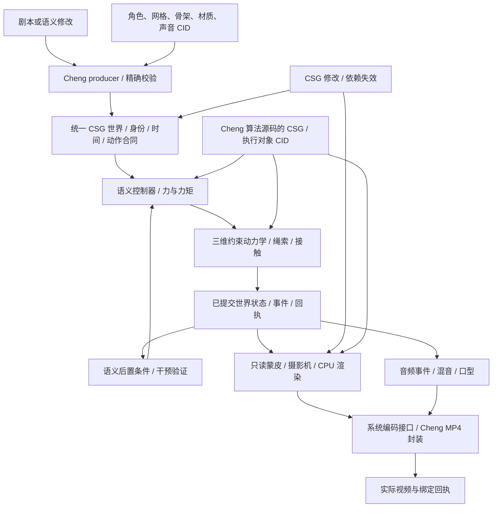
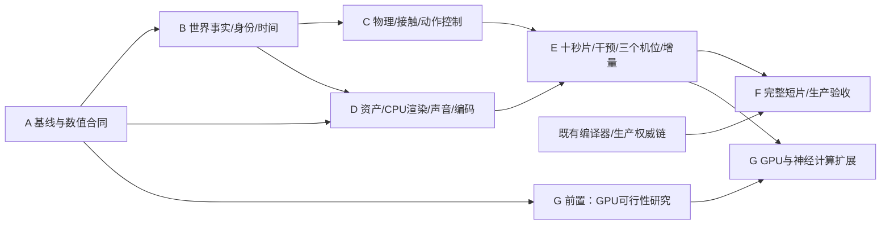

# CSG 语义物理世界视频开发计划

日期：2026-09-06。状态：`propose`。以下为拟议设计、工作量和验收目标，均不是已实现能力或实测性能。

产品提案：[OpenSpec](../../../openspec/proposals/csg-semantic-physical-world-video.md)。任务与事实记录：[任务表](../../campaigns/2026-09-06-csg-semantic-physical-world-video/task_plan.md)、[发现](../../campaigns/2026-09-06-csg-semantic-physical-world-video/findings.md)、[进度](../../campaigns/2026-09-06-csg-semantic-physical-world-video/progress.md)。

资产子计划：[CSG资产管线](2026-09-06-csg-asset-pipeline.md)，细化D1的媒体/GLB/来源语义/USD导入；共享资产schema与消费者，不另建资产引擎。该扩展仍为propose。

## 1. 目标与执行边界

**目标：用一份可执行 CSG 世界产生真实人物运动，并能通过语义修改、物理干预和换机位验证其因果一致性。**

首个功能版本固定为一个角色、一根有质量与约束的绳索、一面可蹬踏岩壁；10 秒、1280×720、24 fps，完成两次交替抓握、明确蹬踏及抬升。交付正常片、全部支撑解除片、三个机位、世界记录、指标与产物清单。技术调试骨架与方块只作中间验证，交付包含可辨认的完整角色、服装和材质。

随后交付 60–90 秒、6–10 镜头的原创出山短片；覆盖行走、停留、抓握和攀爬，具备表情、声音、对白/旁白与字幕。镜头内主体必须发生实际运动。马车、多人物搬运等新增行为只有物理与资产验收通过后纳入，不能用静态推拉补足时长。

首期正式执行器为 **macOS arm64 上的纯 Cheng CPU 离线模拟与渲染**。输出帧率是影片采样率，不是生成速度。渲染质量、实际耗时和内存逐项测量，不承诺实时或照片级画质。GPU 作为 G 阶段明确建设的同语义后端；CPU 路径一直保留为正式离线执行器和对拍基准。

纯度边界：自有代码均为 Cheng，资产是数据；系统文件、线程、驱动、音频和硬件 codec 是逐项列明的外部效应。首期拟用系统 H.264/AAC 编码接口处理已生成的画面和混音，Cheng 实现时间戳、混音和 MP4 封装；称为“Cheng 生成与封装＋系统编码”。不使用收费平台，不自动上传素材，不由 Python/Blender/外语脚本承载生产语义，不内嵌手写 MSL。独立外部播放器或解析器可用于交付验证，不能参与生产生成链。

本提案只建设上述有限世界所需能力，不先训练基础视频模型、不模拟完整现实世界、不更改其他任务的实施状态。

## 2. 共用架构与核心合同

### 2.1 唯一事实来源

- 复用 `src/game/ecs.cheng`、`runtime.cheng`、现有 CSG Merkle 与资源机制。三维组件以同一实体索引新增 SoA 列；二维消费者保持其原有明确合同。电影应用不得维护另一个权威世界。
- 拟定一个世界领域扩展 `csg_dialect::world`，内含物理、动作、摄影机、声音和影片时间语义；不平行创造多个互相翻译的 world/scene/movie 方言。名称须在 B1 与标准维护者核对，当前未注册。现有 Web scene 不改为三维语义。
- 计算定义采用 Cheng 编译产生的 typed CSG/后端 IR，资源与调用绑定实现 CID、精确类型和输入输出。给节点写上“physics”字符串不构成可执行算法。内容包只引用已校验的执行器，不逐内容重新编译产品引擎。
- 语义包含计划、执行中、成功、失败的独立状态；“抓住成功”由接触与承载条件推出。目标失败记录事件，世界仍按物理推进；求解器非收敛则拒绝提交该步，不能静默冻结后导出成功影片。

### 2.2 身份、存储与状态

| 合同 | 拟定规则 |
|---|---|
| 持久实体身份 | 世界实例身份＋分配时记录的实体身份；显示名称可修改，姿态变化不改变实体身份 |
| 运行引用 | 经过验证的实例行、`slot:int32`、`generation:int32`；槽复用和代际溢出显式拒绝陈旧引用；跨状态重排有精确映射 |
| 骨架对应 | 语义身体部件、动力学刚体/关节、蒙皮骨骼引用同一个经过验证的对应表；禁止按名称或空间邻近配对 |
| 资产版本 | 网格、碰撞形状、骨架、材质、纹理、录音分别绑定 CID、字节数和类型；资产版本与实体身份分离 |
| 世界状态 | 位置、速度、姿态、质量惯量、接触、控制器状态、随机流、时间和环境输入；采用 Arena + SoA，不含 GPU 句柄或墙上时钟 |
| 展示状态 | 只读已提交世界状态；摄像机、光照和材质版本单独绑定；渲染插值不得回写物理 |
| 计算与回执 | before/after facts_root、实现和配置 CID、输入与资产 CID、步数、残差、状态、实际产物 hash；用户提供的 CID 不能自造生产信任 |

按检查点＋逐步输入/事件记录回放，完整状态验证按流处理；不无界保存所有帧、浮点值和纹理副本。大块状态/张量是有类型的资源载荷，CSG 保存其结构与绑定。

### 2.3 时间与数值

- 时间使用 `int64` tick 和精确有理 timebase。首期物理 240 Hz、画面 24 fps、声音 48 kHz；每帧 10 步、每步 200 个音频采样帧。10 秒为 2400 步、240 个视频帧、每声道 480000 个音频样本；区间为 `[0, 10s)`，终点状态可以保存但不多导出一帧。
- 音频样本数指源 PCM 和成片的有效播放区间。AAC 的编码预填充与尾部填充必须明确记录并正确写入 MP4 时间映射；原始解码块可能含额外样本，验收按有效区间裁定，不把填充当作叙事时长。
- 物理使用米、千克、秒、弧度，右手坐标、Z 向上；资源导入显式转换单位、手性和轴，禁止按尺寸猜单位。影片事件映射到视频帧/音频样本的舍入规则写入合同。
- 首期权威三维求解采用明确范围的 f64、固定计算顺序和可重现调度；禁 NaN/Inf 与未说明的 fast-math。输入序列、负零/舍入、容差和计算环境写入数值 profile。相同冻结环境验状态字节一致；跨后端按独立冻结的误差口径验收，不承诺所有 GPU 字节相同。
- 物理时钟不依赖渲染速度。离线按需要推进至下一采样点；交互预览用就绪事件/截止时间驱动，暂停无任务时阻塞等待，不用轮询。
- 约束关系允许数学上的环；由明确的求解算子求解。存储 DAG 通过时间步输入→输出展开，不将循环约束误写成非法的 Merkle 依赖环。

### 2.4 动力学与控制

三维关节刚体、单边接触、摩擦和柔性绳索共同参与动力学。A2 冻结求解方法、离散方程、碰撞覆盖与误差预算；C1 先通过自由落体、悬挂、摆动和碰撞解析/参考例，才进入人体控制。只允许明确列入支持表的碰撞形状组合，其他组合硬失败。

骨架目标及 IK 可用于提出关节目标；控制器施加有上限、有来源记录的力/力矩，动力学决定身体位姿。禁止将 IK 结果直接覆盖权威身体、隐藏悬挂点、无限抓力或移走支撑后继续播放根节点轨迹。人体质量和惯量由版本化资产明确提供，不要求求解器从外观猜测。

数据驱动动作首先是有类型的显式计划。自然语言解析与学习模型在后续只提出候选；必须经过相同验证器、控制器和求解器，不能绕过已记录世界状态生成另一套动作。

## 3. 阶段、依赖与工作量

下表为规划级估算，单位是工程人周，不是日历承诺；按熟悉 Cheng/CSG 的开发者、目标工具链可修复、既有基础可复用假设估计。美术另计，编译器共享阻塞和 GPU 研究的不确定性单列。A 阶段结束后依据实测拆分重新估算，不把缺失能力按零成本处理。

| 阶段 | 依赖 | 交付与放行条件 | 估算 |
|---|---|---|---|
| A 基线与合同 | 无 | 当前编译/ABI/文件/媒体可达验证；冻结数值、素材与范围；未通过项有可复现阻塞 | 1–2 人周，另加实际工具链修复 |
| B 世界 CSG | A | 最小世界 producer→validator→materializer→执行接通，精确身份与时间通过正反例 | 3–5 人周 |
| C 物理与动作 | B | 可解释的三维接触/绳索、受力控制；正常动作及干预成立 | 8–14 人周 |
| D 资产与画面 | A；世界接口以 B 为准 | 完整角色蒙皮、CPU 渲染、混音、编码/封装可执行 | 6–10 人周，可与 C 并行 |
| E 十秒闭环与编辑 | C、D | 三机位、取消支撑、增量/全量对拍、完整可播放视频 | 3–5 人周 |
| F 完整短片与发布 | E；生产权威链关闭 | 60–90 秒成片、编辑回执、生命周期/纯度/完整播放验收 | 4–7 人周，另加生产链阻塞修复 |
| G GPU/神经扩展 | E；能力研究结论 | 同一语义的真实 GPU 内核或受约束模型执行，独立验收 | A 阶段安排 1–2 人周可行性研究；实施量据结果单独核算 |

A–F 的初步合计为 **25–43 工程人周**，不是已经投入或可保证的交付时间。角色建模、绑定、材质、动作调校及声音建议另留 3–6 人周，随 D–F 并行。GPU 或神经模型不占用首个十秒影片的必要关键路径。

以上为原有限世界范围估算，尚未包含后续提出的完整外部资产管线。资产子计划与本表D1及基线/验收有重叠；实施A阶段逐任务去重重估，不能把两张人周表直接相加，也不能宣称新增来源覆盖免费完成。

## 4. 文件、行动、验证与完成条件

下列新增路径均为拟定，不代表当前存在。实施前检查同名模块及共享任务 owner，优先合并到现有模块；每一任务只有一个写入者。已有路径只做必要演进，不整文件重写。

| 任务 | files | action | verify | done |
|---|---|---|---|---|
| A1 当前基线 | 现有 `docs/cheng-formal-spec.md`、`docs/csg-core-standard.md`；拟新增本 campaign 的 `baseline.md`、`capabilities.json` | 冻结实际源码/编译器/链接对象/设备；检查浮点、跨模块借用、SoA、文件、线程、媒体 ABI；区分当前运行与历史报告 | 当前入口编译运行必要能力，故障有最小复现；最终链接闭包识别自有外语实现 | [ ] 每项为已测/不支持/阻塞，不留含糊“已有” |
| A2 数值与资产合同 | 拟新增 `docs/csg-world-contract.md`、campaign `solver-decision.md`、`assets.md` | 冻结有限碰撞形状、关节/摩擦/绳模型、求解方法、单位、误差、角色和声音数据合同；选择方法基于明确方程与失败条件 | 审查解析案例、参数范围、收敛准则、接触完整性和资产可获得性；没有资源时列出制作任务 | [ ] 方程/接口/试验与资源工作量可评审，阈值在测试前冻结 |
| B1 事实与准入 | 拟新增 `src/game/csg/{schema,producer,validation}.cheng`；必要演进 `src/core/csg_core/validator.cheng` 与标准 registry | 先接通最小世界事实的真实生产和精确验证，后续 kind 成对加入；区分意图/状态/结果 | 单位/类型/引用/未知 kind/损坏资源/重复身份负例；相同输入 canonical 输出一致 | [ ] 有实际 producer、validator、consumer 后才登记已支持 profile |
| B2 世界物化与时间 | 复用 `src/game/{ecs,runtime}.cheng`；拟新增 `src/game/{time,world3d}.cheng`、`csg/materializer.cheng` | 在唯一 ECS 扩展三维组件、身份代际与事务式提交；精确时间推进及检查点 | 同名实体、重排、删除重建、陈旧引用、溢出、跨步回放；二维消费者回归 | [ ] 同一实体精确贯穿语义/动力学/展示，非法输入拒绝物化 |
| B3 计算接线 | 复用现有 Cheng→CSG/后端 IR；拟新增 `src/game/csg/execution.cheng` | 世界内容引用具体算法版本和类型化调用；绑定实现闭包与实际执行回执 | 更换实现 CID、缺 provider、输入布局不符均拒绝；观测真实入口消费 | [ ] 非仅元数据，最小世界产生实际状态变化 |
| C1 三维动力学 | 拟新增 `src/game/{physics3d,contacts3d,constraints3d,rope3d}.cheng` | 实现冻结的刚体/关节/绳索与接触求解；空间索引、支持形状的连续碰撞和有界残差判定 | 自由落体、承重、摆动、碰撞、关节限位；高速度、质量比、步长边界和非收敛负例 | [ ] 解析/独立参考误差达标，全部外力可归因，无轨迹覆盖 |
| C2 身体与控制 | 拟新增 `src/game/motion/{skeleton,controller,grasp,climb}.cheng` | 绑定同一骨架；实现抓握/释放/换手/蹬踏目标、有限执行力和语义成功判定 | 不可达抓点、绳索移走、抓力不足、支撑解除；动作失败后物理仍推进 | [ ] 两次交替抓握、蹬踏和抬升可连续完成并通过干预 |
| D1 真实资产 | 复用既有资源/CID约定；拟新增 `src/game/assets/{mesh,skeleton,material,pack}.cheng`、`src/tools/csg_world_asset_main.cheng` | 按资产子计划建设统一导入与加工；制作或导入符合所需能力的角色、绳、岩壁与声音 | 源/交换数据范围、单位、骨架/权重/CID负例及实际多角度消费；物理角色须通过交互门 | [ ] 只按本世界实际请求能力验收D1；不能要求全部USD/重建先完成，也不能用动画记录替代物理控制 |
| D2 CPU 渲染 | 对齐共享计划拟新增 `src/game/render/{resources,frame,animation}.cheng`；拟新增 `cpu_raster.cheng`、`src/game/cinema/camera.cheng` | 蒙皮、投影、裁剪、深度、材质、灯光/阴影和采样；读取已提交世界，流式输出帧 | 固定机位人物运动；三个机位身份/遮挡/接触一致；重复渲染与边界图形案例 | [ ] 完整角色真实三维画面输出，变形/穿模/闪烁通过视觉审查 |
| D3 音频与媒体 | 拟新增 `src/game/cinema/{timeline,audio,export,mp4}.cheng`、`src/core/runtime/cinema_darwin_provider.cheng` | Cheng 音频事件、混音、字幕/口型时间；受控系统H.264/AAC编码、Cheng MP4封装和错误传播，处理音频预填充/尾部填充 | 精确帧数/有效时长/声道样本数、PTS/DTS、音频时间映射、flush/EOS、取消、编码失败、完整独立解码 | [ ] 无外部脚本生成依赖，实际视频可播放，系统 codec 明确列账 |
| E1 十秒应用 | 拟新增 `src/apps/world_cinema/{main,climb_scene}.cheng` | 用正式 world producer 创建内容，通过唯一执行路径生成正常、干预和三机位影片 | 第 5 节人物运动、下落、视觉与声音门全部通过 | [ ] 视频、源事实、资源与回执可一一对应 |
| E2 增量编辑 | 复用 `src/core/csg_core/merkle_invalidation.cheng`；拟新增 `src/game/cinema/{edit,render_dependency,replay}.cheng` | 语义修改→完整依赖失效→检查点重算；覆盖物理尾段、声音、遮挡、阴影、采样状态 | 抓点/绳质量/灯光/相机分别修改，与清空派生缓存的全量计算对拍 | [ ] 先证明一致，再报告复用与时间；相机修改不重算世界 |
| E3 可重复门禁 | 拟新增 `src/tools/csg_world_video_gate.cheng` 与 `src/tests/csg_world_*` | 真实入口集中跑功能、干预、错误与纯度验收；receipt 绑定源码闭包及最终文件 | 故意篡改源、状态、资源、缓存和回执均拒绝；缺影片不能通过 | [ ] 同一冻结构建两次通过；没有历史报告抵扣 |
| F1 完整内容 | 拟新增 `src/apps/world_cinema/{story,shot_plan,edit_main}.cheng`；复用 motion/资产模块 | 编辑入口支持换相机、改抓点/动作区间/材质；扩展行走/停留、表情、对白与6–10镜头叙事 | 每镜实际主体运动、跨镜角色/道具/状态连续；语义修改实际改变输出；完整观看和听音 | [ ] 60–90 秒可交付片及可重建项目，无静态补时长 |
| F2 生产与生命周期 | campaign 最终回执、既有生产编译/CSG launcher 门禁；拟新增发布清单 | 冻结源码/资产/执行器，计量 CPU/内存/磁盘/编码资源，生产权威依赖复验 | 正式编译要求的固定点和精确 1GiB 进程树门；存储信任/activation/replay；反复卸载与失败清理 | [ ] 生产依赖与影片门均通过才 archive；编译器与媒体运行资源门分别记账 |
| G1 GPU 后端 | 复用共享计划的 shader/IR 目录；平台路径由 A 研究后冻结 | Cheng 类型化 kernel/shader CSG→正式目标编译→驱动执行；统一布局/资源/同步 | 真蒙皮/材质/阴影内核执行、显式版本身份；与 CPU 按冻结误差合同对拍；无内嵌外语算法 | [ ] 实际硬件支持与收益成立；不可用明确不支持，不借其他平台计划假定完成 |
| G2 受约束生成 | 复用 `src/inference/{kernel,kernel_ir,model_executor}.cheng`；拟新增 `src/game/cinema/model_candidate.cheng` | 先实现可验证的资产/动作候选接口；模型图、权重 CID、dtype/layout/所有权纳入事实合同 | 缺算子/权重/错误布局拒绝；候选须通过同一语义/物理执行链；全帧自由重生成不能抵扣物理验收 | [ ] 只有所选模型真实执行且可控收益达标才发布；无基础模型训练承诺 |

## 5. 验收矩阵

**下列数字是建议门槛，A2 冻结后作为测试输入；未经变更提案不得在失败后放宽。** 动作和物理误差与最终视觉质量分别验收。

| 验收 | 方法与建议目标 |
|---|---|
| 时间正确 | 10 秒严格 2400 物理步、240 视频帧、每声道480000个有效音频样本；AAC额外填充通过容器时间映射排除，分别记录编码块与有效区间；事件落点可精确追溯，长时间轴不累计毫秒截断误差 |
| 正常攀爬 | 固定机位；至少两次交替抓握、一次明确蹬踏，质心净上升 ≥0.5m；处于“抓牢”状态时抓握误差 ≤1cm，支持范围内可见穿透 ≤5mm；关节/力矩限值不超资产合同 |
| 全部支撑解除 | 从正常片某一检查点派生；解除手、脚和所有外部连接，禁止隐藏根运动驱动；关闭空气阻力，确保至少250ms不接触其他物体。质心与 `z(t)=z0+v0*t−g*t²/2` 对比，误差目标≤1cm；依据初速度比较轨迹，不要求第一瞬间必向下 |
| 因果干预 | 移走绳索→抓取失败；降低摩擦/抓力→按模型滑移或失去支撑；接触消失→继续物理运动；不能仅改变日志状态 |
| 身份一致 | 同名角色、实体重排、删除重建、资产换版；语义/骨架/碰撞体/蒙皮对应逐项验证。三个机位引用同一模拟状态记录及其 CID |
| 数值与求解 | 自由落体、单摆小角度范围、承重、关节与碰撞案例；明确外力做功，不能对有执行器的系统错误要求总机械能恒定；残差/失败是执行器原始输出 |
| 增量正确 | 改抓点、绳质量、灯光、摄影机后，增量与全量对拍世界状态/接触/音频事件/未压缩帧。全量基准从修改后的权威事实重新物化初态，不复用增量路径的检查点、接触热启动、空间索引或求解缓存；随机流从已绑定的初始状态重建。同一冻结CPU环境比字节；模型/GPU另定数值口径。编码后的压缩字节不替代语义对拍 |
| 缓存真实性 | 首轮清空派生缓存，后轮绑定所有输入、算法、数值和资源 CID；修改照明必须影响阴影相关输出；物理修改影响之后实际依赖区间；不预先承诺“只改手部” |
| 画面与声音 | 完整人物、服装、材质；抓握点、遮挡、蒙皮无明显错误；无静态推拉冒充动作。旁白实际听音验自然度，重叠/截断/爆音和对白口型检查；音画事件误差目标≤1视频帧 |
| 媒体交付 | 对正常片、干预片、三机位片及完整短片分别完整解码；帧数、时长、音频、PTS单调、EOS和文件hash留档；首帧截图不能代替完整播放 |
| 纯度与所有权 | 真实可达调用链与最终对象闭包；无业务裸指针/外语内核；托管值跨函数返回、覆盖、自赋值、空值及ORC平衡；系统codec单独列出 |
| 生命周期 | 100次场景加载/执行/卸载，CPU/编码器/文件资源回到可解释基线；中断后输出未完成状态，损坏或未完成影片不可被封为成功 |
| 生产资格 | 当前源码/编译器/执行器/资产/配置/视频hash全绑定；正式编译器固定点与1GiB编译进程树证明、CSG生产权限链关闭；静态通过不等于动态生产完成 |

首次资源目标：首期渲染按帧流式，自有执行进程树常驻内存拟限4GiB、派生缓存拟限8GiB；在A1根据真实场景与机器资源冻结，和正式编译器1GiB门禁不是同一个预算。系统编码服务的内存、队列与资源句柄单独计账；无法观测的服务内部内存明确标注，不能伪装为已计入进程树。

可用性目标：单个10秒/720P机位从已加工资产和空派生缓存开始，模拟＋渲染＋编码的端到端耗时拟限30分钟；资产首次加工另计。正常片、干预片与三个机位分别记录成本。A阶段以实际编译出的最小执行器校准预算并冻结；若无法达到，修正算法/实现或显式修订范围，不能无上限运行后仍判产品可用。单步求解迭代上限和残差由A2同时冻结；耗时超限/非收敛拒绝成功提交。运行须可取消，并在拟定2秒内确认取消、停止接收新工作，等待不可中断的系统编码请求退出时另记实际时间与未完成状态。

E阶段记录模拟每步p50/p95/最大耗时、每帧渲染、编码与总耗时、峰值内存、读写字节及缓存复用量；所有值来自实际执行，不以未实测的倍数或实时帧率作为结论。

## 6. 资源、风险与启动顺序

建议工作分工：语义/编译与执行合同、物理/动作、图形/媒体各一名主责；验证与资产制作可并行参与。这是角色配置建议，不代表已有人员。只有独立目录或冻结接口后的任务并行；`ecs/runtime`、CSG validator 和编译器热文件使用单 owner。

| 风险或依赖 | 处理与完成判据 |
|---|---|
| 当前编译器/借用/平台 ABI 不闭合 | A1 以当前源码复现，修归对应 compiler/provider 主线；合法 Cheng 不靠 hoist/裸指针/外语桥绕过。独立资产与契约工作可继续，依赖功能不记完成 |
| 三维人体控制难度高 | 先验证接触、关节与力矩控制的解析案例，再接角色；质量比、步长、摩擦及不可达目标覆盖失败，不靠事后修图 |
| CPU 离线速度不足 | 实测后优化同一算法的空间索引、批处理和并行；仍未达冻结资源/耗时目标则保持未通过，不能静默降低画质 |
| Mac GPU 纯 Cheng 路径不确定 | A 阶段独立研究可用目标格式及系统编译接口。Android SPIR-V 计划不能代替 Metal 接线；只允许由 Cheng/typed IR 生成且可追溯的目标产物，手写外语内核不准入 |
| 资源质量或声音不足 | D1 单独制作和验收角色与声音；复用现有文件前校验来源/CID/听感，不能因已有旧片而声称资产完整 |
| 生产权威链仍未关闭 | 功能影片可验收，但 F2 与 archive 保持未完成；复用现有 authority 主线，不另造宽松发布入口 |
| 整片依赖与神经模型跨帧耦合 | 正式记录全依赖；缺少可证明分解时整段失效是正确行为。模型扩展必须单独对拍，不影响核心世界权威 |

实施开始后的首批顺序：

1. A1：核实当前编译器与平台；生成真实能力清单及最小失败复现。
2. A2：冻结世界单位、身份、时间、动力学方法、资产和十秒验收场景；安排GPU研究及资产制作。
3. B1–B3：用最小有质量实体与重力打通真实 producer→验证→物化→状态变化→回执；这是执行接线门，不是影片完成。
4. 并行 C1/C2 与 D1–D3，接口以同一世界状态和资源合同为准；汇合到 E。
5. E 达成后再推进整片 F 与扩展 G；不预先下载大型模型、不启动收费服务或外发素材。

## 7. 评审与完成纪律

- 每个实现任务按 files/action/verify/done 执行：先冻结输入输出及错误条件，再实现，运行必要门禁，Review 查 Bug，最后检查更小、更稳健的实现。
- 本轮只完成计划。全局路线图为导航，OpenSpec为范围，详细计划为任务合同，campaign任务表为执行状态；有冲突先修文档，不把历史表中的完成迁移到本任务。
- 临时构建与渲染测试使用 `tools/cheng_scratch_scope.sh` 管理生命周期；跨命令长任务注册真实 owner，脚本先冻结副本；无清理器缓存不得跨任务保留。正式交付影片/回执放用户确认的持久目录，不能随临时清理删除。
- 修改共享文件前重读并保留其他任务改动；不创建新分支/worktree，不部署、推送或上传。后续用户要求实施本计划后进入 apply；验收全部满足再 archive。
- 单个 smoke、历史报告、图中节点数量、日志“成功”、仅视频容器可打开，都不能替代真实身体运动、因果干预、当前纯度与完整成片验收。
