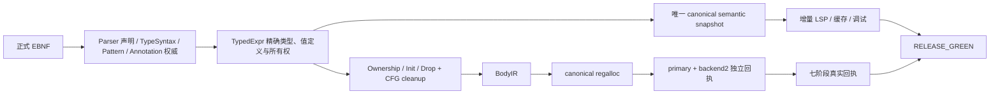

# Cheng 语言生产就绪计划

## 当前判定

- 语义快照：唯一 latest schema、精确身份和六查询当前结构审计已通过，唯一
  blocker 为 `no_published_candidate_evidence`；尚无真实非空 `published=1`。
- 确定性内存：生产链静态接线已收敛为单 formal entry、5 个 producer、144 个
  可达调用和零模块全局 ledger；lowering allocator 当前机械剩余
  `68 = 66 add + 1 setLen + 1 reserve`。动态 official `live=0`、失败矩阵、
  ORC 平衡和 Linux cgroup v2 1GiB 硬上限仍未完成。
- regalloc：primary、backend2 已直接调用 canonical emitter，SystemLinkExec
  current topology 为唯一 formal root、两个 official entry、零 direct/compat/
  post-plan selector；primary/backend2 WholeCall 已分别达到 `25/25`、`11/11`
  exact，均无 `node=-1`。
  七阶段真实回执、current-source driver、GEN2/GEN3 和正式性能门仍缺失。
- 语言覆盖：按当前正式 EBNF、parser producer declarations 与 Fusion
  obligation 合同重算为 `125 = 0 MAPPED + 125 PARTIAL + 0 UNMAPPED`，
  required obligation 为 `971 witnessed + missing = 0 + 971`。旧
  `48 MAPPED + 40 PARTIAL + 36 UNMAPPED` 口径已失效；生产完成只认双
  current-source driver 的真实 receipt 将 971 项全部 witness。
- 当前动态前沿：最新 frozen full 的 pre/post manifest 原始字节完全一致，
  `drift=[]`，O2 build `rc=0`；full `rc=2` 的精确首红为
  `CidEvidenceSourceIndexCase → CidEvidenceSortTexts`，initialized var-out
  source 虽 `live_before_call=1/dataflow_valid=1/state=2`，但 exact source
  admission 仍拒绝。AnnotationArg scalar token/source/span 已闭合，生产 witness
  仍为 0。
- SHA256 bridge 的 production/nolibc provider、mobile consumer 与 smoke 已统一
  为唯一无版本 C ABI 符号；未保留旧符号或兼容 wrapper，focused link/run 已绿，
  正式身份仍待 official current driver。
- 八个固定注解的文本读取残留已归零；`keep_export_binding` 已接入 exact CSG
  retention root/provenance。`borrows/escapes` 已分离 argument view ownership
  与 value-definition ownership，Unmanaged 不再误建 effect，strict replay
  已做行边界校验；`var` parameter identity、Field/Index projection 与 managed
  temp value-def 仍明确 RED，不能只凭 flag transport 计为语言完成。
- 生产完成的唯一终点：冻结源码下，语法、快照、内存、双后端和 regalloc 共用精确身份链，取得 `RELEASE_GREEN`；历史 PASS、单个 smoke 或用户态 RSS 采样不算完成。

## 实施顺序

1. 冻结权威基线

   - 保留现有 dirty worktree，不建分支或 worktree；选择无并发写入的冻结窗口，同时锁定 Cheng、Fusion、正式规范、工具、driver 和依赖闭包哈希。
   - 重新生成当前基线；任何文件在门禁运行中变化，整轮证据作废。
   - 把四条线合入一个生产就绪 OpenSpec，按 `propose → 确认 → apply → archive` 推进；每片固定为 files/action/verify/done。

2. 闭合正式 EBNF required obligations

   - 映射表改为由正式 EBNF、parser producer 和真实 receipt 自动生成，禁止人工填写 `MAPPED`。
   - `typeExpr`：将现有 TypeSyntax SoA 正式映射到 object、generic、proc、tuple、set、enum、ref、var、qualified、postfix、typeArg；补齐尚未结构化的 `?`、代数类型/variant、object inheritance、type parameter constraint/default。每个根保存精确 source、token span、owner declaration、child CSR 和泛型身份。
   - `pattern`：将现有 Pattern SoA 覆盖 binding、wildcard、literal、tuple、sequence、object、constructor、named-field、range，并为内嵌类型注解和 destructuring value projection 建立精确边；禁止多个绑定复用同一个 initializer value-def。
   - 注解参数：新增 Annotation/AnnotationArg SoA，支持 ident、数值、字符串、字符、布尔、递归 list、dict、key/value 和 `:`/`=` 分隔；已知注解统一从结构化节点读取，删除固定注解的文本拆分。未注册注解在语义 admission 阶段 hard-fail。
   - `moduleHeader`、concept/trait、lvalue、caseArm 等不复制无意义 AST：映射到精确 declaration/statement/postfix 节点，并提供 owner、span、child 和语义校验回执。
   - 完成条件：全部 production 为 `MAPPED`；所有 required obligation 都有 parser-owned 节点或正式声明的结构映射，`witnessedRequiredCount=requiredObligationCount` 且 `missingRequiredCount=0`。Fusion 正式映射序列化器必须在任一条件不满足时拒绝落盘。

3. 版本化语义快照统一闭环

   - 只保留一个 canonical schema，带明确 `schemaVersion` 和 semantic epoch；破坏性升级原子迁移全部 producer/consumer，旧 schema 直接拒绝，不保留 V1/V2 双写、别名或兼容读取。
   - 固定构建顺序：source/parser skeleton → Decl/Type/Symbol/Function → interface → import DAG → typed/reference/scope/layout/ownership/diagnostic → function fragment → strict validation/cargo/admission → stage/commit。
   - 完成 `DeclId/DeclKeyCid/TypeId/SymbolCid/FunctionInterfaceCid` 和精确 caller/target/value-def；字段、参数、局部、解构绑定、类型参数、注解目标全部使用 `int32` 行身份和 CID，禁止文本、行号、name+arity 或裸指针近似身份。
   - production event path 改为事件驱动增量计划：add/change/remove/rename、range edit、cancel、close/reopen 只重建受影响 fragment；候选通过完整 admission 后原子 publish，旧版本、取消结果和迟到写入全部拒绝。
   - 将 `missingFactBitmap` 清零，取得真实非空多文件 `published=1`，由 pinned snapshot 服务六类查询；随后完成 30 seeds × 30 transitions 的冷编译对拍以及 object/run/debug/ORC 等价。
   - 性能验收：真实开发循环墙钟降低至少 40%、文件读取降低至少 50%、冷构建额外开销不超过 1%。

4. 确定性内存与 ORC

   - `LifetimeLedger` 接入 CompilerCSG、lowering、primary、backend2 和两个生产入口，只记录真实 alloc/move/borrow/release、Arena/Seq 物理释放及字节；不得用清空字段冒充释放，也不得使用模块全局账本。
   - 所有权由 TypedExpr 的不可变字段贯穿 CallOp、Ownership/Init/Drop IR、CleanupPlan、BodyIR；托管 call-result/sret 先进入带 Owned/Borrowed 证明的本地 value-def，再 move/share store。禁止按 callee 名猜测、`moveSource` 布尔或可变 LocalSlot ownership。
   - 使用 CFG fixed point 生成 conditional drop flag 和全部 cleanup edge，覆盖 normal fallthrough、return、break、continue、defer、`?`、临时值、global/container overwrite、self-assignment、partial init、borrowed return、线程边界；panic 按规范直接终止，不伪造 unwind。
   - primary/backend2 和所有生产 target 共用单函数 lower→emit→release 状态机；诊断只租赁命中函数数据，禁止 full-resident fallback。
   - 正确性闭合后再做 last-use move/retain-release 消除；优化开关不得改变程序行为、析构顺序或快照字节。
   - 最终使用 Linux cgroup v2 对完整进程树施加 `memory.max=1073741824`、swap=0 的硬上限；Darwin process-tree 采样只作为辅助画像。所有成功和失败路径均要求 ledger `live=0`、ORC `alloc==free`。

5. regalloc 性能线与发布闭环

   - 保持单一 `body_ir_adapter → canonical regalloc → production emitter` 路径；primary、backend2 分别具有可达 import、唯一 build/emit 调用、冻结 plan/action/fragment 的真实消费和对象字节回执。`fixed_template`、空 BodyIR 和旧启发式分配路径一律拒绝。
   - 清除当前 preflight 暴露的 post-seal source scan、文本类型/layout 推断、take-last/单层 alias 等非权威路径；regalloc 只消费冻结 BodyIR 的 use/def/fixed/clobber/address-escape/CFG 事实。
   - 同一 source identity 生成七阶段回执：`typed_expr → csg → lowering → primary → primary_regalloc → backend2 → backend2_regalloc`；删除任一列、换身份、换 ingress 或篡改 action/fragment 必须 hard-fail。
   - 重建 current-source official driver，生成不同 inode 的 GEN2/GEN3，要求原始字节完全一致；绑定 source manifest、official/baseline identity、backend2 epoch、jobs、exec-diff、target-emit 和 GEN3 locks。
   - 正式性能门沿用现有合同：ABBA/BAAB 样本；编译墙钟和 process-tree peak 相对 immutable baseline 最大回归不超过 5%，组间噪声不超过 10%；12 次均低于 1GiB；spill density 低于 baseline 且不超过 250000 ppm；`__TEXT` 小于 baseline，且 `__TEXT/clang <= 2.0`。
   - 生产验收 target 固定为 Darwin arm64、Linux AArch64、Linux x86_64，并在真实架构环境运行；其他 target 不计入本轮生产承诺，遇到未实现组合必须 hard-fail，禁止切回旧 emitter。

## 测试与发布门

- 语法：从 EBNF 自动生成正反例、嵌套/空值/尾逗号/分隔符组合和 mutation；真实 parser receipt 必须绑定精确 source/token/node/span。
- 快照：乱序版本、range edit、cancel、close/reopen、rename、跨模块接口变化、缓存篡改、读集越权、CID 漂移和 30×30 随机编辑全部验证。
- 内存：diamond、loop、partial-init、manual consume、覆盖、自赋值、空值、defer LIFO、sret、跨函数返回、5000 次 ORC 调用和失败矩阵；ASAN/UBSAN 与 alloc/free/live 对拍。
- regalloc：自动枚举全部 BodyIR op/call/term；覆盖压力、spill/reload、call clobber、并行复制环、critical edge、sret、address escape、stack arg、F64/NaN、209+ exec-diff 和 jobs 1/N。
- 发布：两个仓库源码和工具哈希冻结；parser 与七阶段 receipts 全绿；双后端 object/run/debug/ORC 等价；GEN2/GEN3 固定点；Linux 1GiB 硬门；最终报告必须 `status=GREEN`、`red_count=0`、`driver_role=production`、`RELEASE_GREEN` 后才 archive。

## 默认约束

- “生产就绪”限定为语言编译器、增量语义服务、内存语义和上述三个正式 target，不包含未证明的平台扩张。
- 旧 36 个数量来自过时映射，不能直接当剩余实现量；当前基线由正式 EBNF
  动态重算为 125 个 production、971 个 required obligation，后续源码变化后
  继续动态重算，禁止把数量写成固定白名单。
- 不使用 Mock、降级、兜底、轮询、文本身份、裸指针身份或提高内存上限。
- 任一源码漂移、缺失真实回执、用户态采样冒充硬上限或历史证据未绑定当前哈希，整轮发布失败。
