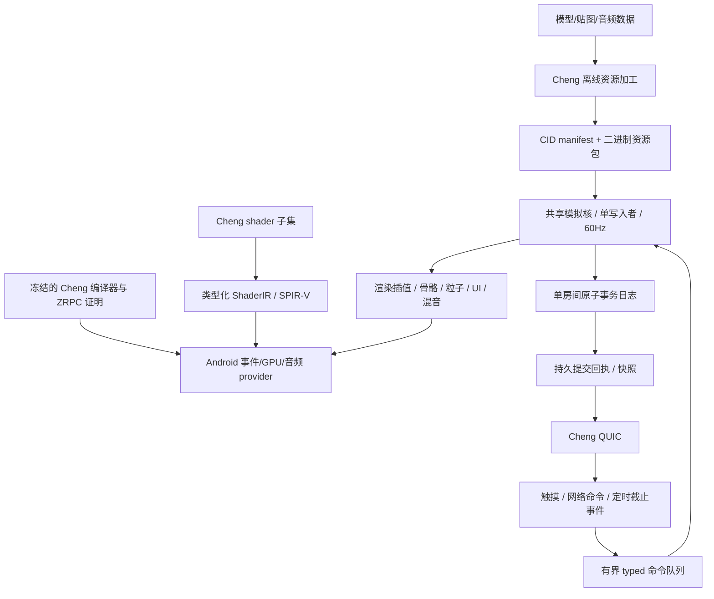

# 纯 Cheng 横屏捕鱼游戏

状态：`propose`，2026-09-05。用户本次要求制定开发计划；尚未授权进入游戏实现。本文是具体产品提案，通用引擎方向仍由 `docs/cheng-native-game-engine-plan.md` 管理，语言语义以 `docs/cheng-formal-spec.md` 为准。

## 目标与默认范围

制作视频所示类型的横屏街机捕鱼：海底场景、鱼群、炮台射击、自动射击、锁定目标、Boss、金币表现、大厅选场。视频只证明这些可见表现，不能据此推断原作引擎、命中概率、经济规则或联网协议。

计划默认首发 Android arm64；macOS 用于开发、资源加工和无窗口逻辑验证。iOS 和桌面可视化版本作为后续独立平台项目。首版采用固定相机的真实 3D 表现与二维玩法平面，鱼和子弹的碰撞规则独立于视觉网格；这是产品规则，不以二维图片替代最终 3D 模型。

首个完整可玩版本：1 张海底场景、6 类鱼、1 类可调档位炮台、1 个分阶段 Boss、触摸瞄准/连续射击/锁定、命中反馈、音效、明确的积分结算、暂停与本地恢复。首个联网版本为 4 人共享一个权威房间，再扩为可选的多个房间。鱼数、奖励表、炮台档位均由版本化配置决定。

首版拟用明确血量和固定积分奖励；视频无法确认的隐藏概率和经济规则不自行仿造。转盘、额外模式、社交、支付及复杂运营系统不计入首版。资产使用原创或具有可用授权的模型、贴图和声音，不从视频中恢复或复制游戏资源。

## “纯 Cheng”的验收边界

1. 所有自有客户端、游戏内核、渲染、音频、网络协议、持久化、服务器与平台适配的可执行源均为 Cheng。不得依赖 Unity/Cocos/SDL 等引擎或自有 C/C++/Objective-C/Java/Kotlin/JavaScript 平台壳。
2. 允许操作系统、GPU 驱动和系统 API 二进制作为设备边界；允许 SDK 的打包、签名和调试工具。系统 NativeActivity 属于系统边界，不引入 NDK 的 C `native_app_glue` 实现。XML 配置、资产文件和构建清单不属于游戏执行语言。
3. GPU 源以有限、明确的 Cheng shader 子集表达，经类型化 IR 直接生成 SPIR-V。GPU 指令是编译目标；手写 GLSL/MSL、把外语代码放进 Cheng 字符串，或生成 C 再编译游戏逻辑，都不满足本提案。
4. 游戏公开接口使用值、`var T` 隐式借用和 `int32` 索引。禁止 `&`、`ptr`、`ref T`、`void*`、`@importc` 在业务层绕过 ZRPC。平台 ABI/系统回调由编译器和受控 provider 在精确类型与借用证明后落地；物理地址不得成为跨帧身份。
5. 编译器纯度与游戏源码纯度分别验收。正式构建复用绑定源码与工具哈希的纯 Cheng 发布编译器证据；如缺失，则记录工具链阻塞。不得把旧 cold 产物、单个 smoke 或未绑定的历史报告计入本游戏发布。

## 当前基础与缺口

2026-09-05 只读源码审计，未运行构建或真机测试：

| 子系统 | 可借鉴内容 | 仍需实现或验证 |
|---|---|---|
| ECS | 64 槽 SoA、整数位置/速度 | 销毁和槽复用、代际校验、精确资源关联、容量配置 |
| 模拟 | 固定步进、SHA256 回执 | 有理数 60Hz 时钟、定点精度/溢出证明、有界事件队列、长回放 |
| 碰撞 | AABB 基础 | 空间索引、凸多边形/复合体、移动目标连续命中 |
| 渲染/UI | 2D draw facts、字体图集思路 | 真 3D 网格/材质/动画/粒子、纯 Cheng GPU 提交和 shader 编译 |
| 平台/音频 | 移动端生命周期经验 | 移除对生成外语壳的依赖，纯 Cheng 窗口/触摸/声音实机闭环 |
| 网络 | 原生 Cheng QUIC/TLS/UDP 路径 | 当前源码的跨进程验收、事件驱动接线、容量与房间权限 |
| 存储 | 文件和同步原子发布接口 | 持久追加提交、去重表、事务恢复；SQLite 包装不作为纯 Cheng 数据库 |

详细路径证据见 `docs/campaigns/2026-09-05-pure-cheng-fishing/findings.md`。已有模块名、旧文档和测试源码均不等于当前版本通过。

## 最简架构

- 世界为 Arena + SoA；实体引用由 `slot:int32 + generation:int32` 构成，网络引用再绑定 `roomId:int32 + roomEpoch:int64` 完整房间实例；epoch持久分配且复用不重置，先验证房间再查实体。资源以 CID 为内容身份，运行时使用经验证的整数资源行；句柄不是资产身份。
- 60Hz 表示精确 tick 序号与有理时间，不使用固定 16ms 冒充。模拟用有范围证明的定点整数及加宽中间值；渲染允许浮点插值，不能回写世界状态。权威世界哈希与 GPU 像素比较是两种验收，不能混用。
- 鱼沿版本化路径曲线移动，每tick内运动明确为分段线性平移；二维均匀网格为宽阶段，显式凸多边形/复合体做相对运动连续SAT，产生精确有理数接触时刻。全房间事件按tick、接触时刻、弹/鱼精确身份和shapeIndex排序，不用浮点epsilon判同刻；阶段/形状变化在tick边界生效。碰撞体由资产声明，不按纹理或名称猜测。先做捕鱼需要的碰撞，不扩建通用刚体、流体或大编辑器。
- 客户端只发送瞄准、开火、切炮、锁定等意图；服务器裁定生成、命中、消耗和奖励。本地瞄准/UI可即时反馈，权威命中和积分等待提交回执，两类延迟分别测量。离线模式调用同一模拟与结算规则，不能另写简化世界。
- 输入/生命周期/网络就绪事件驱动调度；活跃对局按最早 tick 截止唤醒，VSync 只驱动呈现。暂停且无网络工作时阻塞等待。不得用 `SleepMs` 轮询；不能把固定物理时钟当成轮询而取消。
- 单房间只有一个状态写入者；以定步事务原子提交世界变更、积分变化和去重结果后才发“已提交”回执。普通重连续用持久业务会话和原命令键，新登录不能改键重放旧待确认命令。暂停/进程恢复保留逻辑tick并重新绑定本进程单调时间，停机时间不推进首版世界。多房间先由同进程独立房间实例实现，压力数据决定是否需要后续分片。

## 阶段与放行条件

| 阶段 | 交付物 | 放行条件 |
|---|---|---|
| A 基线与边界 | 确切编译器/源码/设备/依赖清单 | 无伪窗口/伪网络作为依赖；语言或 provider 缺口有可复现阻塞项 |
| B 手机最小闭环 | 纯 Cheng Android 包；纹理图形、触摸、声音 | 真机安装和执行，GPU 实际呈现，回调与恢复正确，最终链接闭包符合纯度 |
| C 3D 表现闭环 | 一条带动画的鱼、海底、炮台、文字、粒子、混音 | 真实资源导入到 GPU/声卡可观测；缺资源硬错；资源释放平衡 |
| D 可玩单机 | 完整首版玩法和恢复 | 同输入同世界状态；无穿透/重复奖励；目标负载实机可玩 |
| E 四人联网 | 账号身份、权威房间、重连、持久提交 | 四个真实客户端；重复/乱序/崩溃/重连不改变结算唯一性 |
| F 内容与发布 | 多房间选场、性能优化、完整安装包 | 冻结资产/源码，全量真机门和纯度门通过，方可 archive |

设备、资产画质和负载数字是拟验收目标，当前没有性能实测。具体任务、资源预算、依赖与工期见 `docs/superpowers/plans/2026-09-05-pure-cheng-fishing.md`。

## 后续实施规则

按 `propose → 用户确认 → apply → archive` 推进；本轮交付提案与计划，不进入 apply。已有授权不能外推为新分支、新 worktree、外发或发布许可。

每个实现任务先冻结接口和可观察失败条件，再实现、验证、Review 查 Bug，最后检查是否存在更小更稳健的实现。合法 Cheng 表面被拒时修 primary/backend realizer，不做业务 hoist、裸指针或 C 桥补救。后台长任务必须可追踪；临时产物遵守任务 scratch 生命周期。
