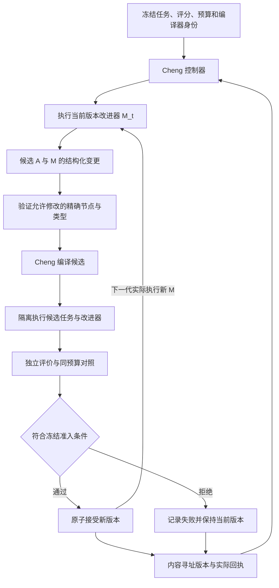

# 纯 Cheng RSI 框架

状态：`apply`（2026-09-07 立项，2026-09-13 批次九；用户 2026-09-07 指令确认递归对象=程序 RSI 首版 + 编译器域通道）。首版程序 RSI 已实现并过门禁（`src/tools/rsi_gate.cheng` 11/11）；任务域已 EXHAUSTED（31/31 格，在位即空间最优，图上可证）；编译器域 C1/C2 试验线已首轮入图（C 链载具），纯载具 A/B 仍 BLOCKED@kernel 载具墙。逐批次实现现状与如实边界见 §8（2026-09-07 → 09-13）。

## 1. 原理与目标

递归自改进的核心，是把“如何产生下一次改进”也作为可修改对象。用 `A` 表示任务执行器、`M` 表示改进器、`E` 表示独立评价器：

```text
S_t = (A_t, M_t)
候选 C_t = M_t(S_t, 开发任务, 历史实际反馈, 本轮预算)
若 E(C_t, S_t) 达到预先冻结的准入条件，则 S_(t+1) = C_t
否则 S_(t+1) = S_t
下一轮实际执行 S_(t+1) 中的 M，而非永远调用最初的 M_0。
```

这里“递归”是改进过程参与自身更新，不要求程序采用递归函数。循环训练只更新任务权重时，尚未证明改进过程得到改进。编译器自举表示能够编译自身，原始字节固定点需另行验证；这些都不证明模型能力提高。

Gödel Machine 在给定公理与效用定义下先寻找自修改有益的证明；DGM 使用实际任务评测筛选程序变体。两者分别是理论与经验路径，不能把有限测试通过写成普遍有益证明。本框架采用经验准入；提高多少由实验产生，不预设一定提高，更不承诺无限提升。[Gödel Machine 原始说明](https://people.idsia.ch/~juergen/goedelmachine.html)、[DGM 作者说明](https://sakana.ai/dgm/)。

## 2. 首版范围与选择

| 方案 | 递归对象 | 主要代价 | 建议 |
|---|---|---|---|
| 程序 RSI | Cheng 任务执行器及生成下一代候选的改进器 | 结构化修改、原生编译、隔离执行、独立评测 | 首版（已实现，见 §8） |
| 训练 RSI | 模型权重及更新规则/训练算法 | 完整反向传播、真实权重与数据、算力、训练可再现 | 另接明确训练适配器 |
| 编译器 RSI | Cheng 编译器及其优化搜索器 | 编译语义等价、完整门禁、固定点与发布权威 | 通道已定义并接入提案校验（src/rsi/proposal.cheng），解锁前置见下 |

建议首版实现本地、串行、有界的程序 RSI：纯 Cheng 控制器管理候选、调用 Cheng 编译器、独立评测、保存代际证据；已接受的改进器产生下一代。任意程序搜索没有普遍最优的现成算法，框架只冻结可验证协议，不声称某种候选搜索全局最优。

### 2.1 编译器域改进方向（2026-09-07 用户定谳，五维全为硬指标域）

- **C1 编译时间**：固定语料（档 0 = `src/tests/physics2d_determinism_smoke.cheng` 唯一开放；档 1/2 BLOCKED）【**09-09 三修后档 0 改为 `src/tests/rsi_minimal_smoke.cheng`，见下方现势段**】编译器自报 `exec_phase_total_us`（微秒确定性相位；best-of-5 容 1 败取 min，禁 wall-clock 单次计时）；
- **C2 编译内存峰值**：guard `process_tree_resident_peak_bytes`，per-corpus 冻结 peak 基线、帽=基线×3/2；768MiB 为防失控硬限（理论极限帽口径），越低越好；
- **C3 最小编译内核**：满足全部门禁的自举闭包最小集合（条目数/源码量）；
- **C4 运行时性能**：产物代码质量（探针运行时间/指令数），不与 C1 混算；
- **C5 语法优雅简洁符合符号化直觉**：以 `docs/cheng-formal-spec.md` 正形收敛为准，直觉合法表面必须 primary/backend realizer 直修，禁业务层绕行。

> 批次四实测修订（2026-09-08）：C1 由「端到端墙钟」改为编译器自报 `exec_phase_total_us`（wall-clock 单次不可作改进证据）；C2 的 768MiB 守卫降为防失控硬限，改进判定用理论极限帽（冻结基线×3/2）。
>
> **〔2026-09-11 用户裁定后的口径约束（后发，优先级高于上一行）〕**：768MiB 已由"防失控硬限"**升格为硬门**——`tools/user_path_gate.sh` `RSS_CAP_MIB=768`，**超过理论内存/理论编译时间的运行状态一律按病态处理**（见 `lessons.md` 同名红线与 `docs/memory-time-limits-plan.md` §八）。对 C2 的三条直接约束：① **"帽 = 冻结基线 × 3/2" 不得用于把越界状态判为可接受**——若冻结基线本身已超过理论门，则该基线是病态基线，须先消解再谈改进判定；② 凡"通过/更优"判词，**其运行状态若曾越过理论边界，判词无效**；③ 抬门（`--rss-cap-mib` 覆写或 `CHENG_PARENT_RSS_GUARD`）**只许用于发现缺陷**，全部轮次标 `diagnostic`，且其运行状态本身就是病态证据，不得计入任何达标结论。

解锁前置（2026-09-08 用户纠正后分域化）：**试验准入**按维独立——C1/C2/C4 = 固定语料集（语料 CID 冻结）新旧编译器产物**语义指纹**（运行 rc+stdout sha；产物字节 sha 因 Mach-O 每进程随机 uuid 不可用，map sha 仅记账）对拍 + 全门禁绿 + 该维实测严格更优；C3 另加自举链重新闭合（不要求与旧字节相同）；C5 另加 spec 迁移探针。**发布准入**（仓规第 6 条不变）= GEN2/GEN3 原始字节固定点 + 权威链回执——自举固定点是发布级证据，不是改进试验的前置。各维冻结测量合同（语料/探针/口径/阈值）落库前，该维提案仍恒拒，不产出任何假绿。C1/C2 的批次四冻结测量合同见 `docs/campaigns/2026-09-07-pure-cheng-rsi/compiler_domain_c1c2_contract.md`。

**2026-09-13 现势（C1/C2 试验线，T1 线根修后）**：语料档以 `src/rsi/types.cheng:86-109` 为准——档 0 = `src/tests/rsi_minimal_smoke.cheng`（开放，CID `ef548daa…`）；**档 1 = `src/tests/physics2d_determinism_smoke.cheng` 已解锁**（T1 定谳 = 源侧 use-after-move：`Physics2dReceiptValid(receiptA)` byval 消费后再借用，检查器拒绝正确——负控 Q2 仍拒证未放宽；修复全源侧零编译器改动：ecs.cheng 14 个只读查询标 @borrows + physics2d.cheng 5 处标 @borrows + preimage 5 处改 Fmt 共享模式（字节等价 ⇒ receiptCid 不变 ⇒ 确定性合同无损）；smoke compile=0/run=0 九断言含三篡改拒绝全过，见 `.rebuild/t1_line/REPORT.md`）；档 2 = `src/core/tooling/backend_driver_dispatch_min.cheng`（仍 BLOCKED：GEN2 覆盖墙 `identity.cheng parser=7`）。同墙族三 smoke 已于 09-13 T5 线全部解锁（ecs_world_hash / ecs_capacity 零额外库改动——与件1 同根同修；physics2d_forces 链 3 函数标 @borrows + preimage Fmt 共享 + smoke 自身拷贝前置；三件 compile=0/run=0 含各自确定性/篡改拒绝断言全过）。C1 首轮 A/B 已真实入图（C 链解锁口径）：genesis `best_us=1130937` / `peak_bytes=171589632`，候选 `BACKEND_JOBS=2` 被语义锚拒收（`reason=sha_mismatch`，误编译实证）；jobs 全 3 格扫描终验封闭（genesis tier0 `1123684µs`，jobs4 `1129122` / jobs2 `1114995` 均无严格增益 reject）。纯载具（禁 C 链）A/B 的阻塞已从「覆盖墙」收敛为 `held_exec_parent_linux_x86_64_required`（`system_link_exec` 生产入口的 Linux x86_64 平台声明点，DarwinAuthority 运行时载体未实现），与档 1/2 语料墙一并归 kernel 战役（判词 48-54，见 §8）。

**2026-09-13 融合口径（与 `docs/cheng-rsi-fusion-plan.md` 同一份，取代本条此前"整条等 kernel 清墙"的单向口径）**：kernel 战役与编译器域是**同一个优化问题的两条约束轴**——Cheng 链自烤的时间墙（`ParserValueExprTreeAppendFromImpl` 三处同族站点，森林窗 553,914 ms）与内存 `G(k)` 主项（`ParserValueExprProcessStatementRangeWithTypeOwner`，**671 MB / 单调用 96.3%**）**同属 `src/core/lang/parser.cheng` 的 `ParserValueExpr*` 族**；异口径对照 = C 链参照烤 `kd_b102` parse 136,997,679 µs / 208,367,529 µs = **65.7%**。据此编译器域四条即时义务：
① **C2 帽语义改双判据**：`process_tree_resident_peak_bytes` 判定 = **硬门 ≤805,306,368 B ∧ 回归帽 ≤冻结基线×1.5 ∧ rc=0**；"冻结基线×3/2"不再称"理论极限帽"（它是工作集回归检测，不是理论边界）。**基线自身越门 = 病态基线，判拒收并先消解，不得就地重标**；抬门轮一律 `diagnostic`，其运行状态本身即病态证据，**不得进入任何"通过/更优"判词**（`lessons.md` 2026-09-11 红线）。
② **C2 必报逐相**：只报进程树总峰不足以判达标，须报逐相 RSS 与模型值差值（>50 MB 即遗留物，必须解释）；未钉模型项（待钉区①–⑤）须显式标注"未钉"，不得当 0 或用估计值充数（约束卡 `design/memory_model_constraints.md`）。
③ **常量单点派生**：`compiler_domain.cheng:123` 与 `rsi_gate.cheng:272/315` 的 `--rss-limit:805306368` 现为**字面量**，须改为从 `tools/memory_model_limits.sh` 单点派生；`rsi_gate.cheng:471` 注释仍写"guard 的 --rss-limit:1GiB" = **注释与代码背离，待修**。
④ **新增语料档 3 = 234 源全量自烤**（kernel 验收线本体）：C1 = 该轮 report 实测 `exec_phase_total_us`，C2 = 进程树 peak + 逐相账，载具 = kernel 当轮驱动，准入判据 = `cheng-plan.md` §6.2 四判据 + §6.2.1 逐相贴线。**该档使 kernel 每把内存/时间刀自动成为编译器域一次 A/B 试验**（候选 = patch 集，试验 = 门禁跑，判词 = 逐相 + 语义），档 3 开放门与档 1/2 同受 kernel 墙约束（清墙前只能跑抬门 `diagnostic` 档）。
另：**语义锚合并**——本提案的语义指纹（rc + stdout sha，best-of-5）与 kernel §6.3 B4（四夹具 + 2 源对 + 8 源闭包）须收敛为**同一实现**，禁止两套。
解锁面不再整条挂在 kernel 墙上：拆为 **L1 时间模型结构化 ∥ L4 语义 oracle（31 格任务域当编译器回归语料）∥ L5 本口径落地** 三条立即可开项，只有档 1/2 解冻与纯载具 A/B 仍等清墙。

“纯 Cheng”要求框架业务逻辑、候选生成和评价器均为 Cheng，并由已验证的 Cheng 原生编译链构建。操作系统隔离与现有资源守卫是宿主边界，须记录其实现和哈希；当前仓内守卫含 shell/Python，不能宣称整个工具闭包零其他语言。如果用户要求包括守卫在内全部纯 Cheng，需将守卫迁移列为前置工作。不得用 Python/C++ 生成器、Ollama 或外部模型 API 代替纯 Cheng 业务闭包。（**09-10 现势**：ollama 仅作为**可选提案源适配器**接入 `src/rsi/generator_adapter.cheng`——业务闭包与评价权仍在 Cheng 控制器，适配器 `kept=0` 时逐字节同现状；不构成替代关系，见 §8.1。）

候选生成需要真实能力：采用用户指定的本地 Cheng 生成程序，或接入有真实权重、已支持算子的 Cheng 推理路径。当前尚未指定生成模型/权重或初始改进程序，不能用预写答案、轮数查表或伪造推理填补。有限搜索器可以作为明确限定语法空间的适配器，不能冒充语言模型。（**09-10 现势**：初始改进程序 M0/M1 已实现（白盒观测表+乐观界规则），候选生成=三域 31 格结构化搜索器；LLM 提案源已接线并以 qwen2.5:0.5b 活体联调，`kept=0` 如实记录。）

## 3. 架构与数据合同



控制器持有五类数据：不可变任务合同、版本、候选、试验、准入记录。内存身份采用 `int32` 行索引，变长关系采用 offset/count 列；节点表按 Arena + SoA 组织。持久身份绑定规范编码后的内容 CID；不得以文件名、源码行或函数名+参数数代替节点身份。

每个版本绑定父版本 CID、任务执行器源码/产物 CID、改进器源码/产物 CID、生成该版本的改进器 CID、试验记录 CID。记录 `generation` 仅用于展示，真实谱系由这些引用证明。

每次试验绑定候选与父版本、任务集 CID、评价器 CID、编译器与工具闭包哈希、目标平台、完整参数、随机种子和资源预算。候选输出只能提供答案，成功数和评分由控制器掌管的评价器计算；退出码、资源使用和标准输出来自实际执行观察，不能接受候选自报的 `passed=true`。

修改由现有 parser/typed facts 得到精确节点身份后产生结构化变更，逐层保持类型、字段布局和所有权证明。业务公开接口只用合法 Cheng 类型与 `var T` 借用。未知语义、过期父代、缺少文件、损坏 CID、未绑定试验均明确拒绝。

## 4. 状态、评测与执行边界

正常候选状态为 `Proposed -> Admitted -> Built -> Evaluated -> Accepted/Rejected`。准入不符进入 `Rejected`；编译/运行失败进入 `Failed`；守卫终止、评价基础设施故障或控制器中断进入 `Aborted`，均保存具体原因。只有 `Accepted` 可推进当前版本。工件先写入、校验、持久化，再原子提交当前版本引用；并发写者在入口拒绝，崩溃恢复只读完整提交记录。重启时未提交的中间试验标为 `Aborted`，已有 `Evaluated` 不自动接受；重试必须分配新试验身份并重新执行，不能改写旧记录或覆盖已提交版本。

开发任务可产生给改进器的反馈。反复用于候选选择的数据明确称为验证集，不声称是未见测试集。最终测试集由评价侧持有，只在冻结版本后使用一次；再次用于搜索则必须取消其最终测试身份。候选代码、改进器和其子进程均不能修改评价器、读取最终答案或扩大任务预算。

每次比较采用相同任务、相同输入和资源上限。功能正确性是硬约束；能力变化和成本分别报告。首版采用父代保持的准入策略，评价工作负载限定为固定输入/种子下可确定重放的任务。任务合同须明确必过任务、逐题评分、整数聚合公式和资源阈值；拒绝未定义指标的合同。仅修改 A 时，候选必须通过全部既有必过任务，聚合分数严格高于父代；平分不推进。时间、内存等成本作为上限约束与观测值，不用一次计时波动作为提高能力的证据。随机任务的统计准入需另行冻结样本数、配对种子、聚合方法、多次选择校正和决策阈值，首版不宣称提供该能力。

修改 M 时，候选 A 必须满足全部必过任务且聚合分数不低于父代；额外比较父代与候选改进器在相同起点、开发任务和预算下产生后继任务程序的质量，候选 M 的后继聚合分数必须严格更高。仅靠 A 提分不能接受退化或平分的 M。元评价固定为一次前瞻：后继程序只交不可变任务评价器评分，不在本次试验继续启动后继改进器准入，避免无限递归。父代对照、候选生成、编译和后继评价全部计入总预算，各配对臂获得相同子预算。未观察到改善的递归执行记录只能证明协议可运行，不能推进版本或计为改进能力提高。

搜索预算、最大代数、最大候选数、最大源码/输出字节、超时、内存和子进程数量都须为正且有限；预算耗尽是正常终止，不制造成功。

执行采用事件驱动的进程结束和管道读取；命令使用 argv，不把候选文本拼进 shell。生成、编译和运行各阶段的全部子进程都进入权限边界，每代只暴露允许的源码闭包和只读工具。评价器持有独立私有视图，候选及其生成/编译/运行子进程均看不到任务答案、最终测试、评价器凭据和原仓；只读挂载不能代替不可见隔离。资源守卫不能代替文件/网络权限隔离：隔离能力未接通时拒绝执行自修改候选。禁止创建 Git 分支或 worktree。

临时目录绑定拥有进程，使用现有 scratch 生命周期；执行结束验证目录确实被清理，不能信任吞掉错误的删除返回值。提交根及全部已接受谱系的必要工件禁止回收：保留源码闭包、生成器身份、任务与评价版本、实际答案输出、逐题评分输入、完整准入回执，以及元评价使用的父代/候选/后继工件。大型模型与编译工具可引用已固定的不可变内容存储，重放前仍须验证实际字节可用。旧可执行产物可在源码与相同编译闭包可重建并核对 CID 时回收；缺依赖则明确报告无法重放。拒绝试验按冻结保留预算处理，被回收的原始证据只能保留摘要，不能继续声称可完整重放。所需谱系证据将超过存储预算时停止新试验，不能删除当前提交所依赖的工件。

## 5. files / action / verify / done

以下均为拟新增文件或明确依赖，不表示已存在实现。

| 步骤 | files | action | verify | done |
|---|---|---|---|---|
| 1 核心合同 | `src/rsi/types.cheng`、`src/rsi/state.cheng` | SoA 身份、不可变合同、状态转换、预算记账 | 非法状态、过期父代、边界溢出、预算为零/耗尽、重复提交 | 全部正反例真实通过 |
| 2 工件与恢复 | `src/rsi/store.cheng` | 复用内容寻址基础，真实字节校验、原子接受、恢复、谱系工件固定 | 修改字节、丢文件、每个提交边界中断、重启、双写者拒绝、回收依赖拒绝 | 重启只能得到旧或新完整版本，未提交试验不得自动接受 |
| 3 编译执行 | `src/rsi/compiler.cheng`、`src/rsi/execution.cheng` | 冻结纯编译入口、argv、事件式执行、隔离与守卫 | 合法/非法源码、编译失败、超时、超内存、进程逃逸、越界读写 | 真实 exe、编译回执、资源回执全部绑定 |
| 4 生成接口 | `src/rsi/proposal.cheng`、`src/rsi/generator.cheng` | 精确节点变更，实际调用本地 Cheng 改进器/已支持推理器 | 非白名单节点拒绝、父代失配、未知算子、输出损坏 | 至少一个真实生成器从输入产生候选 |
| 5 独立评价 | `src/rsi/evaluator.cheng`、`src/rsi/promotion.cheng` | 确定性同预算比较、功能门、一次前瞻元评价与最终测试隔离 | 假日志不计分、平分/退化拒绝、A提高但M退化拒绝、评价器不可改、答案不可读 | 决策可由实际执行回执独立重算，所有前瞻开销计入预算 |
| 6 递归闭环 | `src/rsi/engine.cheng`、`src/apps/rsi/main.cheng` | CLI 启动/状态/继续/核验，消费已接受改进器 | M0 产生并接受 M1，M1 真实产生下一候选；失败不中断当前版本有效性 | 改进器 CID、exec 身份与谱系形成真实两轮关系 |
| 7 验收归档 | `src/tests/rsi_contract.cheng`、`src/tests/rsi_recursive_e2e.cheng`、`src/tools/rsi_gate.cheng` | 完整闭包编译、负例、递归对照、源与工具哈希回执 | 当前源码实测、相同种子重放、不同种子复核、托管值生命周期/ORC 平衡 | 全部合同通过后才 archive |

实现现状（2026-09-13 更新，逐项对照）：步 1/4/6 有完整实证；**步 2 负例已补齐**——提交边界中断（陈旧 `.tmp`/半行/缺字段/少行/丢文件/重提交，`rsi_contract.cheng:826-978`）＋**双写者拒绝**（独占 `rsi.write.lock.d` 目录锁 + owner pid/启动标识 + 死锁接管 + 活锁硬拒 + 受锁提交零落盘，`src/rsi/store.cheng:498-792`，判词 `held_by_self`/`held_by_live`/`acquired_by_takeover`/`not_owner` 等）、**步 5 前瞻预算配对账本已接线引擎生产裁决（批次九）**——每臂子预算唯一派生点 `RsiLookaheadPerArmUnits`（1 次改进器 + maxCandidates 次后继候选），引擎前瞻块两臂逐笔记账，生产裁决走 `RsiMetaPromotionDecideBudgeted`：两臂未同额耗尽 = 对照无效（`RsiMetaComparisonInvalid`）不接受 M 变更；meta 事件回执带 `per_arm_units/parent_units/candidate_units` 三字段（冻结载具 contract/e2e 双 rc=0 + gate 11/11 实测，回执 `receipts/batch9_lookahead_ledger.txt`）；步 7 已新增 `src/tests/rsi_recursive_e2e.cheng`（189 行，真 3 轮：gen0 22963→gen1 13450→meta 收 M1→gen3 3937）。上述新增件本席独立复验：`rsi_contract` 与 `rsi_recursive_e2e` 用冻结载具 stage3 均 `compile=0 / run=0`（断言静默全过）。**步 3 负例证据已收口（批次十）**：`src/tests/rsi_execution_negatives.cheng`（282 行，真实 spawn 编译器与候选进程、零 mock，夹具 `src/rsi_work/execneg_*` 平铺自清场）——shell 注入三通道（argv 直发无 /bin/sh，注入载荷按字面打开失败且标记文件不存在）、越白名单格 rc=4 零副作用（`RsiProposalCellValid` 前置 + 只消费 3*maxCandidates 行）、金标只在评价器进程内存（模板源五断言不内嵌）、超时 SIGTERM→SIGKILL rc=124、越界读写 SIGTRAP rc=133、@importc 缺席符号链接期 undefined 拒绝、超内存组杀（gate `rsi_rss_guard` 腿）；冻结载具 negatives compile=0/run=0 + gate 12 行全 PASS。四处不可构建负例（文件/网络权限隔离未实现=执行层头注如实声明不冒充、importc 已知 libc 符号边界见证、编译超时共用运行超时桥、进程组级逃逸属宿主 beat_c 守卫）按 §8.2 记提案边界。实际文件清单与各腿判据见 §8。

实现过程中发现合法 Cheng 表面不能编译，先最小复现并修编译器正式语义/后端，不用业务 hoist、裸指针或换 API 掩盖。每项改动后 Review 查 Bug，再核对是否有更简单稳健的实现。

## 6. 现有基础与已知缺口

- `src/diloco/train/inner_step.cheng` 有真实定点线性 SGD；`src/diloco/train/qwen38_inner.cheng` 明确仅训练缩小混合图的 lm_head。两者都不能作为全模型反传或 RSI 的完成证明。
- `src/diloco/artifact/store.cheng` 有内容存储/回读设计，`src/diloco/core/diloco.cheng` 有版本谱系；优先复用底层 `src/libp2p/cas_store.cheng` 与哈希基础，避免为本地 RSI 引入整个分布式协议。现有模块仍有旧字符串语法，必须按正式规范验证导入闭包后才判定可直接复用。
- `src/inference/distributed_engine.cheng` 有 KV 状态生成路径，但本轮尚未验证实际权重、算子覆盖和完整纯 Cheng 调用闭包。`planner_task.cheng` 含规则回退，不作为本任务接入入口。
- 根 `task_plan.md` 的 2026-09-06 更新记录 GEN2 自烤被 768MiB 守卫中止，不能按二进制名称认定纯编译链完成。**2026-09-10 现势**：GEN2 自烤 rc=0 与 GEN3 原始字节固定点已在克隆树达成（4 轮同配方，186-188s/900s 帽内，driver sha256 `e98be9ea…` 四轮相等；见 `docs/campaigns/2026-08-31-kernel-userpath/verify_append/VERIFY_gen2r3_append.md`），但该固定点绑定的源码未冻结（锚 commit+未提交工作树），且 768MiB 全树驻留峰仍超门 5.8-49MB（同目录 `VERIFY_b3struct_append.md` / `VERIFY_goal_integrate2_append.md`）；纯 Cheng 生产入口在 Darwin 上停在 `held_exec_parent_linux_x86_64_required`（判词 54）。按仓规第 6 条，这不是发布级固定点，本提案不以它充当完成信用。
- `tools/beat_c_process_group_guard.sh` 提供进程树守卫，`tools/linux_cgroup_guard.sh` 提供 Linux cgroup v2 精确 805306368 字节硬限。正式发布要求按仓库现有权威链独立验收，不把 Darwin 采样当作 Linux 硬上限。**2026-09-10 现势**：`rsi_gate` 已挂进程树 RSS 腿（`rsi_rss_guard`，判定=冻结基线×3/2 的确定性命中值，防失控硬限 768MiB）；Linux cgroup v2 双口径仍未接。
- 生产编译器域账本 `artifacts/rsi_compiler` 当前不在盘上（末态证据固化在 `docs/campaigns/2026-09-07-pure-cheng-rsi/receipts/cdomain_current.txt` + `cdomain_events.log`）；gate 私账本 `artifacts/rsi_gate_store_compiler` 现为 gen=0 / best_us=1116023 / product_sha `0:01a5d548…`。任务域生产账本 `artifacts/rsi` 在位（v3 schema，generation 3 / score 2254 / facts 632 行）。
- `j-space` 技能现已在会话技能目录可用；`planning-with-files`、`gsd-method-guide` 仍未发现。本提案与战役任务文件（`docs/campaigns/2026-09-07-pure-cheng-rsi/`）承担流程记录职责。

## 7. 完成标准

全部七项实现与正反例通过；存在真实两轮改进器消费链；未提升、平分、失败、资源越界和篡改均按合同处理；证据绑定当前源码/生成器/编译器/评价器/任务集；声明的纯 Cheng 闭包和发布依赖均成立，才可以宣称首版完成。模型能力提升另凭实验数据判断，代码落盘或测试夹具跑通不能替代真实生成器及改进效果验收。

达成对照（2026-09-13 批次十后）：已满足——真实两轮改进器消费链（M0→M1 `meta_accepted`，M1 后继兑现，M 规则 0..4 同起同预算竞争），平分/失败/越界/篡改按合同处理（gate 12 行含篡改拒收、RSS 腿、exhausted 审计），任务域空间最优图上可证（31/31 `EXHAUSTED`、`incumbent==best_correct`），前瞻预算账本接线引擎（批次九），步3 进程逃逸/越界读写负例证据（批次十，含四处能力边界如实入档）。未满足——「证据绑定当前源码」在工具壳侧仍用 stage3 载具（sha `05af823e…`，未重烤）；「纯 Cheng 闭包与发布依赖」中 GEN2/GEN3 发布级固定点未达成（候选固定点见 §6）；§5 各步剩余边界 = §8.2 所列能力边界（文件/网络隔离等）。因此首版**不可 archive**。

## 8. 实施现状（2026-09-07 → 2026-09-10）

首版程序 RSI 种子已实现并通过门禁实证（载具 `artifacts/bootstrap/cheng.stage3`，darwin arm64）：

- **代码**：`src/rsi/{types,state,store,proposal,generator,compiler,execution,evaluator,promotion,engine}.cheng`（批次三/四续增 `model.cheng`/`csg_layer.cheng`/`compiler_domain.cheng`，批次七续增 `generator_adapter.cheng`）、`src/apps/rsi/main.cheng`（CLI：run/status/verify/exhausted/cdomain）、`src/tests/rsi_contract.cheng`（合同冒烟）、`src/tools/rsi_gate.cheng`（纯 Cheng 门禁）。**09-07 首版口径**：全部为新文件，未改任何既有热文件；批次五起 `0..<200` 修复与判词 50/52 的 E1/V1 补丁已触及 `src/core/lang/typed_expr.cheng`、`src/core/lang/parser.cheng` 等既有文件（见 §8.1）。
- **实例域**：确定性排序任务（64 元素 LCG 输入、compares 计数为分、金标=计数排序+Sha256 独立实现）；候选=生成器产出的完整可编译 .cheng 变体（排序策略 0..5 × 希尔增量档 0..2）。
- **递归对象**：改进器 M 本身是被编译执行的独立程序（mStrategy 0=顺序枚举、1=希尔族优先）；M-元评价=同起点同预算一次前瞻，M' 后继严格更优才接受 M 变更。
- **门禁判定（rsi_gate，09-07 首版 7 项，缺项不折算；现为 11 项，见 §8.1）**：合同冒烟编译+运行 / CLI 编译 / 一轮 A-试验真实严格降分 accepted / 一轮 M-元评价真实接受 M0→M1 / 哈希链 verify / 篡改一字节必拒 / status 反映推进版本。
- **实测轨迹**（artifacts/rsi_gate_store/events.log，哈希链完整）：gen0 冒泡 2016 → gen1 接受插入排序 1073（严格降分）→ 平分拒收（合同正例）→ M1 后继 297 < M0 后继 1073 → meta_accepted，改进器真实换代。
- **CSG 可控层（2026-09-07 二段，`src/rsi/csg_layer.cheng`）**：候选/试验/版本全部落 canonical JSONL 事实（`csg.rsi.*` dialect），经 csg_core 库层权威函数（merkle_dag/json_canonical/json_field/jsonl，零 @importc）建 Patricia Merkle DAG；版本链 version_g.parent_facts_root 逐代衔接前缀 DAG 根；`verify` 从盘上事实独立重放（R1 全集根可算 / R2 schema 首行 / R3 前缀根衔接 / R4 a 代严格降分、meta 代平分且 m 翻转 / R5 逐行 canonical）并与账本三重对拍。gate 实测（09-07 二段口径）：23 条事实账本，version:0(a,2016)→1(a,1073)→2(meta,1073,m0→1)；改事实一字节重放必拒（现生产账本 632 行事实，见 §8.1）。tag 由事实行数全局单调派生（跨进程轮次撞键的实测教训）。如实边界：不冒充 CSGC 生产准入链（launcher 事件源接线前 HARD_RED），自定义 kind 走 DAG 层身份不进 validator 闭合注册表；fact 数值为字符串字段。
- **白盒可解释模型改进器（2026-09-07 三段，`src/rsi/model.cheng`，用户指令「做出可解释的模型而不是黑盒」）**：M1 改进器=显式观测表（逐策略族 n/min）+ 一句话可复算的乐观界规则（未观测族界=0 探索优先，已观测族界=1+min 利用最优，排序键=(界,族号)）；无浮点、无隐藏状态、无黑盒。模型状态完全由 CSG trial 事实按行序重放重建（`RsiCsgLoadModelInto`），每轮决策前快照入图（`csg.rsi.model` 事实，实测 t4/t12 两快照与 picks 链可手工复算对拍）；改进器源码生成期静态内嵌快照+规则——源码即模型，source_cid 可审计。M0=无模型基线（族号序），M0→M1 由 M-元评价真实接受（同起点 M0 后继 1073 vs M1 后继 297）。确定性：同输入同输出（纯整数函数），decision 全程可解释。
- **如实边界（2026-09-07 首版口径；逐条现势见本节末「当前如实边界（2026-09-10）」）**：①本实例域是限定语法空间的结构化搜索器（非语言模型，能力声明见 §2/§5 不冒充）；②门禁未挂 beat_c 进程树 RSS 守卫与 linux cgroup 双口径（外层 scratch scope 已包生命周期，资源硬限留给正式接线）；③生成器/评价器的变更空间是排序策略参数，扩展到真实工程域（含编译器域五维 C1-C5）需按 §2.1 解锁前置逐域冻结测量合同；④本轮全部实证在 stage3 载具单机完成，未做跨载具对拍；⑤纯 Cheng 声明限定为「框架业务逻辑（engine/generator/evaluator/store/promotion/CLI/gate）+ 候选/改进器程序全部由 Cheng 编译器构建」，宿主边界（scratch/disk guard 等 shell 工具）按 §1 如实记录为非 Cheng。

实施过程中清偿的六类 cold 链墙（含「连续两次 strutil.Split 产物内容损坏」「add() 构造数组不可传参」等，正解归编译器战役）见 `lessons.md` 2026-09-07 条目；这些是过墙规约，不构成语言语义。

### 8.1 批次二至八（2026-09-08 → 2026-09-10）

- **批次二（09-08）**：trials 记账改图上事实派生（done 行 = 决策 + failed）；M 超参扩为规则 0..3；多任务评价集三变体（64/9973、128/4999、32/7919 聚合分）；gate 挂进程树 RSS 腿（首轮基线 `peak_a=190824448` / `peak_m=194904064`，载具 sha 绑定重标），判定=ORC 确定性内存管理理论极限（冻结基线×3/2），768MiB 降为防失控硬限。gate 9/9；生产轨迹 10640→5935→meta M0→M1→归并 1127。
- **M 档位竞争 + 收敛可证化（09-08）**：M1（乐观界）学习效率胜出，M2（纯利用）无增益被正确拒收；新增 `exhausted` 审计子命令，把「学完了」变成图上合同（覆盖矩阵 + incumbent 对拍，实测 PARTIAL 6/18 且 `incumbent==best_correct`）。
- **批次三（09-08）**：双域（排序 + 逆序对）合流；M 规则 0..4；账本 v2 双域聚合（`score==d0+d1`）；生产八轮 gen0 21280→聚合 2254；`EXHAUSTED 22/22`、`incumbent_min=2254`；gate 10/10。三大根修：types const 块撕裂、覆盖死结（param 格无增益 + M 严格准入 ⇒ 探 param 的 M 永不被接受；解=规则 0 完整枚举 + 轮转偏移）、entry cache 假绿（同 in/out 命中 rc=0 却不重写产物 ⇒ 全编译入口强制禁缓存）。
- **批次四（09-08）**：编译器域 C1/C2 试验线落地（测量合同 v1.1 冻结；正确性锚三级否定链=产物 Mach-O 每进程随机 uuid → map sha 受 jobs 布局影响 → **语义指纹**（运行 rc+stdout sha）唯一可用；best-of-5 容 1 败取 min）；语义锚实证拒收 `BACKEND_JOBS=2` 的误编译产物。
- **批次五（09-09）**：C1 首轮 A/B 真实入图（`receipts/cdomain_current.txt`：`best_us=1130937`、`facts_root 409229ac…`；events 记 `cdomain_genesis` + `cdomain_rejected reason=sha_mismatch`）；ld 准入回退串失同步根修；`0..<200` 六层墙逐层清偿；GEN2 载具环解锁（stage3 自烤 driver 17 分钟 / 650MB，纯 Cheng 载具迭代环可用）；幽灵归属反转（stage3 自宿主同炸 ⇒ 缺陷在 `src/core/lang/parser.cheng` merge/绑定层，非 C 车头；判词 32-35）；gate 11/11。
- **批次六（09-09 → 09-10）**：任务域 v3 立项并实现（数论域 GCD 4 族 + 值敏感金标五路互证 `0239c2ae`）；jobs 全 3 格扫描终验封闭（genesis tier0 `1123684µs`，jobs4 `1129122` / jobs2 `1114995` 无严格增益 reject）；gate 11/11×2。
- **批次七（09-10）**：任务域 v3 真实入图（私账本 genesis 22963 → gen1 域 0 归并 13450 → gen2 域 1 归并 3937；`EXHAUSTED 26/26`、`incumbent==best_correct`、verify 145 行）；M 规则 0..4 同起同预算竞争（规则 1 乐观界胜出，规则 2 纯利用被正确拒，终态 8 连拒）；账本 v2→v3 显式代际迁移（判定 = 行内 `d2_*` 字段存在性，两代读取器互斥非容错解析，store 层原子映射 + 幂等，10 组正反例双 rc=0）+ 生产账本迁移与 epoch（gen=3 / score 2254 / verify 177 行 `05b6159f…`）；LLM 生成器适配器（`src/rsi/generator_adapter.cheng`，ollama、零 `@importc`、评价权归控制器、`--llm-endpoint` 缺省逐字节同现状）活体联调（qwen2.5:0.5b：gen0 `dropped=1`、gen1 `dropped=14`、`kept=0` 零进评价；对照 `facts_root` 一致）；判词 48 反转「发射墙」= `add(托管seq,借用源)` 门禁三级吞哑；判词 50/52 E1（MoveInto 源侧 detach）+ V1（空 str 记录 validator 合同收敛）合入主树；gate 11/11×2。
- **批次八前半（09-10）**：任务域 v4 变更空间 26→31 格（域 0 +快排三 param 档、域 1 +分块计数宽 4、域 3 +扩展欧几里得；观测表 19 槽；store 三槽 schema 零改动、无迁移面）；新格先行探针实测全 rc=0、分 `1557/1589/1718/10587/11781` 两两不等且不在旧格分值集；私账本 `EXHAUSTED 31/31`、`incumbent_min=3937`（=1127+1127+1683）；生产账本追加 epoch 后 `31/31`、gen=3 / score 2254 全拒（诚实终态）、verify 321 行 `7ee21162…`；回执 `receipts/batch8_domain_v4.txt`。
- **入库（09-10 晚）**：v4 相关改动已随 commit `dacd3d28e` 入库（域 0 s6 快排三档 `1557/1589/1718`、域 1 s4 分块宽 4 `10587`、域 3 s4 扩展欧几里得 `11781`；观测表 19 号三域映射；store schema 零迁移面；私账本 EXHAUSTED 31/31 `22963→13450→3937`、verify 289 行；生产账本字节级备份后追加 epoch，在位 2254 诚实保持、verify 321 行 EXHAUSTED 31/31 只追加实证；meta 腿 v4 窗口重标定 G2 C4 实测全 G 档出 `meta_accepted`，判词 55）→ gate 11/11×2 `GATE_RC=0`。载具 `cheng.stage3` sha `05af823e7db0c8ea1a69cbd01eda84fcd4b8ff8049d38178663fd357d840f276` 未重烤。
- **批次九（09-13）**：前瞻预算配对账本接线引擎生产裁决（提案 §5 步5「所有前瞻开销计入预算」缺口收口）——`promotion.cheng` 增 `RsiLookaheadPerArmUnits` 唯一派生点 + `RsiMetaPromotionDecideBudgeted`（两臂未同额耗尽 = `RsiMetaComparisonInvalid` 不接受，旧入口保留语义）；`engine.cheng` 前瞻块两臂逐笔记账（父代臂 = 改进器 1 + 实评后继数；候选臂同构），meta 事件带 `per_arm_units/parent_units/candidate_units` 三字段，账本不全（`meta_comparison_invalid`）与真实不占优（`meta_rejected`）分记；`rsi_contract` 补派生约定反查断言、`rsi_recursive_e2e` 补三字段真实回执断言（本轨迹 --max-candidates:4 无 LLM 源 ⇒ 三值均 5）。验证：冻结载具 `05af823e…` contract/e2e 双 `compile=0/run=0` + gate 11/11（`meta_trial` 走新账本路径 M0→M1 accepted、`compiler_ab` 诚实入图、`rss_guard` peak_a=193626112/peak_m=195837952 theory_cap=x1.5）。验证在树内他线 retaddr 探针哈希守卫窗口内完成（窗口后逐字节还原，见回执「验证窗口说明」）。回执 `receipts/batch9_lookahead_ledger.txt`。
- **批次十（09-13）**：步3「进程逃逸、越界读写」负例证据收口——`src/tests/rsi_execution_negatives.cheng`（282 行，真实 spawn、零 mock；机制锚与逐面读数：argv 直发无 shell 三通道注入全拒/越白名单 rc=4 零副作用/金标仅评价器进程内存五断言/超时 rc=124/越界读写 SIGTRAP rc=133/@importc 缺席符号链接期拒绝/超内存组杀复用 gate `rsi_rss_guard` 腿）。验证：冻结载具 negatives `compile=0/run=0`（载具 sha 运行内实测打印）、`rsi_contract` 0/0 正例不回归、gate 12 行全 PASS（私账本自重置未触生产账本）；注释同步两处（`main.cheng:207` 语料档现势、c1c2 合同第 6 行 09-09 三修后档位）带同树刻成对编译行为中性 A/B（逐字节同判据）。四处不可构建负例如实记提案边界（文件/网络权限隔离未实现——执行层头注声明不冒充、importc 已知 libc 符号=边界见证非绿、编译超时共用运行超时桥、进程组级逃逸属宿主 beat_c 守卫）。

### 8.2 当前如实边界（2026-09-10，取代 8.0 首版的①-⑤）

① 生成器 = 三域 31 格限定语法空间结构化搜索器；LLM 提案源已接线但 `kept=0`（0.5b 输出质量如实记录），任务候选仍由搜索器产出，不冒充语言模型能力；
② 资源：gate 已挂进程树 RSS 腿（`rsi_rss_guard`），Linux cgroup v2 768MiB 双口径未接；
③ 变更空间已从排序参数扩到三域 31 格（v4 实测入图），继续扩展须按 §2.1 逐域冻结测量合同；编译器域 C1/C2 已首轮入图，C3-C5 恒拒；
④ 全部实证在 stage3 单载具单机（`05af823e…`），无跨载具对拍；生产编译器域账本 `artifacts/rsi_compiler` 不在盘上（回执存证）；
⑤ 纯 Cheng 声明边界同 §1：框架业务逻辑 + 候选/改进器程序全部由 Cheng 编译器构建；宿主 shell/Python 守卫如实记为非 Cheng；
⑥ 编译器域纯载具 A/B 阻塞：`held_exec_parent_linux_x86_64_required` 声明点已由 `b6b4816e4` 拆为纯派发器
（Linux 主体逐字节保留；darwin 臂五原语判决落地、无 linux required 兜底、未接线处硬 fail 于 errcode 31-34）；
剩余模块化分解为 M1（channel 定长分帧属主）/M2（`posix_spawn START_SUSPENDED` spawn 属主）/M4（child 镜像再证）
= **纯代码接线**，与 **M3（retained/launcher identity 接线，需固定路径安装面 + `SF_IMMUTABLE` + codesign）**
= 唯一需系统安装面的模块（详见 `docs/campaigns/2026-09-07-pure-cheng-rsi/probes/darwin_authority/DESIGN.md` §三）；
A（提供安装面）/B（维持 Linux 专属、终验走 linux lane）**待用户裁决**，无安装面时按纪律显式 HARD_RED 不算绿。
另加档 1/2 语料墙（撞 stage3 `@borrows cloneReceipt` / GEN2 覆盖墙 `identity.cheng parser=7`），一并归 kernel 战役；
⑦ 工具壳（gate/CLI/contract 二进制）暂用 C 链 stage3 构建——阻塞标注，不构成纯 Cheng 生产链证据。
