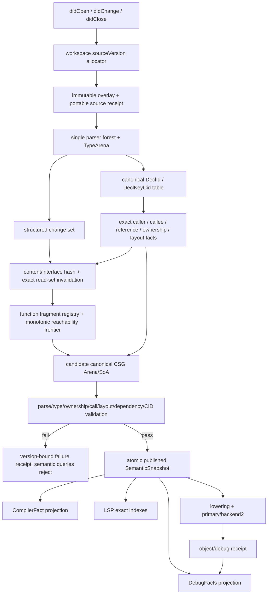

# 版本化语义快照统一闭环

状态：`applying / user confirmed 2026-07-22`。S0 审计、红基线、结束态对比与缩放口径见 `versioned-semantic-snapshot-s0-audit.md`；后续分片只有通过各自门后才能记为完成。

## 目标

把源码编辑、CompilerFact、CompilerCSG、LSP、增量编译、DebugFacts 和后端产物统一成一条版本化语义证据链：

```text
accepted source event
  -> immutable source candidate
  -> parser / type / ownership / call / layout / dependency validation
  -> canonical CSG semantic snapshot
  -> atomic publish
      -> CompilerFact view
      -> LSP view
      -> DebugFacts + object/debug-map receipt
      -> lowering/backend
```

最终必须同时满足：

- 每次接受的 `didOpen/didChange/didClose` 事件分配唯一、严格递增的 workspace-local `sourceVersion`。
- `sourceVersion` 通过本地 binding receipt 精确绑定 `worldHeadCid`、`compilerCid`、`sourceBundleCid`、`csgRootCid`；它不冒充跨进程 portable 语义身份。
- portable 语义身份继续由现有 `cid-identity-chain` 的 domain-separated、length-prefixed SHA-256 receipt 证明，不再创建第二套 source/CID 算法。
- canonical CSG semantic snapshot 是唯一语义真相源。legacy `CHENG_CSG` 只是 object-facts wire，`CHENGCSG` 只是 internal cold snapshot，都不得成为本系统的架构真相。
- CompilerFact、LSP、Debugger、lowering/backend 只从同一个已发布 snapshot 投影；禁止再次解析源码、扫描标识符或猜测调用/布局/所有权。
- 只构建改动函数与真实依赖闭包；增量与同源码冷全量构建在 CSG、facts、object、运行结果上严格等价。
- 任一验证、CID、依赖、缓存、所有权或 receipt 错误 hard-fail，候选不得污染已发布状态。

## S0 初始基线

完整逐项账本见 `openspec/proposals/versioned-semantic-snapshot-s0-audit.md`。S0 将已复现缺陷记为 RED、缺门记为 MISSING、测量路径不合格记为 INVALID，三者都不冒充绿。

- 仓库 HEAD：`d82ec5fa9d4aeea7b1b8ad44324f46734129e793`；工作树已有大规模并行改动，尤其 `typed_expr.cheng` 与 `compiler_csg.cheng`，本提案不得覆盖。
- 当前固定产物：`artifacts/cheng-lsp` SHA-256=`e13ad8f8949835c413f490118de520ae25f99e63fe508a98eebd7b2b982671a2`；`artifacts/backend_driver/cheng` SHA-256=`cbb0136da2dc64b52812b567ec6b48977422efbe3f1a1a568af364de422dfc38`；`artifacts/bootstrap/cheng.stage3` SHA-256=`a1aeea918558595e7191e78ddf03018ec194629358b41bbd607138ca485cc947`。
- `compiler_facts.cheng` 的 production API 仍用 outline parser、逐行声明扫描和 token 扫描独立生成事实；`compilerFactsFromCompilerCsg` 只把 typed facts 粗略投成 definition，未覆盖精确 reference/call/ownership/layout。
- `lsp_server.cheng` 用一组全局 `gFactSymbols/gFactReferences/gFactDiagnostics`；任一文档变化会覆盖全部 facts。`gFactReferences` 实际为空，definition/reference/rename 依赖当前文档文本扫描和名称匹配。
- LSP 声明 `textDocumentSync=1`，每次 `didChange` 接受完整文本；没有事件级结构增量、workspace snapshot identity、原子 publish 或旧请求取消合同。
- `debug_facts.cheng` 会重新扫描源码，用行号差乘 4 推测 address offset；现有 line-map/object 路径未与同一 semantic snapshot receipt 绑定。
- `csge_fingerprint`、`csge_manifest_codec`、`csge_ir_cache`、`typed_expr_frag_codec` 已存在，但 production `typed_expr/compiler_csg` 没有 `CsgeIrCacheGet/Put` 消费点。历史 Commit D 试接线在热 fixture 上约 2x 减速，根因是 reachability 多轮重复全量 decode。
- 当时 `canonicalGraphCid` 只覆盖 canonical node/edge graph，不能单独证明全部 TypedIR、reference、ownership、layout 和 debug-map 事实；最终 `csgRootCid` 必须覆盖完整 canonical semantic snapshot。
- 现有 LSP smoke 主要验证协议 framing、helper 或手工构造 facts；没有 production 多文件版本隔离、真实跨模块 SymbolId、随机编辑增量/冷构建对拍门。

### 当前 artifact 实测红基线

以下结果直接来自 SHA-256=`e13ad8f8949835c413f490118de520ae25f99e63fe508a98eebd7b2b982671a2` 的 `artifacts/cheng-lsp`，不是源码推断：

- 依次打开 `a.cheng: Alpha`、`b.cheng: Beta` 后，`workspace/symbol Alpha` 与 `documentSymbol(a)` 均返回 0 项，证明第二个文档覆盖第一个文档的 facts。
- 随后关闭 `b.cheng`，`Alpha` 仍为 0 项，而已关闭的 `Beta` 仍返回 1 项且 URI 指向 `b.cheng`，证明 didClose 不重建 workspace facts 并留下 stale symbol。
- 对包含 Foo definition、字符串 `"Foo"`、注释 `# Foo` 和真实调用 `Foo()` 的文档请求 references，返回 4 项，位置为 `0:3/4:17/5:6/6:11`；字符串和注释被错误计为语义引用。
- didOpen version=10 后接受 didChange version=9，`After` 立即可见且 `Before` 消失；响应不含 `sourceVersion`，证明没有版本单调性或 snapshot binding。
- 发送合法 range change 把 `Foo` 改成 `Bar` 后，`Bar` symbol 为 0；服务端把 change.text 当整篇文档。initialize 同时把 `textDocumentSync` 编码为 JSON `true`，没有增量同步合同。

另用 backend driver SHA-256=`cbb0136da2dc64b52812b567ec6b48977422efbe3f1a1a568af364de422dfc38` 设置 `CHENG_CSGE_IR_CACHE_ROOT` 连续编译同一小源，两次 object 字节相同但没有生成 cache 目录；报告明确 `cold_system_link_exec=1/full_backend_codegen=0`。该运行绕过纯 Cheng CompilerCSG，不能当 CSGE 性能或正确性基线，只证明当前固定 artifact 不具备测量本目标的资格。S0 必须用 current-source full selfhost candidate 重建正式 baseline harness。

因此当前状态是结构地基存在，但六条消费链仍分叉；任何旧 smoke 通过都不能当作本提案完成。

## 身份合同

### PortableSemanticSnapshotIdentity

portable 层只含可跨 root 复算的内容：

```text
sourceIdentityReceiptCid
worldHeadCid
compilerCid
sourceBundleCid
csgRootCid
semanticSnapshotCid
```

- `sourceIdentityReceiptCid/sourceBundleCid` 直接复用 `cid-identity-chain` 已冻结的 packageId、canonical modulePath、原始源码字节和 canonical import graph 身份。
- `compilerCid` 定义为实际 producer executable + toolchain manifest 的内容身份，不得用 `compilerCsgCid`、`compilerPkgCid` 或路径替代；现有字段保留各自语义，不可混名。
- `csgRootCid` 是完整 canonical CSG semantic snapshot root；`canonicalGraphCid` 作为其 graph 子根输入，不冒充完整根。
- `semanticSnapshotCid` 对上述 portable 字段做 domain-separated、length-prefixed SHA-256；绝对路径、进程、LSP 版本、source index 不得进入。

### LocalSourceVersionBinding

```text
workspaceSessionCid
sourceVersion: int64
clientDocumentVersions[]
semanticSnapshotCid
worldHeadCid
compilerCid
sourceBundleCid
csgRootCid
bindingReceiptCid
```

- `sourceVersion` 由 workspace session 单调分配，不能直接信任客户端 document version，也不能跨 session 比大小。
- 每个已接受事件恰好消费一个版本号；重复、倒退或跳过客户端文档版本必须按协议拒绝或显式记录，不能覆盖已有版本。
- portable snapshot 相同但事件不同，允许 `semanticSnapshotCid` 相同，`sourceVersion/bindingReceiptCid` 必须不同。
- 所有查询必须显式 pin `sourceVersion + semanticSnapshotCid`；编辑到来后取消旧请求，新请求不得读取旧 snapshot。

### 精确索引

- snapshot 内节点、Symbol、Reference、Type、Call、Layout、Ownership、DebugOp 全部使用稠密 `int32` 索引和 Arena + SoA。
- `DeclId` 是 snapshot-local canonical declaration row；所有 owner/caller/callee 选择必须先产生唯一 `DeclId`，源码 span 只作诊断载荷。
- `DeclKeyCid` 是跨 snapshot 的 portable declaration identity，由 package/module identity、owner `DeclKeyCid`、declaration kind、canonical name、结构化 portable signature/type-expression CID，以及仅对可重复局部声明必需的结构化 lexical-scope identity 组成；不得包含绝对路径、源码位置、声明遍历顺序、dense `TypeId` 或原始类型文本。
- `SymbolId` 只是 `DeclId` 的语义符号投影，必须显式保存 `declIds[SymbolId]`；Reference 直接保存 target SymbolId，Call 同时保存 caller FunctionId 与 callee SymbolId。禁止从 SymbolId 反向给文本解析结果补身份。
- 跨 snapshot 对拍使用 `DeclKeyCid`、canonical row CID 和 receipt 映射；禁止 name+arity、文本、源码行、对象地址或裸指针作为身份。
- parser 必须在真实声明语法被接受的决策点向同一 Arena + SoA 声明流恰好追加一行，覆盖 module/type/function/field/parameter/local；每行至少携带 producer source row、declaration kind、精确 name token row、owner declaration row、lexical scope row、可选 function row、可选 TypeSyntax root、declaration/name span、mutable/exported 语义。不得在 parser 之后扫描 token/source text 补声明。
- owner declaration 与 lexical scope 是两个独立索引域。parser 必须同时产生 source/type/function/block scope SoA、parent scope row 与可选 owner declaration row，嵌套 block shadowing 必须得到不同 scope 行；scope parent 只允许指向更早同 source 行并在 seal 时证明无环。无显式 `module` token 的源码不伪造 parser 声明，隐式 module Symbol 只由已封印的 CompilerCSG source/module table 投影。
- 声明流 append/clone/seal 必须保持 source-local row 与 aggregate row 两个显式索引域、owner/scope 的无环结构和六类声明的生产覆盖；Function 表只是声明流中 function 行的精确子集，builder 不得要求 `symbolCount == functionCount`。module/type/field/parameter/local 缺任一 producer authority 都必须在 publish 前 hard-fail。
- pattern 必须由 parser 决策点生成同一 Arena + SoA 的结构行与 child CSR；binding pattern 只能精确引用一个 Local declaration row、name token 和 lexical scope，wildcard/literal/constructor head/named-field label 不得伪造声明。forest remap、canonical CSG、cargo/wire 和 terminal release 必须保持 source-local pattern row 与 aggregate row 分域，禁止 builder/LSP 从文本重建解构、`for`/comprehension、`case/of` 绑定。
- TypedExpr/TypeArena/CompilerCSG 的声明、statement、value-def 和 local-binding 行必须携带 parser `(producerSourceIndex, declarationSourceLocalRow)`；显式注解与推断结果最终都落 exact TypeId/ownership/value-def proof。现有 functionName/bindingName/source line/type text lookup 只能在迁移期作为被拒绝的旧实现，不能成为 builder 的声明 join 或发布权威。
- parser 的 broad `local` 行同时覆盖 module-owned binding 与 callable/block local；builder 必须按 owner 域把前者映射为 portable `Global` declaration、后者映射为 `Local` declaration，同时都投影到 broad `CsgCompilerSymbolLocal`。schema 的 Symbol→declaration kind 校验必须按 owner 域精确判定，不能固定把所有 broad Local 强制成 callable Local。
- `DeclKeyCid` 的局部身份只消费结构化 lexical-scope key；source byte/line、dense scope row 和声明遍历次序只作 snapshot-local 校验，禁止进入 portable key。参数和字段使用声明 owner key + canonical name + TypeCid；函数继续使用结构化 signature TypeCid，不得退回 name+arity。

## 原子发布状态机

```text
Published(current sourceVersion)
  -- source event --> Building(next sourceVersion, isolated arena)
  -- newer event --> Cancelled(candidate), Building(new sourceVersion)
  -- validation fail --> Rejected(candidate, failure receipt)
  -- full validation pass --> Validated(candidate)
  -- one non-failing pointer/index swap --> Published(candidate)
```

- Building/Validated 使用独立 owner；禁止边构建边修改 published snapshot。
- publish 前必须完成 parse、type、ownership、call resolution、layout、import/read-set、reachability、CSG canonicalization、CID 和 lifecycle ledger 校验。
- publish commit 本身必须无分配、无 I/O、无可失败步骤；失败前后 published fingerprint 相同。
- 编辑到来后，旧版本的新查询返回标准 `ContentModified`/取消错误；禁止返回旧结果冒充新版本。
- 语法或语义失败不发布半成品。diagnostics 来自与该 `sourceVersion` 绑定的 validation-failure receipt；definition/reference/rename/hover/completion 对该版本 hard-fail，不回退旧 snapshot。
- 旧 snapshot 只为已经取消但尚未归还 borrow 的请求保留，borrow 全归还后确定释放；服从 `deterministic-memory-lifecycle` owner/borrow/release 合同。

## 事件驱动增量合同

1. `didOpen/didChange/didClose` 更新 immutable overlay/source table 并产生新 `sourceVersion`；禁止文件轮询。文件 URI 在 compiler document identity 绑定事件中只读取并封存一次 base bytes/CID，`didClose` 必须恢复该 sealed base；绑定后的磁盘变化不得静默进入 snapshot。
2. parser 输出结构化 changed declaration/function ranges；禁止用行号或文本猜改动函数。
3. 每 source 维护 raw content hash 和 canonical interface hash；每 function fragment 维护 exact read set、fragment CID、semantic input roots。CSG、cache、decoded registry 和 backend 只能使用一个 canonical fragment CID；禁止为 TypedExpr inspection、cache payload和最终 CSG保留三套身份。
4. 初始 invalid set = changed functions + removed functions + interface changed sources；通过 reverse exact read-set CSR 求固定点依赖闭包。
5. reachability 使用单调 frontier；每 function 在一个 candidate 中最多 lower/edge/release 一次，禁止每轮全表重扫。
6. workspace 内维护 decoded fragment registry：persistent fragment 校验并 decode 一次，随后固定点轮次只引用 registry row；禁止每轮 `TryLoad`/全量 decode。
7. cache hit 必须同时验证 key、fragment CID、source content hash、external read-set interface hash、schema/compiler/target identity；任一不符 hard-fail 或按“合法 miss”整函数重建，绝不部分拼接。
8. candidate 完成后和 cold oracle 对拍 canonical roots；开发模式可按采样运行，正式验收和 mutation/fuzz 必须全量运行。
9. compiler-owned assembler 把 fragment 内 statement/node/scope 的函数局部 `int32` 索引一次 remap 到 candidate 全局 SoA；跨函数、类型、布局和依赖只携带 portable CID。payload 禁止用 path/name/line/name+arity 找函数，禁止在全量 `BuildCompilerCsg` 完成后再把 cache hit 记作增量收益。

## 消费视图

### CompilerFact

- 删除 production `compilerFactsFromSource` 路径；保留时只能作为明确 diagnostic/legacy reader，不能被 LSP、Debugger 或编译器主链调用。
- `CompilerFactBundle` 变为 `SemanticSnapshot` 的确定性只读投影，必须携带完整 snapshot binding。
- symbol/reference/import/type/ownership/concurrency/function-span/token/diagnostic 均从 canonical CSG/parser receipt 投影；每个 reference 带 target SymbolId。
- `semantic_facts` 不再从浅 CompilerFact 二次“解析”，直接投影 CSG resolved-call/type/ownership rows。

### LSP

- 用 workspace snapshot store 替换 `gFact*`；document overlay 只保存客户端文本/版本，不保存第二套语义。
- definition/references/rename/hover/completion/diagnostics/documentSymbol/workspaceSymbol 全部查询同一 snapshot 索引。
- rename 先用 cursor->Reference/SymbolId 精确解析，再遍历 reverse reference CSR；跨文件 edits 按 URI 分组，任何版本漂移整次拒绝。
- sync 改为增量 range changes；服务端按事件应用并校验版本，禁止轮询或静默全量覆盖。
- LSP 进程启动必须消费完整 `CompilerLocalUniverse` 与 `CompilerExecutionIdentity`；综合验收 feeder 只接受哈希绑定、canonical 的 compiler-identity manifest，缺失或篡改时保持 RED，禁止退回裸 `worldHeadCid` 或伪造 CID。

### Debugger 与后端

- DebugFacts 从 canonical CSG DebugOp/SourceSpan/SymbolId 投影；真实 instruction/object address 由 emitter receipt 回填并绑定 object CID。
- line-map、symbol-map、DWARF、crash/profile report 必须携带 `semanticSnapshotCid/sourceVersion/csgRootCid/objectCid`。
- Debugger 只允许把 runtime PC -> emitted op -> CSG node -> exact source span 反查；删除 `line delta * 4`、函数名拼 link name和源码重扫路径。
- primary/backend2 各自必须消费同一冻结 snapshot 和 regalloc plan，并回执实际消费的 row/fragment/object bytes。

## 全局数据流



## Apply 分片

| 分片 | files | action | verify | done |
| --- | --- | --- | --- | --- |
| S0 合同与基线 | 本提案、S0 audit、真实 LSP baseline harness | 冻结 workload、artifact/source/tool hashes；记录现有语义错误并拒绝无效性能样本 | LSP 红基线可重复；审计矩阵、结束对比、测量合同和 AI 小时缩放已冻结 | complete |
| S1 snapshot core | 新 `semantic_snapshot`/receipt/index 模块；SystemLinkPlan/CompilerWorld/CompilerCSG 接缝 | 复用 CID-first receipt；实现 local sourceVersion binding、candidate owner、原子 publish/cancel/reject | 版本唯一、字段 mutation kill、publish fail-no-mutation、旧查询取消、owner/borrow/release 平衡 | complete：core、production Stage/Commit/reclaim、rejection、compiler-owned documentCid 与 execution receipt 已闭合；Fusion 从正式 MCP 工具独立重放三门，auditCid=`ce5850ca047d00d20e54dc7f47a9bdf86fc1fbef559df43d73c005927a924543`。LSP 成功发布完整 facts 属 S2/S3，保持 applying |
| S2 canonical CSG 与 facts | CompilerCSG/csg_core writer、compiler_facts、semantic_facts | 完整 csgRoot；CompilerFact/SemanticFact 改成只读投影；移除 production source rescan | CSG/facts 双跑字节一致；reference/ownership/layout/call rows 完整；独立扫描入口 production 零调用 | applying：canonical standard 已直接替换为唯一 `csg_core`，旧 standard 拒绝；parser 的六类 declaration、独立 lexical scope 与 Pattern/child CSR 已按 canonical source base-remap 进入同一 CSG parser sidecar、cargo 和 wire，关系篡改、双对象门已绿，terminal Pattern release/64 轮 clone-release 门已绿。CompilerCSG graph/receipt 已改为 producer source/declaration 坐标+name proof，single-truth 静态门已清除逐行 local/Fmt/external、`callArgsText`/`&fn`、signature-line 与 same-name fanout 后转绿。value-call 已分离 aggregate structural row 与 source-local origin row，exact call graph projection focused 已绿。Compiler/SemanticFact 的 function/reference/call/scope/export/concurrency/resolved-type/layout-field 声明身份已逐行接线并删除无 canonical authority 的文本 overload 表面，但 ownership/type/layout 仍有剩余。schema/wire 与 production builder 已通过完整/聚焦门：每 source 一个显式或隐式 Module Symbol，Function 精确 owner 指向同源 Module，Function 表是 Symbol 子集，两次 canonical remap 与 `module::member` qualified identity 均有重根攻击；builder=`dc4cf9fe0d53…`、完整 object=`b2ed01234ee7…`。type/field/parameter/local 的 TypeId、DeclId/DeclKey、owner/scope/reference 与 Symbol 投影尚未完成；首轮多 binding value-def 又被 Review 证伪为复用 initializer RHS 假证据，正在改为诚实 hard-fail 与 exact coverage，因此完整生产发布仍未证明 |
| S3 多文件 LSP | lsp_protocol/lsp_server/LSP tests | workspace store、增量 range event、精确 SymbolId/Reference CSR、全功能 version pin | 双文件同名隔离、跨模块 definition/references/rename、并发编辑取消、close 重算、无 `gFact*`/文本扫描 | applying：workspace store、range event、published pin 和 exact query API 已进入 `lsp_server`；启动已直接消费完整 compiler universe/execution 并对损坏返回非零。builder 的 modulePath/physical sourcePath 错域已修并由交换攻击锁定；acceptance harness 已切到 production `cheng/configureCompilerSource`、compiler-owned documentCid 和正式 compiler target。LSP 已接入唯一 `Make→Strict→Stage→StoreStrict→Commit→StoreStrict→reclaim` 候选 sink，失败绑定当前 sourceVersion 且禁止读旧 payload；两文档交错 open/change/close/reopen 与 Building candidate 已证明六类请求拒绝当前未完成版本且结果清零，source-level failure 不再强取可空 parser root。但 production `CompilerSnapshotProductionAdmissionAssessInto` 仍在 canonical tables 产生前把 source/symbol/function/typed/reference/scope/dependency/diagnostic 全部硬记为 missing，并要求 `admissionBlocked=true`，所以当前入口仍只会构造 failure cargo 并 reject。S2 完整表完成后必须让同一 sink 消费 builder candidate 并以 zero-missing 原子发布，禁止在 rejection 旁新增测试专用 publish；目前没有真实 `published=1` 六查询证据 |
| S4 增量 CSG | typed_expr/CompilerCSG、csge fingerprint/manifest/cache/codec | exact read-set closure、decoded registry、单调 frontier、函数片段 splice、tamper hard-fail | 1/2/N 文件随机编辑与冷构建对拍；decode count=unique loaded fragments；function visit 线性；缓存破坏 100% kill | applying：function fragment registry、candidate int32 row、decode-once、无版本 codec 篡改和真实 producer receipt 首片已 focused 通过；admission 已直接证明 finalized function read preimage，reverse CSR 只构建一次并由 StrictValidate 线性复验，双门与 production builder 当前树全绿；完整读取域、随机编辑冷对拍与 production authority 待验证 |
| S5 Debugger/backend | debug_facts、line_map、lowering、primary/backend2、receipt | DebugOp->instruction/object 精确 join；同 snapshot 消费回执 | PC/崩溃/profile 精确回源；object/line-map/DWARF receipt CID 对拍；两后端对象与运行等价 | applying：CSG-only debug projection、object/debug emission receipt 与真实 Mach-O `__debug_line/__debug_info/__debug_abbrev` external-reloc writer focused 门已通过，primary/backend2 对象字节一致且 `dwarfdump --verify` 无错误；`ObjectBuffer` 扩容旧 storage、take/release 和 DWARF/Mach-O 成功/错误路径生命周期已由反复攻击门闭合。完整 ORC、最终 PC 回源、跨格式 writer、对象/运行对拍与 production 发布待验证 |
| S6 总验收与 archive | 新 production gate + 现有 CSG/ORC/perf gates | 固定真实 dev-loop A/B、fuzz/mutation、1GiB 门、独立 oracle；Review 后精简 | 墙钟≥40%、文件读取≥50%、cold overhead≤1%，所有正确性门绿；否则继续定位瓶颈 | pending：总门禁已静态绑定 20 个组件和 21 个生产源文件的 30 次随机编辑合同；当前真实构建身份、Linux 原始归档、发布/对象/运行/ORC 对拍和三项性能阈值仍为 MISSING，禁止 archive |

执行顺序固定为 S0→S1→S2→S3/S4→S5→S6。S3 与 S4 只有在 S2 schema 冻结后才可并行；当前 dirty 热文件稳定前不得进入对应写集。

## 验收矩阵

| 不变量 | 必需门 |
| --- | --- |
| sourceVersion 唯一绑定四 CID | open/change/close、重复/倒退 client version、同内容重复事件、跨 session、四字段逐项 mutation |
| 原子发布且无 stale | 构建中查询、验证失败、新事件取消旧 candidate、publish 前失败 fingerprint 不变、旧 borrow 释放 |
| CSG 唯一真相 | production call graph 证明 LSP/CompilerFact/DebugFacts 无 parser/source-scan 入口；所有投影绑定同 root |
| 多文件精确 LSP | 同名/重载/alias/shadow/generic/字段/跨包 fixture；definition/reference/rename/hover/completion/diagnostic 全校验 SymbolId |
| 精确增量 | leaf/body/interface/import/remove/rename/ownership/layout 改动；真实 read-set closure 与 rebuild set 独立 oracle 相等 |
| 缓存安全 | key、schema、fragment bytes、CID、read set、interface hash、compiler/target identity、trailing bytes 篡改全部拒绝 |
| 冷/热等价 | canonical CSGC、CompilerFact bytes、DebugFacts、primary/backend2 object、link/run stdout/stderr/exit、ORC retain/release |
| 性能与内存 | 固定真实复杂开发循环至少 30 次随机编辑；报告 median/p95 wall、read syscall/bytes、decode/function visits、RSS、cold overhead |

现有 `tools/cold_csg_roundtrip_test.sh`、`compiler_csg_incremental_reachability_smoke`、thread/atomic/ORC、`perf_memory_contract_smoke` 继续保留，但不能单独证明本提案。S0 必须新增一个统一 production gate，最终逐项调用并绑定所有输入/工具/产物哈希。

## 性能口径

- 旧文档的“40%+”“文件读取减少 50–80%”“10–20x”均是投影，不是完成证据。
- 真实 A/B workload 固定为多文件打开、连续 body/interface 编辑、definition/references/rename、增量编译、一次运行/崩溃映射的完整开发循环。
- baseline 与 candidate 使用相同机器、源码事件 trace、compiler/tool hashes、warmup、采样次数和输出验证；报告 median 与 p95，不用单次最好值。
- 性能不是 S6 才补的尾门：S2–S5 每个最小切片都必须记录 wall、RSS、源码读取、decode/function/row visit 和渐近复杂度；新增全表重扫、重复解码、额外源码读取或无法归因的冷构建回归立即阻断该切片。
- 最终门：整体墙钟降低至少 40%，文件读取次数或字节至少降低 50%，冷构建额外墙钟不超过 1%。任一未达标，保持 applying 并按 phase/visit/I/O ledger 找真实瓶颈。

## 协调边界

- `cid-identity-chain` 是身份前置权威；本提案只增加 snapshot binding 和完整 CSG semantic root，不改 portable source identity 定义。
- `deterministic-memory-lifecycle` 是 candidate/published snapshot owner 前置权威；禁止全局 singleton、裸指针长持有或无账本缓存。
- `regalloc-production` 决定 primary/backend2 的真实消费回执；仅出现 regalloc 名称不算接线。
- 当前 `typed_expr.cheng`、`compiler_csg.cheng`、CompilerWorld/receipt 文件存在未收敛改动；用户确认后也必须先做写集/接口复核，再逐片 apply。
- 不创建 branch/worktree，不修改 official driver，不清理或覆盖现有 dirty worktree。

## 预计投入

S0 初始审计给出的总量为 `410–630 AI 小时`，用于保存当时的未知量基线。2026-07-23 在 Module/Type/CompilerFact/Debug focused 门、真实 admission RED 和增量接线缺口均已实测后，当前完成度约 `45%`，剩余重估为 `230–360` 聚合 AI 小时；该估算不是验收证据。逐分片缩放和计算依据见 S0 audit。只有验收矩阵全部通过后才 archive。

## 确认门

用户已于 2026-07-22 确认进入 `apply`。当前按 S1→S2→S3/S4→S5→S6 执行，任何分片未通过门都保持 applying。

## Apply 进展（2026-07-23）

- 已闭合 implicit Module 的判别坐标合同及 CompilerFact/DebugFact/query/LSP/pinned store 消费；生产绑定和完整 LSP 聚合门均在精确 1GiB 守卫下通过。
- 已删除 DebugSectionPlan function/operation rows 中重复的 `modulePath/functionName` 身份；DWARF 显示文本单独按 exact sourceId/DocumentCid 和 FunctionId 对齐投影，不能参与声明选择。
- fragment cache 已绑定 `functionInterfaceCid` 并拒绝接口篡改；decode-once/reuse 门通过。
- S2 仍为 applying：Type declaration↔TypeSyntax exact 双射、unused generic 诚实拒绝和 producer-owned base SymbolCid 索引已闭合；剩余 Type portable projection replay、一次全局 SymbolId remap、完整 consumer provenance 和 type-only 零函数路径。
- S3 仍为 applying：六查询已共用 pinned CompilerFact 精确行投影并拒绝 CompilerFact CID 篡改；派生 CSR 删除行攻击先由 canonical tables 完整 source-slice 重验拒绝，最终仍需 snapshot-root 认证 slice。当前版本隔离门在合法字面量 binding 暴露 TypedExpr parser-root 缺失，禁止转走 treeless 文本 fallback。
- S4 仍为 applying：30 seed × 30 transitions 的确定性 manifest、双对象固定点和 cache/CID/dependency 篡改合同已绑定；真实 production 运行在四文件 seed20 的 sourceVersion 4 诚实 RED 于 admission `missing_fact_bitmap=509`，对象/运行/ORC oracle 尚未到达。事件热路径仍全量 BuildCompilerCsg；现有 plan/cache 缺 compiler-owned fragment assembler、完整读取域、predecessor pin 和统一 canonical fragment CID，不能薄接线宣称增量。
- S5 focused DWARF/PC/ObjectBuffer 门已绿，但跨格式、完整 ORC 与同源码对象/运行等价仍未闭合；S6 性能三阈值尚无最终冻结报告。
